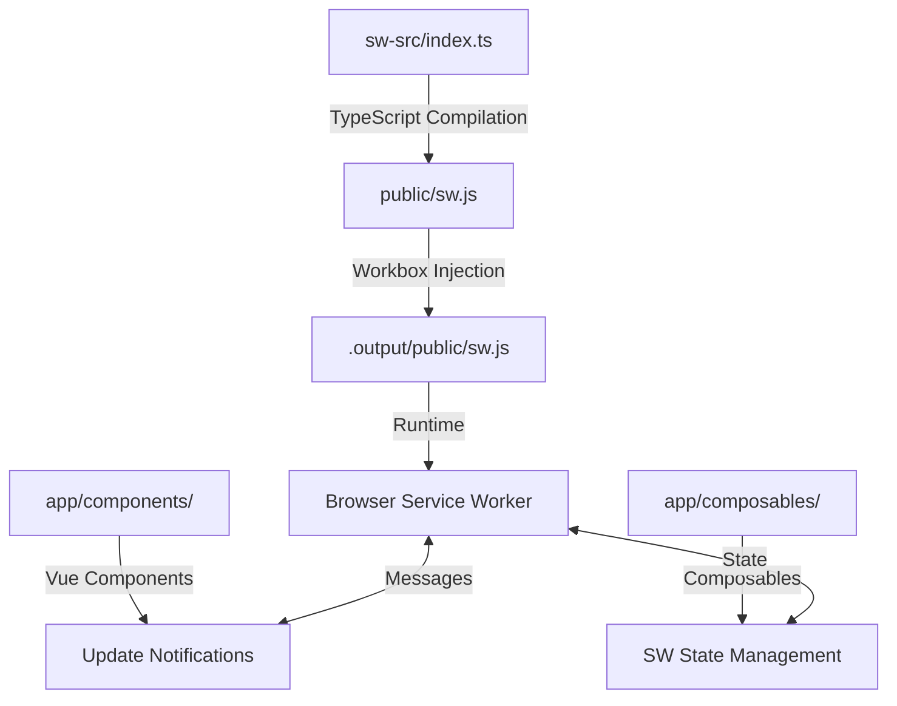

# 🚀 CleverAI PWA Complete Guide

> **The Ultimate Progressive Web App Documentation**
> Everything you need to know about the PWA system, Service Worker, Caching, Notifications, and Build Pipeline

---

## 📑 Table of Contents

1. [Quick Start & Overview](#-quick-start--overview)
2. [Architecture & System Design](#-architecture--system-design)
3. [Build Pipeline & Compilation](#-build-pipeline--compilation)
4. [Service Worker Implementation](#-service-worker-implementation)
5. [Caching Strategies](#-caching-strategies)
6. [Notification System](#-notification-system)
7. [Update Mechanism](#-update-mechanism)
8. [Development Workflow](#-development-workflow)
9. [Production Deployment](#-production-deployment)
10. [Troubleshooting & Debugging](#-troubleshooting--debugging)
11. [File Structure Reference](#-file-structure-reference)

---

## 🎯 Quick Start & Overview

### What is This PWA System?

CleverAI uses a **custom Progressive Web App (PWA) implementation** built on Nuxt 4 with TypeScript. This provides:

- ✅ **Offline functionality** - App works without internet
- ✅ **Install to home screen** - Native app-like experience
- ✅ **Background sync** - Data syncs when connection returns
- ✅ **Push notifications** - Real-time user engagement
- ✅ **Fast loading** - Advanced caching strategies
- ✅ **Auto-updates** - Seamless service worker updates

### Key Commands

```bash
# Development with hot reload
yarn dev

# Build service worker only
yarn sw:build

# Full production build with PWA
yarn build:inject

# Test PWA offline functionality
yarn test:pwa

# Debug tools
open http://localhost:3000/dev-tools/
```

### Critical Files You Need to Know

| File | Purpose | Edit? |
|------|---------|-------|
| `sw-src/index.ts` | **Main service worker source** | ✅ YES |
| `app/components/ServiceWorkerUpdateNotification.vue` | Update UI | ✅ YES |
| `app/composables/shared/useServiceWorkerUpdates.ts` | Update logic | ✅ YES |
| `public/sw.js` | Compiled service worker | ❌ AUTO-GENERATED |
| `scripts/inject-sw.cjs` | Build pipeline | ⚠️ RARELY |

---

## 🏗️ Architecture & System Design

### PWA Pipeline Overview



### Core Technologies

- **Nuxt 4.0.3**: Framework (PWA module disabled for manual control)
- **TypeScript**: Service worker development
- **Workbox**: Manifest injection and caching strategies
- **Vue 3**: Reactive UI components for updates
- **IndexedDB**: Offline data storage
- **Web Push API**: Notification system

### Why Custom Implementation?

We use a custom PWA instead of `@nuxtjs/pwa` because:

1. **Full Control**: Complete control over caching strategies
2. **TypeScript**: Type-safe service worker development
3. **Advanced Features**: Background sync, IndexedDB, custom notifications
4. **Bundle Size**: Only include needed features
5. **Debugging**: Better development tools and debugging

---

## 🔧 Build Pipeline & Compilation

### Three-Stage Build Process

#### Stage 1: TypeScript Compilation
```bash
yarn sw:build
# sw-src/index.ts → public/sw.js
```

#### Stage 2: Workbox Injection
```bash
yarn build:inject
# Injects __WB_MANIFEST into compiled SW
```

#### Stage 3: Production Build
```bash
yarn build
# Nuxt builds everything to .output/
```

### Build Scripts Explained

#### `scripts/inject-sw.cjs`
```javascript
// Workbox manifest injection for production
const { injectManifest } = require('workbox-build')

// Injects list of all static assets into service worker
// Replaces self.__WB_MANIFEST placeholder
```

#### `scripts/check-sw-placeholder.cjs`
```javascript
// Safety check: Ensures __WB_MANIFEST placeholder exists
// Prevents build failures during injection
```

### Package.json Scripts

```json
{
  "scripts": {
    "sw:build": "esbuild sw-src/index.ts --bundle --outfile=public/sw.js",
    "sw:check": "node scripts/check-sw-placeholder.cjs",
    "build:inject": "yarn sw:build && yarn sw:check && node scripts/inject-sw.cjs",
    "build": "nuxt build",
    "dev": "yarn sw:build && nuxt dev"
  }
}
```

### Critical Build Requirement

⚠️ **IMPORTANT**: The service worker must contain the exact string `self.__WB_MANIFEST` for Workbox injection to work.

**✅ Correct TypeScript code:**
```typescript
// This compiles to: self.__WB_MANIFEST
const manifest = (self as any).__WB_MANIFEST || []
```

**❌ Incorrect TypeScript code:**
```typescript
// This compiles to: selfWithWB.__WB_MANIFEST (Workbox can't find it)
const selfWithWB = self as unknown as { __WB_MANIFEST?: any }
let manifest = selfWithWB.__WB_MANIFEST
```

---

## ⚙️ Service Worker Implementation

### Main Service Worker (`sw-src/index.ts`)

This is the **single source of truth** for all service worker functionality:

```typescript
import { precacheAndRoute, cleanupOutdatedCaches } from 'workbox-precaching'
import { registerRoute } from 'workbox-routing'
import { StaleWhileRevalidate, CacheFirst, NetworkFirst } from 'workbox-strategies'

// CRITICAL: Exact string needed for Workbox injection
const manifest = (self as any).__WB_MANIFEST || []
precacheAndRoute(manifest, {
  ignoreURLParametersMatching: [/^utm_/, /^fbclid$/]
})

// Cleanup old caches on activation
cleanupOutdatedCaches()
```

### Core Features Implemented

#### 1. Precaching with Workbox
```typescript
// All build assets are automatically cached
precacheAndRoute(manifest)
```

#### 2. Runtime Caching Strategies
```typescript
// API calls: Network first, fallback to cache
registerRoute(
  ({ url }) => url.pathname.startsWith('/api/'),
  new NetworkFirst({ cacheName: 'api-cache' })
)

// Images: Cache first for performance
registerRoute(
  ({ request }) => request.destination === 'image',
  new CacheFirst({ cacheName: 'images' })
)

// Pages: Stale while revalidate for balance
registerRoute(
  ({ request }) => request.mode === 'navigate',
  new StaleWhileRevalidate({ cacheName: 'pages' })
)
```

#### 3. Background Sync
```typescript
// Sync data when connection returns
self.addEventListener('sync', (event) => {
  if (event.tag === 'background-sync') {
    event.waitUntil(doBackgroundSync())
  }
})
```

#### 4. Push Notifications
```typescript
// Handle incoming push notifications
self.addEventListener('push', (event) => {
  const data = event.data?.json() || {}
  event.waitUntil(
    self.registration.showNotification(data.title, {
      body: data.body,
      icon: data.icon || '/icons/icon-192x192.png',
      badge: '/icons/badge-72x72.png',
      data: { url: data.url }
    })
  )
})
```

#### 5. Notification Click Handling
```typescript
// Navigate when notification is clicked
self.addEventListener('notificationclick', (event) => {
  event.notification.close()
  const url = event.notification.data?.url || '/'
  event.waitUntil(clients.openWindow(url))
})
```

#### 6. Message Handling
```typescript
// Communication with main thread
self.addEventListener('message', (event) => {
  if (event.data && event.data.type === 'SKIP_WAITING') {
    self.skipWaiting()
  }
})
```

#### 7. IndexedDB Operations
```typescript
// Offline data storage
import { openDB } from 'idb'

const dbPromise = openDB('CleverAI', 1, {
  upgrade(db) {
    db.createObjectStore('folders')
    db.createObjectStore('materials')
  }
})
```

### Service Worker Lifecycle

1. **Install**: Cache all static assets
2. **Activate**: Clean up old caches
3. **Fetch**: Intercept network requests
4. **Message**: Handle client communication
5. **Push**: Display notifications
6. **Sync**: Background data synchronization

---

## 🗄️ Caching Strategies

### Four-Layer Caching Architecture

#### Layer 1: Precaching (Build Assets)
```typescript
// All static files from build are precached
// Includes: JS, CSS, images, fonts, manifest
precacheAndRoute(manifest)
```

**What gets precached:**
- All JavaScript bundles
- CSS stylesheets
- Static images and icons
- Fonts and assets
- Manifest and SW itself

#### Layer 2: Runtime Caching (Dynamic Content)
```typescript
// Different strategies for different content types

// Navigation requests (pages)
new StaleWhileRevalidate({
  cacheName: 'pages',
  plugins: [
    { cacheKeyWillBeUsed: async ({ request }) => `${request.url}?v=1` }
  ]
})

// API calls
new NetworkFirst({
  cacheName: 'api-cache',
  networkTimeoutSeconds: 3,
  plugins: [
    { cacheWillUpdate: async ({ response }) => response.status === 200 ? response : null }
  ]
})

// Images
new CacheFirst({
  cacheName: 'images',
  plugins: [
    { cacheExpiration: { maxEntries: 60, maxAgeSeconds: 30 * 24 * 60 * 60 } }
  ]
})
```

#### Layer 3: IndexedDB (Structured Data)
```typescript
// For complex application data
const db = await openDB('CleverAI', 1)

// Store folders offline
await db.put('folders', folderData, folderId)

// Retrieve when offline
const folders = await db.getAll('folders')
```

#### Layer 4: Background Sync (Pending Operations)
```typescript
// Queue operations when offline
self.addEventListener('sync', async (event) => {
  if (event.tag === 'folder-sync') {
    // Sync folder changes when online
    const pendingChanges = await db.getAll('pending-operations')
    for (const change of pendingChanges) {
      await syncChange(change)
    }
  }
})
```

### Cache Configuration

#### Cache Names and Purposes
- `workbox-precache-v2-{hash}`: Static build assets
- `pages`: HTML pages and navigation
- `api-cache`: API responses
- `images`: Image files and media
- `fonts`: Web fonts
- `external`: Third-party resources

#### Cache Expiration Policies
- **Static assets**: Never expire (versioned by hash)
- **Pages**: 1 hour TTL, background refresh
- **API**: 5 minutes TTL, network-first
- **Images**: 30 days TTL, cache-first
- **External**: 1 day TTL

### Offline Strategy

1. **Static Content**: Always available (precached)
2. **Dynamic Pages**: Last cached version shown
3. **API Data**: Cached responses with staleness indicator
4. **Forms**: Queued for background sync
5. **Images**: Cached with lazy loading
6. **Fallbacks**: Offline page for uncached routes

---

## 🔔 Notification System

### Complete Push Notification Implementation

#### Client-Side Subscription (`useNotifications` composable)
```typescript
// app/composables/useNotifications.ts
export const useNotifications = () => {
  const isSubscribed = ref(false)
  const subscription = ref<PushSubscription | null>(null)

  const registerNotification = async () => {
    // Request permission
    const permission = await Notification.requestPermission()
    if (permission !== 'granted') return false

    // Get service worker registration
    const registration = await navigator.serviceWorker.ready

    // Subscribe to push notifications
    subscription.value = await registration.pushManager.subscribe({
      userVisibleOnly: true,
      applicationServerKey: vapidPublicKey
    })

    // Save subscription to server
    await $fetch('/api/notifications/subscribe', {
      method: 'POST',
      body: { subscription: subscription.value }
    })

    isSubscribed.value = true
    return true
  }

  return { registerNotification, isSubscribed, subscription }
}
```

#### Server-Side API Endpoints

**Subscribe**: `/server/api/notifications/subscribe.ts`
```typescript
export default defineEventHandler(async (event) => {
  const { subscription, userId } = await readBody(event)

  // Save subscription to database
  await prisma.notificationSubscription.create({
    data: {
      endpoint: subscription.endpoint,
      keys: subscription.keys,
      userId: userId || null,
      userAgent: getHeader(event, 'user-agent'),
      deviceInfo: { /* device details */ }
    }
  })
})
```

**Send Notifications**: `/server/api/notifications/send.ts`
```typescript
export default defineEventHandler(async (event) => {
  const { title, message, url, targetUsers } = await readBody(event)

  // Get subscriptions
  const subscriptions = await prisma.notificationSubscription.findMany({
    where: targetUsers ? { userId: { in: targetUsers } } : { isActive: true }
  })

  // Send to each subscription
  for (const sub of subscriptions) {
    await webpush.sendNotification(sub, JSON.stringify({
      title, body: message, url, icon: '/icons/icon-192x192.png'
    }))
  }
})
```

#### Database Schema (MongoDB Compatible)
```prisma
model NotificationSubscription {
  id           String           @id @default(auto()) @map("_id") @db.ObjectId
  endpoint     String
  keys         SubscriptionKeys
  userId       String?          @db.ObjectId
  user         User?            @relation(fields: [userId], references: [id])
  createdAt    DateTime         @default(now())
  expiresAt    DateTime?
  isActive     Boolean          @default(true)
  failureCount Int              @default(0)
  lastSeen     DateTime?
  userAgent    String?
  deviceInfo   Json?

  @@unique([endpoint])
  @@index([userId, isActive])
}
```

#### Notification Features
- ✅ **Push subscription management**
- ✅ **Targeted notifications** (specific users)
- ✅ **Click navigation** (opens specific URLs)
- ✅ **Failure tracking** (removes invalid subscriptions)
- ✅ **Device information** (debugging & analytics)
- ✅ **Expiration handling** (automatic cleanup)

#### Environment Configuration
```env
VAPID_PUBLIC_KEY=your_vapid_public_key
VAPID_PRIVATE_KEY=your_vapid_private_key
```

---

## 🔄 Update Mechanism

### Enhanced Service Worker Update Notification

The `ServiceWorkerUpdateNotification.vue` component is now a **comprehensive solution** that combines:

- ✅ **User-friendly update notifications** (banner and modal)
- ✅ **Developer debugging panel** (SW status, uploads, errors)
- ✅ **Network status monitoring** (online/offline indication)
- ✅ **Keyboard shortcuts** (development mode)
- ✅ **File upload progress** (chunked upload tracking)
- ✅ **Error handling** (comprehensive error display)

#### Enhanced Component Features

```vue
<!-- Full-featured component usage -->
<ServiceWorkerUpdateNotification
  mode="auto"              <!-- banner | modal | auto -->
  :auto-show="true"        <!-- Automatically show updates -->
  :enable-debug-panel="true" <!-- Show debug panel (dev mode) -->
/>
```

#### Development Keyboard Shortcuts

- **`Ctrl/Cmd + Shift + D`** - Toggle debug panel
- **`Ctrl/Cmd + Shift + U`** - Force update or simulate update
- **`Ctrl/Cmd + Shift + R`** - Force page refresh

#### Component Modes

1. **Banner Mode**: Slide-down notification from top
2. **Modal Mode**: Full-screen update dialog
3. **Auto Mode**: Banner for regular updates, modal for critical updates

#### Update Detection (`useServiceWorkerUpdates` composable)
```typescript
// Enhanced composable with debugging features
export const useServiceWorkerUpdates = () => {
  const updateAvailable = ref(false)
  const isUpdating = ref(false)
  const updateError = ref<string | null>(null)
  const refreshing = ref(false)

  // Development mode utilities
  const forceServiceWorkerUpdate = async () => { /* Force SW update */ }
  const simulateUpdateAvailable = () => { /* Test update UI */ }
  const debugServiceWorker = async () => { /* Debug SW state */ }

  // Production update flow
  const checkForUpdates = async () => { /* Check for SW updates */ }
  const applyUpdate = async () => { /* Apply waiting SW */ }
  const dismissUpdate = () => { /* Dismiss update notification */ }

  return {
    updateAvailable, isUpdating, updateError, refreshing,
    checkForUpdates, applyUpdate, dismissUpdate,
    // Dev mode functions (only in development)
    ...(isDev && {
      forceServiceWorkerUpdate,
      simulateUpdateAvailable,
      debugServiceWorker
    })
  }
}
```

#### Service Worker Bridge Integration

The component also integrates with `useServiceWorkerBridge` for:

```typescript
// Service worker monitoring and control
const {
  version,           // SW version
  isControlling,     // Is SW controlling page
  uploads,          // File upload progress
  lastError,        // Last SW error
  formSyncStatus    // Form sync status
} = useServiceWorkerBridge()
```

#### Debug Panel Features

**Service Worker Status:**
- Controlling status (Yes/No)
- Version information
- Network status (Online/Offline)
- Update availability
- Upload count
- Form sync status

**File Upload Progress:**
- Real-time upload tracking
- Progress bars for chunked uploads
- Upload completion status
- Upload identifier display

**Development Controls:**
- Force SW update
- Claim control
- Simulate update
- Debug SW state
- Manual refresh
- Reset update state

#### Error Handling

**Comprehensive Error Display:**
- Update errors from SW registration
- Network connectivity issues
- Upload failures
- Form sync errors
- Visual error indicators

#### Responsive Design

**Mobile Optimizations:**
- Responsive debug panel (adapts to screen size)
- Touch-friendly controls
- Optimized spacing for mobile devices
- Auto-hide functionality for better UX

#### Usage Examples

**Basic Implementation:**
```vue
<template>
  <!-- Auto-mode with debug panel in development -->
  <ServiceWorkerUpdateNotification />
</template>
```

**Advanced Configuration:**
```vue
<template>
  <!-- Banner-only mode with manual debug control -->
  <ServiceWorkerUpdateNotification
    mode="banner"
    :auto-show="true"
    :enable-debug-panel="false"
    ref="swNotification"
  />

  <button @click="$refs.swNotification.toggleDebugPanel()">
    Toggle Debug
  </button>
</template>
```

**Programmatic Control:**
```typescript
// Component reference
const swNotification = ref()

// Show critical update modal
swNotification.value?.showCriticalUpdate()

// Simulate update for testing
swNotification.value?.simulateUpdateAvailable()

// Reset all update state
swNotification.value?.resetUpdateState()
```

### Update Flow Process

#### Automatic Detection
1. **Background Check**: Every 5 minutes
2. **SW Registration**: Check for new service worker
3. **Update Detection**: Compare versions
4. **User Notification**: Show banner/modal based on mode

#### User-Controlled Updates
1. **User Consent**: Click "Update Now" button
2. **SW Activation**: Skip waiting and activate new SW
3. **Controller Change**: Wait for new SW to take control
4. **Page Refresh**: Automatic refresh to use new SW
5. **Completion**: User sees updated app

#### Error Recovery
1. **Timeout Handling**: 5-second timeout for SW activation
2. **Fallback Refresh**: Manual refresh if auto-update fails
3. **Error Display**: User-friendly error messages
4. **Retry Mechanism**: Allow user to retry failed updates

### Testing the Enhanced Component

**Test Page**: Visit `/test-enhanced-sw` to test all features:

- Update simulation
- Debug panel interaction
- Keyboard shortcuts
- Error scenarios
- Mobile responsiveness

**Development Testing:**
```bash
# Test the enhanced component
yarn dev
open http://localhost:3000/test-enhanced-sw

# Test keyboard shortcuts (in browser)
# Ctrl/Cmd + Shift + D - Toggle debug panel
# Ctrl/Cmd + Shift + U - Simulate update
# Ctrl/Cmd + Shift + R - Force refresh
```---

## 💻 Development Workflow

### Daily Development Commands

```bash
# 1. Start development
yarn dev
# ↳ Compiles SW + starts Nuxt dev server

# 2. Test service worker changes
yarn sw:build
# ↳ Rebuild SW only (faster than full restart)

# 3. Test offline functionality
yarn test:pwa
# ↳ Run Playwright PWA tests

# 4. Debug service worker
open http://localhost:3000/dev-tools/
# ↳ Debug utilities and test pages
```

### Development Tools

#### `/dev-tools/` Directory
- **`debug-console-test.js`**: Browser console testing scripts
- **`emergency-sw-clear.js`**: Emergency service worker cleanup
- **`test-custom-sw.js`**: Automated service worker testing
- **`debug-notification-clicks.html`**: Notification testing page
- **`test-notification.html`**: Push notification debugging

#### Browser DevTools Integration
```javascript
// Service worker status
navigator.serviceWorker.ready.then(reg => {
  console.log('SW Ready:', reg)
  console.log('SW State:', reg.active?.state)
})

// Cache inspection
caches.keys().then(names => {
  console.log('Cache Names:', names)
  names.forEach(name => {
    caches.open(name).then(cache =>
      cache.keys().then(keys =>
        console.log(`Cache ${name}:`, keys.length, 'entries')
      )
    )
  })
})
```

### Hot Reload Behavior

#### Service Worker Changes
1. Edit `sw-src/index.ts`
2. Run `yarn sw:build` (or save if using watcher)
3. Refresh browser to see changes

#### Vue Component Changes
1. Edit any `.vue` file
2. Changes apply immediately (Nuxt HMR)
3. Service worker state preserved

#### Build Script Changes
1. Edit `scripts/inject-sw.cjs`
2. Run `yarn build:inject` to test
3. Verify with `yarn sw:check`

### Testing Strategy

#### Unit Tests (Jest/Vitest)
```typescript
// Test service worker functionality
describe('Service Worker', () => {
  test('registers successfully', async () => {
    const registration = await navigator.serviceWorker.register('/sw.js')
    expect(registration).toBeDefined()
  })

  test('caches static assets', async () => {
    const cache = await caches.open('workbox-precache-v2')
    const keys = await cache.keys()
    expect(keys.length).toBeGreaterThan(0)
  })
})
```

#### E2E Tests (Playwright)
```typescript
// tests/pwa-offline.spec.ts
test('works offline', async ({ page, context }) => {
  await page.goto('/')

  // Go offline
  await context.setOffline(true)

  // Navigate to cached page
  await page.click('a[href="/about"]')

  // Verify page loads
  await expect(page.locator('h1')).toContainText('About')
})
```

### Common Development Issues

#### Service Worker Not Updating
```bash
# Clear all caches and restart
rm -rf public/sw.js .nuxt .output
yarn sw:build && yarn dev
```

#### Build Injection Failing
```bash
# Check placeholder exists
yarn sw:check

# Rebuild service worker
yarn sw:build

# Try injection again
yarn build:inject
```

#### Notification Testing
```javascript
// Test push subscription
navigator.serviceWorker.ready.then(async (reg) => {
  const sub = await reg.pushManager.subscribe({
    userVisibleOnly: true,
    applicationServerKey: 'your-vapid-key'
  })
  console.log('Subscription:', sub)
})
```

---

## 🚀 Production Deployment

### Production Build Process

#### Step 1: Pre-build Validation
```bash
# Ensure service worker compiles
yarn sw:build

# Check for required placeholder
yarn sw:check

# Validate TypeScript
yarn type-check
```

#### Step 2: Full Production Build
```bash
# Build with manifest injection
yarn build:inject

# This creates:
# - .output/public/sw.js (with injected manifest)
# - .output/public/ (all static assets)
# - .output/server/ (Nuxt server)
```

#### Step 3: Production Verification
```bash
# Preview production build
yarn preview

# Test PWA functionality
yarn test:pwa

# Check service worker in DevTools
# Application → Service Workers → Check "Update on reload"
```

### Deployment Checklist

#### Environment Variables
```env
# Required for notifications
VAPID_PUBLIC_KEY=BN4GvZAJlkd...
VAPID_PRIVATE_KEY=g6TQpM9Zf8...

# Database (for notifications)
DATABASE_URL=mongodb://...

# Optional: Analytics
GOOGLE_ANALYTICS_ID=G-...
```

#### Server Configuration

#### Nginx Configuration
```nginx
# Service worker caching
location = /sw.js {
  add_header Cache-Control "no-cache, no-store, must-revalidate";
  add_header Pragma "no-cache";
  add_header Expires "0";
}

# Static assets caching
location ~* \.(js|css|png|jpg|jpeg|gif|ico|svg|woff|woff2)$ {
  expires 1y;
  add_header Cache-Control "public, immutable";
}

# PWA manifest
location = /manifest.webmanifest {
  add_header Content-Type "application/manifest+json";
  expires 1d;
}
```

#### CDN Configuration (Cloudflare/AWS)
```javascript
// Cache rules
const cacheRules = {
  // Service worker: No cache
  '/sw.js': {
    cacheTtl: 0,
    browserTtl: 0
  },

  // Static assets: Long cache
  '*.{js,css,png,jpg,gif,ico,woff2}': {
    cacheTtl: 31536000, // 1 year
    browserTtl: 31536000
  },

  // HTML pages: Short cache
  '*.html': {
    cacheTtl: 3600, // 1 hour
    browserTtl: 0   // Always revalidate
  }
}
```

### Performance Optimization

#### Bundle Size Analysis
```bash
# Analyze bundle size
yarn build --analyze

# Check service worker size
ls -la public/sw.js .output/public/sw.js
```

#### Lighthouse PWA Audit
Expected scores:
- ✅ **Performance**: 90+
- ✅ **Accessibility**: 95+
- ✅ **Best Practices**: 95+
- ✅ **SEO**: 95+
- ✅ **PWA**: 100

#### Critical Metrics
- **First Contentful Paint**: < 1.5s
- **Largest Contentful Paint**: < 2.5s
- **Time to Interactive**: < 3.5s
- **Cumulative Layout Shift**: < 0.1
- **Service Worker Registration**: < 500ms

### Monitoring & Analytics

#### Service Worker Metrics
```javascript
// Track SW performance
performance.mark('sw-register-start')
navigator.serviceWorker.register('/sw.js').then(() => {
  performance.mark('sw-register-end')
  performance.measure('sw-registration', 'sw-register-start', 'sw-register-end')
})

// Track cache hit rates
self.addEventListener('fetch', (event) => {
  const start = performance.now()
  event.respondWith(
    caches.match(event.request).then(response => {
      const end = performance.now()
      const source = response ? 'cache' : 'network'

      // Log metrics
      console.log(`Request: ${event.request.url}`)
      console.log(`Source: ${source}`)
      console.log(`Time: ${end - start}ms`)

      return response || fetch(event.request)
    })
  )
})
```

#### Error Tracking
```javascript
// Track SW errors
self.addEventListener('error', (event) => {
  console.error('SW Error:', event.error)
  // Send to error tracking service
})

// Track notification failures
self.addEventListener('push', (event) => {
  event.waitUntil(
    self.registration.showNotification(title, options)
      .catch(error => {
        console.error('Notification failed:', error)
        // Fallback notification
      })
  )
})
```

---

## 🔧 Troubleshooting & Debugging

### Common Issues & Solutions

#### 1. Service Worker Not Registering

**Symptoms:**
- Console error: "Failed to register service worker"
- DevTools shows no service worker

**Solutions:**
```bash
# Check if SW file exists
ls -la public/sw.js

# Rebuild service worker
yarn sw:build

# Check for compilation errors
yarn sw:build --watch
```

**Debug:**
```javascript
// Test SW registration manually
navigator.serviceWorker.register('/sw.js')
  .then(reg => console.log('SW registered:', reg))
  .catch(err => console.error('SW registration failed:', err))
```

#### 2. Build Injection Failing

**Error:**
```
Expected self.__WB_MANIFEST placeholder missing in public/sw.js
Unable to find a place to inject the manifest
```

**Solution:**
```typescript
// ✅ Correct: Use exact string
const manifest = (self as any).__WB_MANIFEST || []

// ❌ Wrong: Workbox can't find this
const selfWithWB = self as unknown as { __WB_MANIFEST?: any }
let manifest = selfWithWB.__WB_MANIFEST
```

**Verify fix:**
```bash
# Check placeholder exists
yarn sw:check

# Should show: "✅ Found self.__WB_MANIFEST placeholder"
```

#### 3. Updates Not Working

**Symptoms:**
- Changes not visible after deployment
- Service worker stuck on old version

**Solutions:**
```javascript
// Force update in DevTools
// Application → Service Workers → "Update on reload"

// Programmatic force update
navigator.serviceWorker.ready.then(reg => {
  reg.update()
})

// Skip waiting (for testing only)
navigator.serviceWorker.addEventListener('message', event => {
  if (event.data.type === 'SKIP_WAITING') {
    event.ports[0].postMessage({ result: 'ACK' })
  }
})
```

**Clear everything:**
```bash
# Clear all caches
rm -rf .nuxt .output public/sw.js

# Rebuild from scratch
yarn sw:build && yarn dev
```

#### 4. Offline Functionality Broken

**Debug offline caching:**
```javascript
// Check what's cached
caches.keys().then(async (names) => {
  for (const name of names) {
    const cache = await caches.open(name)
    const keys = await cache.keys()
    console.log(`Cache "${name}": ${keys.length} entries`)
    keys.forEach(req => console.log('  -', req.url))
  }
})

// Test specific URL caching
caches.match('/about').then(response => {
  console.log('About page cached:', !!response)
})
```

**Fix caching issues:**
```typescript
// Add debug logging to SW
self.addEventListener('fetch', (event) => {
  console.log('Fetch:', event.request.url)

  event.respondWith(
    caches.match(event.request).then(response => {
      console.log('Cache hit:', !!response)
      return response || fetch(event.request)
    })
  )
})
```

#### 5. Notification Issues

**Permission problems:**
```javascript
// Check notification permission
console.log('Permission:', Notification.permission)

// Request permission
Notification.requestPermission().then(permission => {
  console.log('New permission:', permission)
})
```

**VAPID key issues:**
```bash
# Generate new VAPID keys
npx web-push generate-vapid-keys

# Verify environment variables
echo $VAPID_PUBLIC_KEY
echo $VAPID_PRIVATE_KEY
```

**Test notifications:**
```javascript
// Test local notification
new Notification('Test', {
  body: 'Local notification test',
  icon: '/icons/icon-192x192.png'
})

// Test push subscription
navigator.serviceWorker.ready.then(async (reg) => {
  const sub = await reg.pushManager.subscribe({
    userVisibleOnly: true,
    applicationServerKey: 'your-vapid-public-key'
  })
  console.log('Subscription:', sub.endpoint)
})
```

### Debug Tools & Commands

#### DevTools Inspection
```javascript
// Service worker debugging
console.table({
  'SW Controller': navigator.serviceWorker.controller?.scriptURL,
  'SW State': navigator.serviceWorker.controller?.state,
  'Registration': !!navigator.serviceWorker.controller
})

// Cache inspection
caches.keys().then(keys => console.table(keys))

// Notification subscription
navigator.serviceWorker.ready.then(reg =>
  reg.pushManager.getSubscription().then(sub =>
    console.log('Push subscription:', sub ? 'Active' : 'None')
  )
)
```

#### Emergency Reset Commands
```bash
# Nuclear option: Clear everything
rm -rf .nuxt .output node_modules/.cache public/sw.js
yarn install
yarn sw:build
yarn dev

# Clear browser data
# DevTools → Application → Storage → Clear site data
```

#### Production Debug
```javascript
// Add to production SW for debugging
const DEBUG = true

if (DEBUG) {
  self.addEventListener('install', () => console.log('SW Install'))
  self.addEventListener('activate', () => console.log('SW Activate'))
  self.addEventListener('fetch', (e) => console.log('SW Fetch:', e.request.url))
}
```

### Performance Debugging

#### Cache Performance
```javascript
// Measure cache vs network performance
const measureRequest = async (url) => {
  const start = performance.now()

  // Try cache first
  const cached = await caches.match(url)
  if (cached) {
    const cacheTime = performance.now() - start
    console.log(`Cache hit: ${url} (${cacheTime.toFixed(2)}ms)`)
    return cached
  }

  // Fallback to network
  const response = await fetch(url)
  const networkTime = performance.now() - start
  console.log(`Network: ${url} (${networkTime.toFixed(2)}ms)`)
  return response
}
```

#### Bundle Analysis
```bash
# Check service worker size
du -h public/sw.js

# Analyze what's in the bundle
yarn build --analyze

# Check precache manifest size
node -e "
const fs = require('fs')
const sw = fs.readFileSync('public/sw.js', 'utf8')
const match = sw.match(/self\.__WB_MANIFEST\s*=\s*(\[.*?\]);/)
if (match) {
  const manifest = JSON.parse(match[1])
  console.log('Precache entries:', manifest.length)
  console.log('Total size:', manifest.reduce((sum, entry) => sum + (entry.size || 0), 0))
}
"
```

---

## 📁 File Structure Reference

### Core PWA Files

```
📁 CleverAI PWA System
├── 🎯 SERVICE WORKER SOURCE
│   └── sw-src/
│       └── index.ts                 # Main TypeScript service worker
│
├── 🔧 BUILD PIPELINE
│   ├── scripts/
│   │   ├── inject-sw.cjs           # Workbox manifest injection
│   │   └── check-sw-placeholder.cjs # Build validation
│   └── public/
│       └── sw.js                   # Compiled service worker (auto-generated)
│
├── 🎨 VUE COMPONENTS
│   └── app/components/
│       ├── ServiceWorkerUpdateNotification.vue  # Update UI
│       ├── ServiceWorkerBridgePanel.vue        # Debug panel
│       └── NetworkStatusIndicator.vue          # Network status
│
├── 🔄 STATE MANAGEMENT
│   └── app/composables/
│       ├── useServiceWorkerBridge.ts      # SW communication
│       ├── useNetworkStatus.ts            # Network detection
│       ├── useOffline.ts                  # Offline handling
│       └── shared/
│           └── useServiceWorkerUpdates.ts  # Update management
│
├── 🔌 PLUGINS & MIDDLEWARE
│   └── app/plugins/
│       ├── sw-register.client.ts          # SW registration
│       └── sw-notification-navigation.client.ts  # Notification handling
│
├── 🔔 NOTIFICATION SYSTEM
│   ├── server/api/notifications/
│   │   ├── subscribe.ts            # Push subscription
│   │   ├── unsubscribe.ts         # Unsubscribe
│   │   └── send.ts                # Send notifications
│   └── app/composables/
│       └── useNotifications.ts     # Client-side notifications
│
├── 🧪 TESTING & DEBUG
│   ├── dev-tools/                  # Debug utilities
│   │   ├── README.md
│   │   ├── debug-console-test.js
│   │   ├── emergency-sw-clear.js
│   │   ├── test-custom-sw.js
│   │   └── *.html                  # Debug pages
│   └── tests/
│       ├── pwa-offline.spec.ts     # E2E PWA tests
│       └── pwa-offline-basic.spec.ts
│
└── 📋 CONFIGURATION
    ├── nuxt.config.ts              # Nuxt PWA config
    ├── package.json                # Build scripts
    ├── public/
    │   └── manifest.webmanifest    # PWA manifest
    └── server/prisma/
        └── schema.prisma           # Notification schema
```

### Auto-Generated Files (Don't Edit)

```
❌ DON'T EDIT THESE FILES
├── public/sw.js                    # Compiled from sw-src/index.ts
├── .output/public/sw.js           # Production build with manifest
├── .output/public/**              # All build output
└── .nuxt/**                       # Nuxt build cache
```

### File Purposes Quick Reference

| File | Purpose | When to Edit |
|------|---------|--------------|
| `sw-src/index.ts` | **Service worker logic** | ✅ Add features, caching strategies |
| `ServiceWorkerUpdateNotification.vue` | **Update UI** | ✅ Customize update experience |
| `useServiceWorkerUpdates.ts` | **Update state management** | ✅ Change update behavior |
| `scripts/inject-sw.cjs` | **Build pipeline** | ⚠️ Only for build process changes |
| `public/sw.js` | **Compiled output** | ❌ Never (auto-generated) |
| `nuxt.config.ts` | **PWA configuration** | ✅ Change manifest, build settings |
| `dev-tools/*` | **Development debugging** | ✅ Add debug utilities |

### Key Dependencies

```json
{
  "dependencies": {
    "workbox-precaching": "^7.0.0",    // Precaching
    "workbox-routing": "^7.0.0",       // Route matching
    "workbox-strategies": "^7.0.0",    // Caching strategies
    "idb": "^8.0.0",                   // IndexedDB wrapper
    "web-push": "^3.6.7"               // Push notifications
  },
  "devDependencies": {
    "esbuild": "^0.20.0",              // SW compilation
    "workbox-build": "^7.0.0"          // Manifest injection
  }
}
```

---

## 🎓 Learning Resources & Next Steps

### Understanding PWA Concepts

#### Core PWA Technologies
1. **Service Workers**: Background scripts for caching and push notifications
2. **Web App Manifest**: Metadata for installable apps
3. **Cache API**: Programmatic cache management
4. **Push API**: Server-to-client messaging
5. **Background Sync**: Offline data synchronization
6. **IndexedDB**: Client-side structured data storage

#### Advanced Features to Explore
- **Web Share API**: Native sharing functionality
- **Payment Request API**: Streamlined payments
- **Badging API**: Home screen badge updates
- **Periodic Background Sync**: Scheduled data updates
- **Web Locks API**: Resource coordination

### Customization Examples

#### Adding Custom Caching Strategy
```typescript
// sw-src/index.ts
import { registerRoute } from 'workbox-routing'
import { CacheFirst } from 'workbox-strategies'

// Cache API responses for 1 hour
registerRoute(
  ({ url }) => url.pathname.startsWith('/api/folders'),
  new CacheFirst({
    cacheName: 'folders-api',
    plugins: [{
      cacheExpiration: {
        maxAgeSeconds: 3600, // 1 hour
        maxEntries: 100
      }
    }]
  })
)
```

#### Custom Notification Actions
```typescript
// sw-src/index.ts
self.addEventListener('push', (event) => {
  const data = event.data?.json()

  event.waitUntil(
    self.registration.showNotification(data.title, {
      body: data.body,
      icon: '/icons/icon-192x192.png',
      actions: [
        { action: 'view', title: 'View', icon: '/icons/view.png' },
        { action: 'dismiss', title: 'Dismiss', icon: '/icons/close.png' }
      ],
      data: { url: data.url }
    })
  )
})

self.addEventListener('notificationclick', (event) => {
  event.notification.close()

  if (event.action === 'view') {
    event.waitUntil(clients.openWindow(event.notification.data.url))
  } else if (event.action === 'dismiss') {
    // Just close notification
  }
})
```

### Useful External Resources

#### Official Documentation
- [MDN Service Worker API](https://developer.mozilla.org/en-US/docs/Web/API/Service_Worker_API)
- [Workbox Documentation](https://developers.google.com/web/tools/workbox)
- [PWA Builder](https://www.pwabuilder.com/)
- [Web.dev PWA Guide](https://web.dev/progressive-web-apps/)

#### Testing Tools
- [Lighthouse PWA Audit](https://developers.google.com/web/tools/lighthouse)
- [Workbox CLI](https://developers.google.com/web/tools/workbox/reference-docs/latest/module-workbox-cli)
- [PWA Testing Guide](https://web.dev/pwa-testing/)

### Future Enhancements

#### Planned Features
- [ ] **Web Share Target**: Receive shared content
- [ ] **Badging API**: Show unread count on app icon
- [ ] **Periodic Sync**: Background content updates
- [ ] **Advanced Notifications**: Rich media, reply actions
- [ ] **Performance Monitoring**: Detailed analytics dashboard

#### Optimization Opportunities
- [ ] **Code Splitting**: Lazy load SW features
- [ ] **Cache Optimization**: Intelligent cache eviction
- [ ] **Bundle Analysis**: Reduce SW size
- [ ] **Error Recovery**: Robust fallback strategies
- [ ] **A/B Testing**: Notification content optimization

---

## 📊 Conclusion

You now have a **complete, production-ready PWA system** with:

✅ **Offline-first architecture** with intelligent caching
✅ **Push notifications** with full user management
✅ **Automatic updates** with user-friendly UI
✅ **TypeScript safety** throughout the stack
✅ **Comprehensive debugging** tools and documentation
✅ **Production optimization** and monitoring ready

### Quick Commands Reminder

```bash
# Development
yarn dev                    # Start with PWA
yarn sw:build              # Rebuild service worker only

# Production
yarn build:inject          # Full PWA build
yarn preview               # Test production build

# Debugging
open http://localhost:3000/dev-tools/  # Debug utilities
yarn test:pwa              # Run PWA tests
```

**Your PWA system is now ready for production deployment! 🚀**

---

*Last updated: $(date)*
*CleverAI PWA System v1.0*
