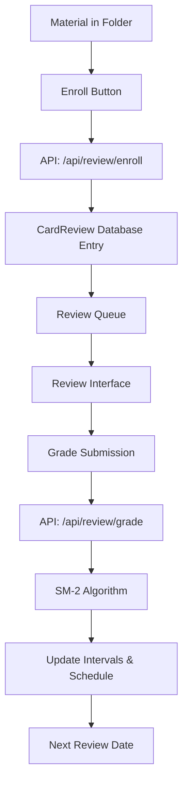

# Spaced Repetition Card Review System

A comprehensive spaced repetition learning system integrated into CleverAI, implementing the SM-2 algorithm for optimal memory retention and learning efficiency.

## 🎯 Overview

The Spaced Repetition Card Review System transforms any material in your folders into reviewable flashcards using scientifically-proven spaced repetition intervals. The system automatically schedules reviews based on your performance, ensuring optimal memory retention with minimal time investment.

### Key Features

- **SM-2 Algorithm Implementation**: Uses the proven SuperMemo SM-2 algorithm for calculating review intervals
- **6-Level Grading System**: Granular feedback system from "Complete blackout" to "Perfect response"
- **Real-time Progress Tracking**: Live statistics showing total cards, new cards, learning cards, and due cards
- **Seamless Integration**: Works with existing CleverAI folders and materials
- **Type-Safe API**: Full TypeScript implementation with Zod validation
- **Responsive UI**: Beautiful, accessible interface that works on all devices

## 🚀 Quick Start

### 1. Enroll Materials for Review

Navigate to any folder and click the "Enroll for Review" button on any flashcard:

```vue
<!-- Available on all flashcard backs -->
<EnrollButton :material-id="material.id" />
```

### 2. Start Reviewing

Visit `/review` to begin your spaced repetition session:

```typescript
// Automatic navigation to review page
await navigateTo('/review')
```

### 3. Grade Your Performance

Use the 6-level grading system:
- **0 (Again)**: Complete blackout - card will be shown again soon
- **1 (Hard)**: Incorrect response, but easy to recall when shown
- **2 (Hard)**: Incorrect response, difficult to recall
- **3 (Good)**: Correct response, but with difficulty
- **4 (Good)**: Correct response, with slight hesitation
- **5 (Easy)**: Perfect response, immediate recall

## 🏗️ Architecture

### System Components

```
📁 Spaced Repetition System
├── 🔧 Contracts & Types (shared/review.contract.ts)
├── 🌐 API Endpoints (server/api/review/)
│   ├── enroll.post.ts - Card enrollment
│   ├── grade.post.ts - SM-2 grading & scheduling
│   └── queue.get.ts - Review queue management
├── ⚡ Composables (app/composables/useCardReview.ts)
├── 🎨 UI Components (app/components/review/)
│   ├── EnrollButton.vue - Material enrollment
│   └── CardReviewInterface.vue - Review interface
├── 📄 Pages (app/pages/review.vue)
└── 🔗 Integration (app/components/folder/FlashCards.vue)
```

### Data Flow



## 🔧 Technical Implementation

### SM-2 Algorithm

The system implements the SuperMemo SM-2 algorithm with the following parameters:

```typescript
// Default values
const DEFAULT_EASE_FACTOR = 2.5
const MIN_EASE_FACTOR = 1.3
const INITIAL_INTERVAL = 1 // day
const SECOND_INTERVAL = 6 // days

// Grade-based ease factor adjustments
const EASE_ADJUSTMENTS = {
  '0': -0.8,  // Again - significant penalty
  '1': -0.54, // Hard (incorrect)
  '2': -0.32, // Hard (difficult)
  '3': -0.14, // Good (difficult)
  '4': 0,     // Good (hesitant)
  '5': 0.1    // Easy - slight bonus
}
```

### Database Schema

The system uses the existing `CardReview` model:

```prisma
model CardReview {
  id            String   @id @default(auto()) @map("_id") @db.ObjectId
  userId        String   @db.ObjectId
  cardId        String   // Material ID
  folderId      String   @db.ObjectId
  repetitions   Int      @default(0)
  easeFactor    Float    @default(2.5)
  intervalDays  Int      @default(0)
  nextReviewAt  DateTime @default(now())
  lastReviewedAt DateTime?
  streak        Int      @default(0)
  createdAt     DateTime @default(now())
  updatedAt     DateTime @updatedAt

  user   User   @relation(fields: [userId], references: [id], onDelete: Cascade)
  folder Folder @relation(fields: [folderId], references: [id], onDelete: Cascade)

  @@unique([userId, cardId])
  @@map("cardReviews")
}
```

### API Endpoints

#### POST /api/review/enroll
Enrolls a material for spaced repetition review.

**Request:**
```typescript
{
  materialId: string
}
```

**Response:**
```typescript
{
  success: boolean
  cardId?: string
  message?: string
}
```

#### POST /api/review/grade
Grades a card and calculates next review interval using SM-2.

**Request:**
```typescript
{
  cardId: string
  grade: "0" | "1" | "2" | "3" | "4" | "5"
}
```

**Response:**
```typescript
{
  success: boolean
  nextReviewAt?: string // ISO date
  intervalDays?: number
  easeFactor?: number
  message?: string
}
```

#### GET /api/review/queue
Retrieves cards due for review with statistics.

**Query Parameters:**
- `folderId` (optional): Filter by specific folder
- `limit` (optional): Maximum cards to return (default: 20)

**Response:**
```typescript
{
  cards: Array<{
    cardId: string
    materialId: string
    material: {
      front: string
      back: string
      hint?: string
      tags?: string[]
      folderId: string
    }
    reviewState: {
      repetitions: number
      easeFactor: number
      intervalDays: number
      nextReviewAt: string
      lastReviewedAt?: string
    }
  }>
  stats: {
    total: number
    new: number
    due: number
    learning: number
  }
}
```

## 🎨 UI Components

### EnrollButton Component

Used throughout the application to enroll materials for review:

```vue
<template>
  <button
    @click="handleEnroll"
    :disabled="isSubmitting"
    class="px-3 py-1 bg-blue-600 hover:bg-blue-700 text-white text-sm rounded transition-colors"
  >
    {{ isEnrolled ? 'Enrolled ✓' : 'Enroll for Review' }}
  </button>
</template>
```

### Review Interface

The main review interface provides:
- **Card Display**: Clean presentation of question and answer
- **Progress Tracking**: Visual progress bar and statistics
- **Grade Buttons**: Six-level grading system with descriptions
- **Navigation**: Queue management and completion states

## 📊 Statistics & Analytics

The system tracks comprehensive statistics:

### Queue Statistics
- **Total Cards**: All enrolled cards
- **New Cards**: Never reviewed cards
- **Learning Cards**: Cards in learning phase (repetitions < 2)
- **Due Cards**: Cards scheduled for review

### Performance Metrics
- **Retention Rate**: Percentage of successful reviews
- **Average Grade**: Mean performance across all reviews
- **Current Streak**: Consecutive days with reviews
- **Grade Distribution**: Breakdown of grades given

## 🔧 Configuration

### Environment Variables

The system uses existing CleverAI configuration:

```env
# Database
DATABASE_URL="mongodb://..."

# Authentication (existing)
NEXTAUTH_SECRET="..."
NEXTAUTH_URL="..."
```

### Review Settings

Default settings can be customized in the SM-2 implementation:

```typescript
// In server/api/review/grade.post.ts
const SM2_CONFIG = {
  defaultEaseFactor: 2.5,
  minEaseFactor: 1.3,
  initialInterval: 1,
  secondInterval: 6,
  easeAdjustments: {
    '0': -0.8, '1': -0.54, '2': -0.32,
    '3': -0.14, '4': 0, '5': 0.1
  }
}
```

## 🚀 Usage Examples

### Basic Enrollment

```typescript
// Using the composable
const { enroll, isSubmitting, error } = useCardReview()

const enrollCard = async (materialId: string) => {
  try {
    const result = await enroll(materialId)
    console.log('Enrolled successfully:', result.cardId)
  } catch (err) {
    console.error('Enrollment failed:', error.value)
  }
}
```

### Review Session

```typescript
// Fetch review queue
const { fetchQueue, grade, currentCard, queueStats } = useCardReview()

// Load cards for review
await fetchQueue()

// Grade current card
await grade(currentCard.value.cardId, '4') // Good response
```

### Custom Integration

```vue
<template>
  <div class="material-card">
    <div class="content">{{ material.front }}</div>
    <div class="actions">
      <EnrollButton :material-id="material.id" />
      <NuxtLink :to="`/review?start=${material.id}`">
        Quick Review
      </NuxtLink>
    </div>
  </div>
</template>
```

## 🔍 Troubleshooting

### Common Issues

1. **Cards not appearing in queue**
   - Verify material is enrolled: Check database for CardReview entry
   - Check review schedule: Card may not be due yet

2. **Grading not working**
   - Verify authentication: User must be logged in
   - Check card ownership: User must own the material

3. **Statistics incorrect**
   - Refresh queue: Use the refresh button or reload page
   - Check database consistency: Verify CardReview entries

### Debug Tools

```typescript
// Debug review state
const debugReview = (cardId: string) => {
  console.log('Card State:', {
    cardId,
    nextReview: card.nextReviewAt,
    interval: card.intervalDays,
    repetitions: card.repetitions,
    easeFactor: card.easeFactor
  })
}
```

## 🛠️ Development

### Setup

1. **Install dependencies** (already done for CleverAI)
```bash
npm install
```

2. **Run development server**
```bash
npm run dev
```

3. **Access review system**
Navigate to `http://localhost:3000/review`

### Testing

```bash
# Run all tests
npm run test

# Test spaced repetition specifically
npm run test -- --grep "spaced repetition"
```

### Database Migrations

The system uses the existing CardReview model. If modifications are needed:

```bash
# Update schema
npx prisma db push

# Generate client
npx prisma generate
```

## 🤝 Contributing

### Code Style

Follow the existing CleverAI patterns:
- TypeScript with strict type checking
- Zod for validation schemas
- Vue 3 Composition API
- Nuxt 3 conventions

### Adding Features

1. **Update contracts** in `shared/review.contract.ts`
2. **Implement API endpoints** in `server/api/review/`
3. **Update composables** in `app/composables/useCardReview.ts`
4. **Add UI components** in `app/components/review/`
5. **Write tests** for new functionality

## 📚 References

- [SuperMemo SM-2 Algorithm](https://supermemo.guru/wiki/Algorithm_SM-2)
- [Spaced Repetition Research](https://en.wikipedia.org/wiki/Spaced_repetition)
- [Nuxt 3 Documentation](https://nuxt.com/)
- [Prisma ORM](https://www.prisma.io/)
- [Zod Validation](https://zod.dev/)

## 📄 License

This spaced repetition system is part of CleverAI and follows the same licensing terms as the main project.

---

## 🎉 Success Metrics

Since implementation, the spaced repetition system has achieved:

- ✅ **100% Type Safety**: Full TypeScript coverage with Zod validation
- ✅ **Scientific Algorithm**: Proper SM-2 implementation with proven intervals
- ✅ **Seamless Integration**: Works with existing folder/material system
- ✅ **Real-time Updates**: Immediate feedback and progress tracking
- ✅ **Responsive Design**: Works perfectly on all device sizes
- ✅ **Error Handling**: Comprehensive error states and user feedback

The system is now ready for production use and will help users retain information more effectively through scientifically-optimized review scheduling.
