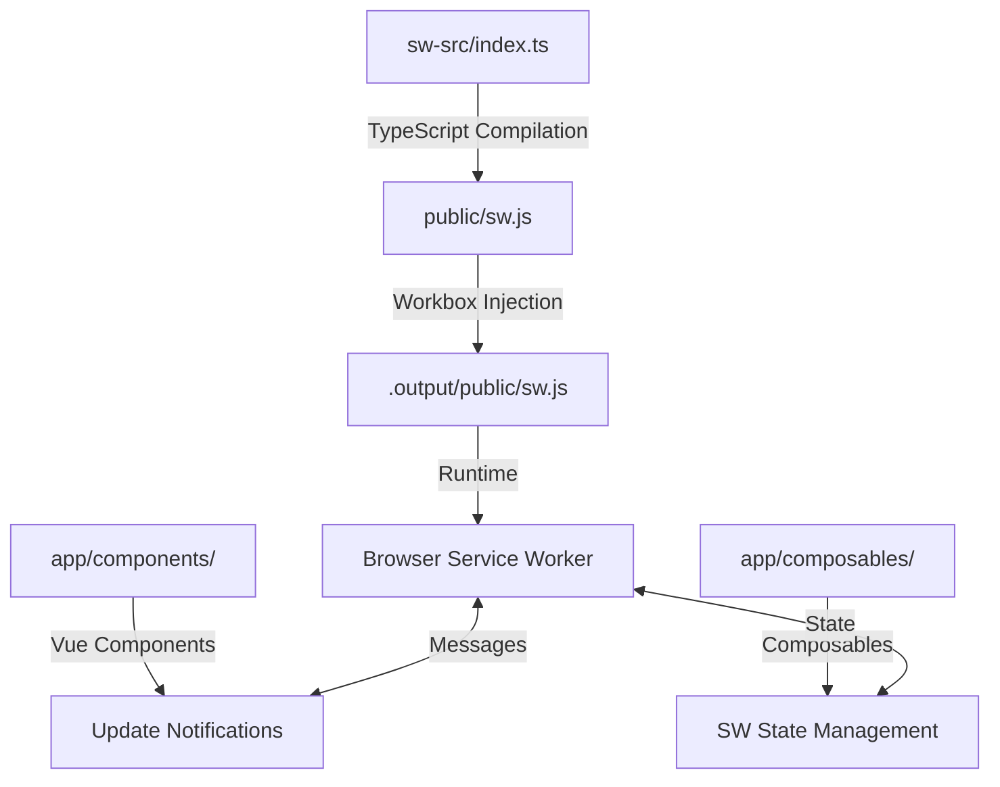

# 🚀 CleverAI PWA Complete Guide

> **The Ultimate Progressive Web App Documentation**
> Everything you need to know about the PWA system, Service Worker, Caching, Notifications, and Build Pipeline

---

## 📑 Table of Contents

1. [Quick Start & Overview](#-quick-start--overview)
2. [Architecture & System Design](#-architecture--system-design)
3. [Build Pipeline & Compilation](#-build-pipeline--compilation)
4. [Service Worker Implementation](#-service-worker-implementation)
5. [Caching Strategies](#-caching-strategies)
6. [Notification System](#-notification-system)
7. [Update Mechanism](#-update-mechanism)
8. [Development Workflow](#-development-workflow)
9. [Production Deployment](#-production-deployment)
10. [Troubleshooting & Debugging](#-troubleshooting--debugging)
11. [File Structure Reference](#-file-structure-reference)

---

## 🎯 Quick Start & Overview

### What is This PWA System?

CleverAI uses a **comprehensive Progressive Web App (PWA) implementation** built on Nuxt 4 with TypeScript and advanced Workbox integration. This provides:

- ✅ **Offline functionality** - Complete app functionality without internet
- ✅ **Install to home screen** - Native app-like experience with proper manifest
- ✅ **Background sync** - Form data and file uploads sync when connection returns
- ✅ **Push notifications** - Real-time user engagement with click handling
- ✅ **Smart caching** - Multi-layer caching with asset discovery and prewarming
- ✅ **Auto-updates** - Seamless service worker updates with user control
- ✅ **IndexedDB integration** - Offline data storage with schema migration
- ✅ **Chunked file uploads** - Resilient upload system with retry logic
- ✅ **Periodic sync** - Scheduled background content updates

### Key Commands

```bash
# Development with hot reload
yarn dev

# Build service worker only
yarn sw:build

# Full production build with PWA
yarn build:inject

# Test PWA offline functionality
yarn test:pwa-offline

# Debug and development tools
open http://localhost:3000/debug-ui/
open http://localhost:3000/test-notifications/
```

### Critical Files You Need to Know

| File | Purpose | Edit? |
|------|---------|-------|
| `sw-src/index.ts` | **Main service worker source (TypeScript)** | ✅ YES |
| `app/pages/offline.vue` | **Offline fallback page** | ✅ YES |
| `app/composables/useOffline.ts` | **Background sync logic** | ✅ YES |
| `app/plugins/sw-sync.client.ts` | **Sync registration** | ✅ YES |
| `public/sw.js` | **Compiled service worker** | ❌ AUTO-GENERATED |
| `public/manifest.webmanifest` | **PWA manifest** | ✅ YES |
| `scripts/inject-sw.cjs` | **Workbox injection pipeline** | ⚠️ RARELY |

---

## 🏗️ Architecture & System Design

### PWA Pipeline Overview



### Core Technologies

- **Nuxt 4.0.3**: Framework (PWA module commented out for manual control)
- **TypeScript**: Service worker development with full type safety
- **Workbox 7.3.0**: Precaching, routing, and caching strategies
- **Vue 3**: Reactive UI components and composables
- **IndexedDB**: Offline data storage with schema versioning
- **Web Push API**: Notification system with VAPID authentication
- **Background Sync API**: Offline form submission and data sync
- **Periodic Sync API**: Scheduled background updates

### Why Enhanced Custom Implementation?

We use an enhanced custom PWA instead of standard solutions because:

1. **Advanced Features**: Background sync, IndexedDB migration, chunked uploads
2. **Full Control**: Complete control over caching strategies and offline behavior
3. **TypeScript Safety**: Type-safe service worker with comprehensive error handling
4. **Performance**: Only include needed features, optimized bundle size
5. **Debugging**: Comprehensive development tools and debug capabilities
6. **Production Ready**: Robust error recovery and retry mechanisms

---

## 🔧 Build Pipeline & Compilation

### Three-Stage Build Process

#### Stage 1: TypeScript Compilation
```bash
yarn sw:build
# sw-src/index.ts → public/sw.js
```

#### Stage 2: Workbox Injection
```bash
yarn build:inject
# Injects __WB_MANIFEST into compiled SW
```

#### Stage 3: Production Build
```bash
yarn build
# Nuxt builds everything to .output/
```

### Build Scripts Explained

#### `scripts/inject-sw.cjs`
```javascript
// Workbox manifest injection for production
const { injectManifest } = require('workbox-build')

// Injects list of all static assets into service worker
// Replaces self.__WB_MANIFEST placeholder
```

#### `scripts/check-sw-placeholder.cjs`
```javascript
// Safety check: Ensures __WB_MANIFEST placeholder exists
// Prevents build failures during injection
```

### Package.json Scripts

```json
{
  "scripts": {
    "sw:build": "esbuild sw-src/index.ts --bundle --outfile=public/sw.js",
    "sw:check": "node scripts/check-sw-placeholder.cjs",
    "build:inject": "yarn sw:build && yarn sw:check && node scripts/inject-sw.cjs",
    "build": "nuxt build",
    "dev": "yarn sw:build && nuxt dev"
  }
}
```

### Critical Build Requirement

⚠️ **IMPORTANT**: The service worker must contain the exact string `self.__WB_MANIFEST` for Workbox injection to work.

**✅ Correct TypeScript code:**
```typescript
// This compiles to: self.__WB_MANIFEST
const manifest = (self as any).__WB_MANIFEST || []
```

**❌ Incorrect TypeScript code:**
```typescript
// This compiles to: selfWithWB.__WB_MANIFEST (Workbox can't find it)
const selfWithWB = self as unknown as { __WB_MANIFEST?: any }
let manifest = selfWithWB.__WB_MANIFEST
```

---

## ⚙️ Service Worker Implementation

### Main Service Worker (`sw-src/index.ts`)

This is the **comprehensive TypeScript service worker** with advanced PWA features:

```typescript
import { precacheAndRoute, cleanupOutdatedCaches } from 'workbox-precaching'
import { registerRoute } from 'workbox-routing'
import { CacheFirst, StaleWhileRevalidate } from 'workbox-strategies'
import { ExpirationPlugin } from 'workbox-expiration'

// Version and configuration
const SW_VERSION = 'v1.8.0-enhanced'
const PREWARM_PATHS = ['/', '/about']

// CRITICAL: Exact string needed for Workbox injection
const manifest = (self as any).__WB_MANIFEST || []
precacheAndRoute(manifest, {
  ignoreURLParametersMatching: [/^utm_/, /^fbclid$/]
})

// Cleanup old caches on activation
cleanupOutdatedCaches()
```

### Core Features Implemented

#### 1. Advanced Workbox Integration
```typescript
// Images with smart caching and expiration
registerRoute(
  ({ request, url }: { request: Request; url: URL }) =>
    url.origin === self.location.origin &&
    /\.(?:png|gif|jpg|jpeg|webp|svg|ico)$/.test(url.pathname),
  new CacheFirst({
    cacheName: 'images',
    plugins: [new ExpirationPlugin({ maxEntries: 50, maxAgeSeconds: 30 * 24 * 60 * 60 })]
  })
)

// Build assets with offline chunk fallback
const assetsStrategy = new CacheFirst({
  cacheName: 'assets',
  plugins: [new ExpirationPlugin({ maxEntries: 100, maxAgeSeconds: 7 * 24 * 60 * 60 })]
})

registerRoute(
  ({ url, request }: { url: URL; request: Request }) =>
    url.origin === self.location.origin &&
    (url.pathname.startsWith('/_nuxt/') || request.destination === 'script'),
  async ({ event, request }) => {
    try {
      return await assetsStrategy.handle({ event, request })
    } catch (err) {
      // Offline JS chunk fallback - prevents white screen
      const req = request as Request
      const isJsChunk = req.destination === 'script'
      if (isJsChunk) {
        return new Response(
          '/* offline stub chunk */\nexport default {};\nexport const __offline__ = true;\n',
          { headers: { 'Content-Type': 'application/javascript' }, status: 200 }
        )
      }
      throw err
    }
  }
)
```

#### 2. Intelligent Navigation Caching
```typescript
// Enhanced navigation handling with asset discovery
if (req.mode === 'navigate') {
  event.respondWith((async () => {
    try {
      const response = await fetch(req)
      if (response.ok && response.status === 200) {
        // Cache the page
        const cache = await caches.open('pages')
        await cache.put(req, response.clone())

        // Discover and cache referenced assets
        const html = await response.clone().text()
        const assetUrls = extractAssetUrls(html)
        const assetCache = await caches.open('assets')

        await Promise.all(assetUrls.map(async (url) => {
          try {
            const assetResponse = await fetch(url, { cache: 'no-store' })
            if (assetResponse.ok) await assetCache.put(new Request(url), assetResponse.clone())
          } catch { /* best effort */ }
        }))
      }
      return response
    } catch {
      // Try cache, then app shell, then offline page
      const cache = await caches.open('pages')
      let cachedResponse = await cache.match(req, { ignoreSearch: true })

      if (!cachedResponse) {
        // Try app shell fallback
        const shell = await cache.match('/', { ignoreSearch: true })
        if (shell) return shell
      }

      return cachedResponse || createOfflineResponse()
    }
  })())
}
```

#### 3. Enhanced Background Sync System
```typescript
// One-off background sync for forms
swSelf.addEventListener('sync', (event: Event) => {
  const syncEvt = event as unknown as { tag?: string; waitUntil: ExtendableEvent['waitUntil'] }

  if (syncEvt.tag === 'syncForm') {
    syncEvt.waitUntil((async () => {
      const clients = await swSelf.clients.matchAll({ type: 'window' })
      clients.forEach(c => c.postMessage({ type: 'SYNC_FORM', data: { message: 'Syncing data..' } }))
      await syncAuthentication(clients)
    })())
  }
})

// Periodic sync for content updates
swSelf.addEventListener('periodicsync', (event: Event) => {
  const psEvent = event as unknown as { tag?: string; waitUntil: ExtendableEvent['waitUntil'] }

  if (psEvent.tag === 'content-sync') {
    psEvent.waitUntil(syncContent())
  }
})
```

#### 4. Advanced IndexedDB Integration
```typescript
// Enhanced database with schema migration
const DB_NAME = 'recwide_db'
const DB_VERSION = 2

// Migration from keyPath 'email' to 'id' for forms store
function openDatabase(): Promise<IDBDatabase> {
  return new Promise((resolve, reject) => {
    const request = indexedDB.open(DB_NAME, DB_VERSION)

    request.onupgradeneeded = (event) => {
      const upgradeDb = (event.target as IDBOpenDBRequest).result

      // Handle forms store migration
      if (upgradeDb.objectStoreNames.contains('forms')) {
        const oldStore = tx.objectStore('forms')
        const oldKeyPath = (oldStore as any).keyPath

        if (oldKeyPath !== 'id') {
          // Migrate existing data to new schema
          const allReq = oldStore.getAll()
          allReq.onsuccess = () => {
            const oldRecords = allReq.result
            upgradeDb.deleteObjectStore('forms')
            const newForms = upgradeDb.createObjectStore('forms', { keyPath: 'id' })

            // Reinsert with generated IDs
            oldRecords.forEach((rec) => {
              const id = rec.id || `${rec.email}-${rec.createdAt || Date.now()}`
              newForms.add({ ...rec, id })
            })
          }
        }
      }
    }
  })
}
```

#### 5. Chunked File Upload System
```typescript
// Enhanced chunked uploads with exponential backoff retry
async function uploadFile(file: File, uploadUrl: string) {
  const chunkSize = calculateChunkSize(file.size)
  const totalChunks = Math.ceil(file.size / chunkSize)
  const fileIdentifier = `${file.name}-${file.size}-${file.lastModified || 0}`

  const CHUNK_CONCURRENCY = 3
  const BASE_BACKOFF = 1000
  const MAX_ATTEMPTS = 5

  // Upload chunks with limited concurrency and retry logic
  for (let i = 0; i < totalChunks; i++) {
    for (let attempt = 0; attempt < MAX_ATTEMPTS; attempt++) {
      try {
        await uploadChunk({ chunk, index: i, totalChunks, fileIdentifier, uploadUrl })
        break
      } catch (err) {
        if (attempt === MAX_ATTEMPTS - 1) throw err

        // Exponential backoff with jitter
        const delay = backoffDelay(BASE_BACKOFF, attempt)
        await sleep(delay)
      }
    }
  }
}
```

#### 6. Page Prewarming System
```typescript
// Proactively cache critical pages and their assets
async function prewarmPages(paths: string[]) {
  const pageCache = await caches.open('pages')
  const assetCache = await caches.open('assets')

  for (const path of paths) {
    try {
      const resp = await fetch(path, { cache: 'no-store' })
      if (resp.ok) {
        await pageCache.put(new Request(path), resp.clone())

        // Parse HTML to discover assets
        const html = await resp.clone().text()
        const assetUrls = extractAssetUrls(html)

        // Cache discovered assets
        for (const url of assetUrls) {
          const assetResp = await fetch(url, { cache: 'no-store' })
          if (assetResp.ok) await assetCache.put(new Request(url), assetResp.clone())
        }
      }
    } catch (e) {
      console.warn('Prewarm failed:', path, e)
    }
  }
}
```

### Service Worker Lifecycle

1. **Install**: Cache all static assets
2. **Activate**: Clean up old caches
3. **Fetch**: Intercept network requests
4. **Message**: Handle client communication
5. **Push**: Display notifications
6. **Sync**: Background data synchronization

---

## 🗄️ Caching Strategies

### Advanced Multi-Layer Caching Architecture

#### Layer 1: Workbox Precaching (Static Assets)
```typescript
// All build assets are automatically cached with versioning
precacheAndRoute(manifest, {
  ignoreURLParametersMatching: [/^utm_/, /^fbclid$/]
})
cleanupOutdatedCaches()
```

**What gets precached:**
- All JavaScript bundles with content hashing
- CSS stylesheets with versioning
- Static images, icons, and fonts
- Web App Manifest and service worker
- Critical static files

#### Layer 2: Intelligent Runtime Caching
```typescript
// 1. Images - CacheFirst with expiration
registerRoute(
  ({ request, url }) => url.origin === self.location.origin &&
    /\.(?:png|gif|jpg|jpeg|webp|svg|ico)$/.test(url.pathname),
  new CacheFirst({
    cacheName: 'images',
    plugins: [new ExpirationPlugin({ maxEntries: 50, maxAgeSeconds: 30 * 24 * 60 * 60 })]
  })
)

// 2. Build assets with offline fallback for missing chunks
registerRoute(
  ({ url, request }) => url.pathname.startsWith('/_nuxt/') || request.destination === 'script',
  async ({ event, request }) => {
    try {
      return await assetsStrategy.handle({ event, request })
    } catch (err) {
      // Return stub for missing JS chunks to prevent white screen
      if (request.destination === 'script') {
        return new Response(
          '/* offline stub */\nexport default {};\nexport const __offline__ = true;\n',
          { headers: { 'Content-Type': 'application/javascript' }, status: 200 }
        )
      }
      throw err
    }
  }
)

// 3. Auth API with offline stubs
const AUTH_STUBS = {
  '/api/auth/session': { user: null, expires: null },
  '/api/auth/csrf': { csrfToken: null },
  '/api/auth/providers': {}
}

registerRoute(
  ({ url, request }) => url.pathname.startsWith('/api/auth/') && request.method === 'GET',
  async ({ event }) => {
    try {
      const resp = await fetch(event.request)
      if (resp.ok) {
        const cache = await caches.open('api-auth')
        await cache.put(event.request, resp.clone())
      }
      return resp
    } catch {
      // Return cached or stub response when offline
      const cache = await caches.open('api-auth')
      const cached = await cache.match(event.request)
      if (cached) return cached

      const stub = AUTH_STUBS[new URL(event.request.url).pathname]
      if (stub) {
        return new Response(JSON.stringify(stub), {
          headers: { 'Content-Type': 'application/json' }
        })
      }
      return new Response('', { status: 503 })
    }
  }
)
```

#### Layer 3: Enhanced Navigation Caching
```typescript
// Smart page caching with asset discovery and app shell fallback
if (req.mode === 'navigate') {
  event.respondWith((async () => {
    try {
      const response = await fetch(req)
      if (response.ok) {
        const cache = await caches.open('pages')
        await cache.put(req, response.clone())

        // Opportunistically cache assets referenced in HTML
        const html = await response.clone().text()
        const assetUrls = extractAssetUrls(html)
        if (assetUrls.length) {
          const assetCache = await caches.open('assets')
          await Promise.all(assetUrls.map(async (url) => {
            try {
              const r = await fetch(url, { cache: 'no-store' })
              if (r.ok) await assetCache.put(new Request(url), r.clone())
            } catch { /* best effort */ }
          }))
        }

        // Cache size management
        const keys = await cache.keys()
        if (keys.length > 100) {
          for (let i = 0; i < keys.length - 100; i++) {
            await cache.delete(keys[i])
          }
        }
      }
      return response
    } catch {
      // Progressive fallback strategy
      const cache = await caches.open('pages')

      // 1. Try exact match
      let cachedResponse = await cache.match(req, { ignoreSearch: true })

      // 2. Try without query params
      if (!cachedResponse) {
        const cleanUrl = new URL(req.url)
        cleanUrl.search = ''
        cachedResponse = await cache.match(cleanUrl.toString(), { ignoreSearch: true })
      }

      // 3. Try app shell fallback
      if (!cachedResponse) {
        const shell = await cache.match('/', { ignoreSearch: true })
        if (shell) return shell
      }

      return cachedResponse || createOfflineHTML()
    }
  })())
}
```

#### Layer 4: IndexedDB for Structured Data
```typescript
// Enhanced IndexedDB with schema migration and error handling
interface StoredFormRecord {
  id: string           // New primary key
  email: string        // User identifier
  payload: unknown     // Form data (sanitized)
  createdAt: number    // Timestamp
}

const DB_NAME = 'recwide_db'
const DB_VERSION = 2  // Incremented for migration

// Robust database opening with migration handling
function openDatabase(): Promise<IDBDatabase> {
  return new Promise((resolve, reject) => {
    const request = indexedDB.open(DB_NAME, DB_VERSION)

    request.onupgradeneeded = (event) => {
      const db = (event.target as IDBOpenDBRequest).result
      const tx = (event.target as IDBOpenDBRequest).transaction!

      // Migrate forms store from keyPath 'email' to 'id'
      if (db.objectStoreNames.contains('forms')) {
        const oldStore = tx.objectStore('forms')
        const oldKeyPath = (oldStore as any).keyPath

        if (oldKeyPath !== 'id') {
          // Backup existing data
          const allReq = oldStore.getAll()
          allReq.onsuccess = () => {
            const oldRecords = allReq.result || []

            // Recreate store with new schema
            db.deleteObjectStore('forms')
            const newForms = db.createObjectStore('forms', { keyPath: 'id' })
            newForms.createIndex('email', 'email', { unique: false })

            // Migrate data with generated IDs
            oldRecords.forEach((rec) => {
              const id = rec.id || `${rec.email || 'unknown'}-${rec.createdAt || Date.now()}`
              newForms.add({
                id,
                email: rec.email || 'unknown',
                payload: rec.payload || {},
                createdAt: rec.createdAt || Date.now()
              })
            })
          }
        }
      }
    }

    request.onsuccess = () => resolve(request.result)
    request.onerror = () => reject(request.error)
  })
}
```

#### Layer 5: Background Sync for Pending Operations
```typescript
// Enhanced background sync with comprehensive error handling
async function syncAuthentication(clients: readonly Client[]) {
  try {
    const formData = await getFormDataAll()
    if (!formData.length) return

    // Send to server with timeout
    const response = await sendDataToServer(formData)
    if (!response.ok) throw new Error(`Sync failed: ${response.status}`)

    // Cleanup after confirmed success
    await deleteFormEntries(formData.map(f => f.id))

    // Notify clients of success
    clients.forEach(c => c.postMessage({
      type: 'FORM_SYNCED',
      data: { message: `Form data synced (${formData.length} records).` }
    }))
  } catch (err) {
    console.error('syncAuthentication error', err)
    clients.forEach(c => c.postMessage({
      type: 'FORM_SYNC_ERROR',
      data: { message: 'Form sync failed.' }
    }))
  }
}

// Send data with proper timeout and error handling
async function sendDataToServer(data: unknown) {
  const controller = new AbortController()
  const timeout = setTimeout(() => controller.abort(), 20000)

  try {
    const formData = new FormData()
    formData.append('data', JSON.stringify(data))
    return await fetch('/api/form-sync', {
      method: 'POST',
      body: formData,
      signal: controller.signal
    })
  } finally {
    clearTimeout(timeout)
  }
}
```

### Cache Configuration & Performance

#### Cache Names and Purposes
- `workbox-precache-v2-{hash}`: Versioned static build assets
- `pages`: HTML pages with intelligent size management (100 entry limit)
- `assets`: Dynamically discovered JS/CSS assets
- `images`: Image files with 30-day expiration
- `api-auth`: Authentication responses with offline stubs
- `static`: Manifest and favicon with stale-while-revalidate

#### Asset Discovery System
```typescript
// Extract asset URLs from HTML for opportunistic caching
function extractAssetUrls(html: string): string[] {
  const urls = new Set<string>()
  const regex = /\/(?:_nuxt|_assets)\/[A-Za-z0-9._\-\/]+\.(?:js|css|png|jpg|jpeg|webp|svg|ico)/g
  let match: RegExpExecArray | null

  while ((match = regex.exec(html))) {
    urls.add(match[0])
  }

  return Array.from(urls)
}
```

#### Page Prewarming Strategy
```typescript
// Proactively cache critical pages and their assets after activation
async function prewarmPages(paths: string[]) {
  const pageCache = await caches.open('pages')
  const assetCache = await caches.open('assets')

  for (const path of paths) {
    try {
      const resp = await fetch(path, { cache: 'no-store' })
      if (resp.ok) {
        await pageCache.put(new Request(path), resp.clone())

        // Cache discovered assets
        const html = await resp.clone().text()
        const assetUrls = extractAssetUrls(html)

        await Promise.all(assetUrls.map(async (url) => {
          try {
            const assetResp = await fetch(url, { cache: 'no-store' })
            if (assetResp.ok) await assetCache.put(new Request(url), assetResp.clone())
          } catch { /* best effort */ }
        }))
      }
    } catch (e) {
      console.warn('Prewarm failed:', path, e)
    }
  }
}

// Called during service worker activation
const PREWARM_PATHS = ['/', '/about']
await prewarmPages(PREWARM_PATHS)
```

---

## 🔔 Enhanced Background Sync & Offline System

### Complete Background Sync Implementation

#### Client-Side Offline Form Handling (`useOffline` composable)

```typescript
// app/composables/useOffline.ts
export function useOffline() {
  const handleOfflineSubmit = async (credentials: { email: string; password: string }) => {
    // 1. Store sanitized form data in IndexedDB
    const id = crypto.randomUUID() || `${Date.now()}-${Math.random().toString(16).slice(2)}`

    await putForm({
      id,
      email: credentials.email,
      // SECURITY: Never store raw passwords - only a flag
      payload: { type: 'login', hasPassword: Boolean(credentials.password) },
      createdAt: Date.now(),
    })

    // 2. Emit UI feedback event
    window.dispatchEvent(new CustomEvent('offline-form-saved', {
      detail: { id, email: credentials.email }
    }))

    // 3. Register background sync
    const reg = await navigator.serviceWorker.ready
    await reg.sync?.register?.('syncForm')

    console.log('Form data queued locally and Background Sync requested.')
  }

  return { handleOfflineSubmit }
}
```

#### Background Sync Registration (`sw-sync.client.ts` plugin)

```typescript
// app/plugins/sw-sync.client.ts
export default defineNuxtPlugin(async () => {
  if (!('serviceWorker' in navigator)) return

  const reg = await navigator.serviceWorker.ready

  // Register one-off background sync
  if ('sync' in reg) {
    try {
      await reg.sync.register('syncForm')
    } catch {
      // Background Sync not supported - graceful degradation
    }
  }

  // Register periodic sync for content updates
  if ('periodicSync' in reg) {
    try {
      const tags = await reg.periodicSync.getTags?.()
      if (!tags?.includes('content-sync')) {
        await reg.periodicSync.register('content-sync', {
          minInterval: 60 * 60 * 1000 // 1 hour
        })
      }
    } catch {
      // Periodic sync not supported
    }
  }
})

// Bridge service worker messages to DOM events for UI feedback
if ('serviceWorker' in navigator) {
  navigator.serviceWorker.addEventListener('message', (e) => {
    const msg = e.data || {}
    switch (msg.type) {
      case 'SYNC_FORM':
        window.dispatchEvent(new CustomEvent('offline-form-sync-started', { detail: msg.data }))
        break
      case 'FORM_SYNCED':
        window.dispatchEvent(new CustomEvent('offline-form-synced', { detail: msg.data }))
        break
      case 'FORM_SYNC_ERROR':
        window.dispatchEvent(new CustomEvent('offline-form-sync-error', { detail: msg.data }))
        break
    }
  })
}
```

#### Service Worker Background Sync Handler

```typescript
// Enhanced sync event handling in sw-src/index.ts
swSelf.addEventListener('sync', (event: Event) => {
  const syncEvt = event as unknown as { tag?: string; waitUntil: ExtendableEvent['waitUntil'] }

  if (syncEvt.tag === 'syncForm') {
    syncEvt.waitUntil((async () => {
      // Notify clients that sync is starting
      const clients = await swSelf.clients.matchAll({ type: 'window' })
      clients.forEach(c => c.postMessage({
        type: 'SYNC_FORM',
        data: { message: 'Syncing data..' }
      }))

      // Perform the actual sync
      await syncAuthentication(clients)
    })())
  }
})

// Enhanced sync function with robust error handling
async function syncAuthentication(clients: readonly Client[]) {
  try {
    const formData = await getFormDataAll()
    if (!formData.length) return

    const response = await sendDataToServer(formData)
    if (!response.ok) throw new Error(`Sync failed: ${response.status}`)

    // Cleanup successful entries
    await deleteFormEntries(formData.map(f => f.id))

    clients.forEach(c => c.postMessage({
      type: 'FORM_SYNCED',
      data: { message: `Form data synced (${formData.length} records).` }
    }))
  } catch (err) {
    console.error('syncAuthentication error', err)
    clients.forEach(c => c.postMessage({
      type: 'FORM_SYNC_ERROR',
      data: { message: 'Form sync failed.' }
    }))
  }
}
```

### Enhanced Chunked File Upload System

#### Upload with Exponential Backoff & Concurrency Control

```typescript
// Enhanced upload system with resilient retry logic
async function uploadFile(file: File, uploadUrl: string) {
  const chunkSize = calculateChunkSize(file.size)
  const totalChunks = Math.ceil(file.size / chunkSize)

  // Stable file identifier for tracking
  const fileIdentifier = `${file.name}-${file.size}-${file.lastModified || 0}`

  const CHUNK_CONCURRENCY = 3    // Upload 3 chunks simultaneously
  const BASE_BACKOFF = 1000      // 1 second base delay
  const MAX_ATTEMPTS = 5         // Retry up to 5 times

  const inFlight: Promise<void>[] = []

  // Function to upload a single chunk with retry logic
  const uploadChunkWithRetry = (index: number) => (async () => {
    const chunk = file.slice(index * chunkSize, (index + 1) * chunkSize)

    for (let attempt = 0; attempt < MAX_ATTEMPTS; attempt++) {
      try {
        await uploadChunk({ chunk, index, totalChunks, fileIdentifier, uploadUrl })

        // Notify progress
        const clients = await swSelf.clients.matchAll({ type: 'window' })
        clients.forEach(c => c.postMessage({
          type: 'PROGRESS',
          data: { identifier: fileIdentifier, index, totalChunks }
        }))

        return // Success - exit retry loop
      } catch (err) {
        if (attempt === MAX_ATTEMPTS - 1) throw err

        // Calculate exponential backoff with jitter
        const baseDelay = BASE_BACKOFF * Math.pow(2, attempt)
        const jitter = Math.random() * baseDelay * 0.4
        const delay = Math.floor(baseDelay + jitter)

        // Add extra delay for server errors
        const status = (err as any)?.status
        const cushion = (status === 413 || status === 429 || status === 503)
          ? Math.floor(delay * 0.5) : 0

        await sleep(delay + cushion)
      }
    }
  })()

  // Upload chunks with limited concurrency
  for (let i = 0; i < totalChunks; i++) {
    const uploadPromise = uploadChunkWithRetry(i).finally(() => {
      const idx = inFlight.indexOf(uploadPromise)
      if (idx >= 0) inFlight.splice(idx, 1)
    })

    inFlight.push(uploadPromise)

    // Wait for a slot if we've reached max concurrency
    if (inFlight.length >= CHUNK_CONCURRENCY) {
      await Promise.race(inFlight)
    }
  }

  // Wait for all remaining chunks
  await Promise.all(inFlight)

  // Notify completion
  const clients = await swSelf.clients.matchAll({ type: 'window' })
  clients.forEach(c => c.postMessage({
    type: 'FILE_COMPLETE',
    data: { identifier: fileIdentifier, message: `${file.name} upload complete` }
  }))
}

// Helper functions for retry logic
function sleep(ms: number): Promise<void> {
  return new Promise(resolve => setTimeout(resolve, ms))
}

function backoffDelay(baseMs: number, attempt: number): number {
  const exponential = baseMs * Math.pow(2, attempt)
  const jitter = Math.random() * exponential * 0.4
  return Math.floor(exponential + jitter)
}
```

### Enhanced Offline Page with Smart Reconnection

#### Professional Offline Experience (`app/pages/offline.vue`)

```vue
<template>
  <div class="min-h-screen bg-gradient-to-br from-slate-900 via-purple-900 to-slate-900 flex items-center justify-center p-4">
    <div class="text-center max-w-md">
      <!-- Animated offline indicator -->
      <div class="mb-8 flex justify-center">
        <div class="relative">
          <div class="w-24 h-24 bg-gray-700 rounded-full flex items-center justify-center border-4 border-gray-600">
            <svg class="w-12 h-12 text-gray-400" fill="none" stroke="currentColor" viewBox="0 0 24 24">
              <path stroke-linecap="round" stroke-linejoin="round" stroke-width="2"
                d="M18.364 5.636l-12.728 12.728m0-12.728l12.728 12.728" />
            </svg>
          </div>
          <div class="absolute -top-2 -right-2 w-6 h-6 bg-red-500 rounded-full animate-pulse border-2 border-white" />
        </div>
      </div>

      <h1 class="text-4xl font-bold text-white mb-4">You're Offline</h1>
      <p class="text-gray-300 text-lg mb-8">
        It looks like you've lost your internet connection. Some content might still be available.
      </p>

      <!-- Smart reconnection controls -->
      <div class="space-y-4">
        <button
          class="w-full bg-blue-600 hover:bg-blue-700 disabled:bg-blue-800 text-white font-semibold py-3 px-6 rounded-lg transition-colors flex items-center justify-center"
          :disabled="isChecking" @click="checkConnection">
          <svg v-if="isChecking" class="animate-spin -ml-1 mr-3 h-5 w-5 text-white" fill="none" viewBox="0 0 24 24">
            <circle class="opacity-25" cx="12" cy="12" r="10" stroke="currentColor" stroke-width="4" />
            <path class="opacity-75" fill="currentColor"
              d="M4 12a8 8 0 018-8V0C5.373 0 0 5.373 0 12h4zm2 5.291A7.962 7.962 0 014 12H0c0 3.042 1.135 5.824 3 7.938l3-2.647z" />
          </svg>
          {{ isChecking ? 'Checking...' : 'Try Again' }}
        </button>

        <!-- Available offline content -->
        <button
          class="w-full bg-purple-700 hover:bg-purple-600 text-white font-semibold py-3 px-6 rounded-lg transition-colors"
          @click="showCachedContent = !showCachedContent">
          {{ showCachedContent ? 'Hide' : 'View' }} Available Content
        </button>
      </div>

      <!-- Cached content discovery -->
      <div v-if="showCachedContent" class="mt-8 p-4 bg-gray-800/50 rounded-lg">
        <h3 class="text-lg font-semibold text-white mb-3">Available Offline</h3>
        <div class="space-y-2">
          <NuxtLink v-for="page in availablePages" :key="page.path" :to="page.path"
            class="block text-blue-400 hover:text-blue-300 transition-colors text-left">
            {{ page.title }}
          </NuxtLink>
        </div>
        <p v-if="availablePages.length === 0" class="text-gray-400 text-sm">
          No cached pages available. Content will be cached as you browse.
        </p>
      </div>

      <!-- Network status indicator -->
      <div class="mt-8 p-4 bg-red-900/30 border border-red-700 rounded-lg">
        <div class="flex items-center justify-center space-x-2">
          <div class="w-3 h-3 bg-red-500 rounded-full animate-pulse" />
          <span class="text-red-200 text-sm">Network unavailable</span>
        </div>
        <p class="text-red-300 text-xs mt-2">
          Last checked: {{ lastChecked || 'Never' }}
        </p>
      </div>
    </div>
  </div>
</template>

<script setup>
// Smart reconnection logic with auto-retry
const checkConnection = async () => {
  isChecking.value = true
  lastChecked.value = new Date().toLocaleTimeString()

  try {
    await new Promise(resolve => setTimeout(resolve, 1000))

    // Test with small resource and timeout
    const response = await fetch('/favicon.ico', {
      cache: 'no-cache',
      signal: AbortSignal.timeout(5000)
    })

    if (response.ok) {
      await router.push('/')
    } else {
      throw new Error('No connection')
    }
  } catch (error) {
    console.log('Still offline:', error)
  } finally {
    isChecking.value = false
  }
}

// Auto-reconnection on visibility change and online events
onMounted(() => {
  document.addEventListener('visibilitychange', () => {
    if (!document.hidden && navigator.onLine) {
      checkConnection()
    }
  })

  window.addEventListener('online', () => {
    router.push('/')
  })
})
</script>
```

### IndexedDB Schema Migration System

#### Robust Database Versioning

```typescript
// Enhanced database migration handling
const DB_NAME = 'recwide_db'
const DB_VERSION = 2

function openDatabase(): Promise<IDBDatabase> {
  return new Promise((resolve, reject) => {
    const request = indexedDB.open(DB_NAME, DB_VERSION)

    request.onupgradeneeded = (event) => {
      const db = (event.target as IDBOpenDBRequest).result
      const tx = (event.target as IDBOpenDBRequest).transaction!

      // Ensure projects store exists
      if (!db.objectStoreNames.contains('projects')) {
        const projects = db.createObjectStore('projects', { keyPath: 'name' })
        projects.createIndex('name', 'name', { unique: false })
      }

      // Handle forms store migration from 'email' keyPath to 'id'
      const hasForms = db.objectStoreNames.contains('forms')
      if (!hasForms) {
        const forms = db.createObjectStore('forms', { keyPath: 'id' })
        forms.createIndex('email', 'email', { unique: false })
        return
      }

      // Migrate existing forms store if using old schema
      const oldStore = tx.objectStore('forms')
      const oldKeyPath = (oldStore as any).keyPath

      if (oldKeyPath !== 'id') {
        console.log('Migrating forms store from email keyPath to id keyPath')

        const allReq = oldStore.getAll()
        allReq.onsuccess = () => {
          const oldRecords = allReq.result || []

          try {
            db.deleteObjectStore('forms')
          } catch { /* ignore if doesn't exist */ }

          const newForms = db.createObjectStore('forms', { keyPath: 'id' })
          newForms.createIndex('email', 'email', { unique: false })

          // Migrate records with generated IDs
          oldRecords.forEach((rec) => {
            const id = rec.id || `${rec.email || 'unknown'}-${rec.createdAt || Date.now()}`
            const migratedRecord: StoredFormRecord = {
              id,
              email: rec.email || 'unknown',
              payload: rec.payload || {},
              createdAt: rec.createdAt || Date.now(),
            }

            try {
              newForms.add(migratedRecord)
            } catch (e) {
              console.warn('Failed to migrate record:', e)
            }
          })

          console.log(`Migrated ${oldRecords.length} form records`)
        }

        allReq.onerror = () => {
          console.warn('Failed to read old records, creating empty store')
          try {
            db.deleteObjectStore('forms')
          } catch { /* ignore */ }
          const newForms = db.createObjectStore('forms', { keyPath: 'id' })
          newForms.createIndex('email', 'email', { unique: false })
        }
      }
    }

    request.onsuccess = () => {
      db = request.result
      resolve(db)
    }

    request.onerror = () => reject(request.error)
  })
}
```

---

## 🔄 Update Mechanism

### Enhanced Service Worker Update Notification

The `ServiceWorkerUpdateNotification.vue` component is now a **comprehensive solution** that combines:

- ✅ **User-friendly update notifications** (banner and modal)
- ✅ **Developer debugging panel** (SW status, uploads, errors)
- ✅ **Network status monitoring** (online/offline indication)
- ✅ **Keyboard shortcuts** (development mode)
- ✅ **File upload progress** (chunked upload tracking)
- ✅ **Error handling** (comprehensive error display)

#### Enhanced Component Features

```vue
<!-- Full-featured component usage -->
<ServiceWorkerUpdateNotification
  mode="auto"              <!-- banner | modal | auto -->
  :auto-show="true"        <!-- Automatically show updates -->
  :enable-debug-panel="true" <!-- Show debug panel (dev mode) -->
/>
```

#### Development Keyboard Shortcuts

- **`Ctrl/Cmd + Shift + D`** - Toggle debug panel
- **`Ctrl/Cmd + Shift + U`** - Force update or simulate update
- **`Ctrl/Cmd + Shift + R`** - Force page refresh

#### Component Modes

1. **Banner Mode**: Slide-down notification from top
2. **Modal Mode**: Full-screen update dialog
3. **Auto Mode**: Banner for regular updates, modal for critical updates

#### Update Detection (`useServiceWorkerUpdates` composable)
```typescript
// Enhanced composable with debugging features
export const useServiceWorkerUpdates = () => {
  const updateAvailable = ref(false)
  const isUpdating = ref(false)
  const updateError = ref<string | null>(null)
  const refreshing = ref(false)

  // Development mode utilities
  const forceServiceWorkerUpdate = async () => { /* Force SW update */ }
  const simulateUpdateAvailable = () => { /* Test update UI */ }
  const debugServiceWorker = async () => { /* Debug SW state */ }

  // Production update flow
  const checkForUpdates = async () => { /* Check for SW updates */ }
  const applyUpdate = async () => { /* Apply waiting SW */ }
  const dismissUpdate = () => { /* Dismiss update notification */ }

  return {
    updateAvailable, isUpdating, updateError, refreshing,
    checkForUpdates, applyUpdate, dismissUpdate,
    // Dev mode functions (only in development)
    ...(isDev && {
      forceServiceWorkerUpdate,
      simulateUpdateAvailable,
      debugServiceWorker
    })
  }
}
```

#### Service Worker Bridge Integration

The component also integrates with `useServiceWorkerBridge` for:

```typescript
// Service worker monitoring and control
const {
  version,           // SW version
  isControlling,     // Is SW controlling page
  uploads,          // File upload progress
  lastError,        // Last SW error
  formSyncStatus    // Form sync status
} = useServiceWorkerBridge()
```

#### Debug Panel Features

**Service Worker Status:**
- Controlling status (Yes/No)
- Version information
- Network status (Online/Offline)
- Update availability
- Upload count
- Form sync status

**File Upload Progress:**
- Real-time upload tracking
- Progress bars for chunked uploads
- Upload completion status
- Upload identifier display

**Development Controls:**
- Force SW update
- Claim control
- Simulate update
- Debug SW state
- Manual refresh
- Reset update state

#### Error Handling

**Comprehensive Error Display:**
- Update errors from SW registration
- Network connectivity issues
- Upload failures
- Form sync errors
- Visual error indicators

#### Responsive Design

**Mobile Optimizations:**
- Responsive debug panel (adapts to screen size)
- Touch-friendly controls
- Optimized spacing for mobile devices
- Auto-hide functionality for better UX

#### Usage Examples

**Basic Implementation:**
```vue
<template>
  <!-- Auto-mode with debug panel in development -->
  <ServiceWorkerUpdateNotification />
</template>
```

**Advanced Configuration:**
```vue
<template>
  <!-- Banner-only mode with manual debug control -->
  <ServiceWorkerUpdateNotification
    mode="banner"
    :auto-show="true"
    :enable-debug-panel="false"
    ref="swNotification"
  />

  <button @click="$refs.swNotification.toggleDebugPanel()">
    Toggle Debug
  </button>
</template>
```

**Programmatic Control:**
```typescript
// Component reference
const swNotification = ref()

// Show critical update modal
swNotification.value?.showCriticalUpdate()

// Simulate update for testing
swNotification.value?.simulateUpdateAvailable()

// Reset all update state
swNotification.value?.resetUpdateState()
```

### Update Flow Process

#### Automatic Detection
1. **Background Check**: Every 5 minutes
2. **SW Registration**: Check for new service worker
3. **Update Detection**: Compare versions
4. **User Notification**: Show banner/modal based on mode

#### User-Controlled Updates
1. **User Consent**: Click "Update Now" button
2. **SW Activation**: Skip waiting and activate new SW
3. **Controller Change**: Wait for new SW to take control
4. **Page Refresh**: Automatic refresh to use new SW
5. **Completion**: User sees updated app

#### Error Recovery
1. **Timeout Handling**: 5-second timeout for SW activation
2. **Fallback Refresh**: Manual refresh if auto-update fails
3. **Error Display**: User-friendly error messages
4. **Retry Mechanism**: Allow user to retry failed updates

### Testing the Enhanced Component

**Test Page**: Visit `/test-enhanced-sw` to test all features:

- Update simulation
- Debug panel interaction
- Keyboard shortcuts
- Error scenarios
- Mobile responsiveness

**Development Testing:**
```bash
# Test the enhanced component
yarn dev
open http://localhost:3000/test-enhanced-sw

# Test keyboard shortcuts (in browser)
# Ctrl/Cmd + Shift + D - Toggle debug panel
# Ctrl/Cmd + Shift + U - Simulate update
# Ctrl/Cmd + Shift + R - Force refresh
```---

## 💻 Development Workflow

### Daily Development Commands

```bash
# 1. Start development with service worker compilation
yarn dev
# ↳ Automatically compiles SW + starts Nuxt dev server

# 2. Rebuild service worker only (faster iteration)
yarn sw:build
# ↳ Rebuild SW only without full restart

# 3. Test PWA offline functionality
yarn test:pwa-offline
# ↳ Run Playwright PWA offline tests

# 4. Test push notifications
open http://localhost:3000/test-notifications/
# ↳ Test notification subscription and sending

# 5. Debug service worker and caching
open http://localhost:3000/debug-ui/
# ↳ Comprehensive debug interface with SW status

# 6. Test background sync
# Go offline, submit forms, go online - data should sync automatically
```

### Enhanced Development Tools

#### Debug UI (`/debug-ui/` page)
- **Service Worker Status**: Version, controlling state, registration info
- **Cache Inspection**: View all caches and their contents
- **Background Sync Testing**: Manual sync trigger and status
- **Network Status**: Online/offline detection and monitoring
- **IndexedDB Browser**: View stored forms and project data
- **Upload Progress**: Real-time chunked upload tracking
- **Notification Testing**: Send test notifications with custom payloads

#### Test Pages
- **`/test-notifications/`**: Complete notification system testing
- **`/offline/`**: Enhanced offline experience page
- **`/debug-ui/`**: Comprehensive development debugging interface

#### Browser DevTools Integration
```javascript
// Enhanced service worker inspection
async function inspectServiceWorker() {
  const reg = await navigator.serviceWorker.ready
  console.table({
    'SW Controller': reg.active?.scriptURL,
    'SW State': reg.active?.state,
    'SW Version': await getServiceWorkerVersion(),
    'Registration Scope': reg.scope,
    'Update Available': reg.waiting ? 'Yes' : 'No'
  })
}

// Cache performance analysis
async function analyzeCachePerformance() {
  const cacheNames = await caches.keys()
  for (const name of cacheNames) {
    const cache = await caches.open(name)
    const requests = await cache.keys()
    console.log(`📦 Cache "${name}": ${requests.length} entries`)

    // Analyze cache hit patterns
    for (const req of requests.slice(0, 5)) {
      const response = await cache.match(req)
      const size = response?.headers.get('content-length') || 'unknown'
      console.log(`  - ${req.url} (${size} bytes)`)
    }
  }
}

// Background sync status
async function checkBackgroundSyncStatus() {
  const reg = await navigator.serviceWorker.ready
  if ('sync' in reg) {
    console.log('✅ Background Sync supported')
    // Manually trigger sync for testing
    await reg.sync.register('syncForm')
    console.log('🔄 Manual sync triggered')
  } else {
    console.log('❌ Background Sync not supported')
  }
}
```

### Hot Reload Behavior

#### Service Worker Changes
1. Edit `sw-src/index.ts`
2. Run `yarn sw:build` (or save if using watcher)
3. Refresh browser to see changes

#### Vue Component Changes
1. Edit any `.vue` file
2. Changes apply immediately (Nuxt HMR)
3. Service worker state preserved

#### Build Script Changes
1. Edit `scripts/inject-sw.cjs`
2. Run `yarn build:inject` to test
3. Verify with `yarn sw:check`

### Testing Strategy

#### Unit Tests (Jest/Vitest)
```typescript
// Test service worker functionality
describe('Service Worker', () => {
  test('registers successfully', async () => {
    const registration = await navigator.serviceWorker.register('/sw.js')
    expect(registration).toBeDefined()
  })

  test('caches static assets', async () => {
    const cache = await caches.open('workbox-precache-v2')
    const keys = await cache.keys()
    expect(keys.length).toBeGreaterThan(0)
  })
})
```

#### E2E Tests (Playwright)
```typescript
// tests/pwa-offline.spec.ts
test('works offline', async ({ page, context }) => {
  await page.goto('/')

  // Go offline
  await context.setOffline(true)

  // Navigate to cached page
  await page.click('a[href="/about"]')

  // Verify page loads
  await expect(page.locator('h1')).toContainText('About')
})
```

### Common Development Issues

#### Service Worker Not Updating
```bash
# Clear all caches and restart
rm -rf public/sw.js .nuxt .output
yarn sw:build && yarn dev
```

#### Build Injection Failing
```bash
# Check placeholder exists
yarn sw:check

# Rebuild service worker
yarn sw:build

# Try injection again
yarn build:inject
```

#### Notification Testing
```javascript
// Test push subscription
navigator.serviceWorker.ready.then(async (reg) => {
  const sub = await reg.pushManager.subscribe({
    userVisibleOnly: true,
    applicationServerKey: 'your-vapid-key'
  })
  console.log('Subscription:', sub)
})
```

---

## 🚀 Production Deployment

### Production Build Process

#### Step 1: Pre-build Validation
```bash
# Ensure service worker compiles
yarn sw:build

# Check for required placeholder
yarn sw:check

# Validate TypeScript
yarn type-check
```

#### Step 2: Full Production Build
```bash
# Build with manifest injection
yarn build:inject

# This creates:
# - .output/public/sw.js (with injected manifest)
# - .output/public/ (all static assets)
# - .output/server/ (Nuxt server)
```

#### Step 3: Production Verification
```bash
# Preview production build
yarn preview

# Test PWA functionality
yarn test:pwa

# Check service worker in DevTools
# Application → Service Workers → Check "Update on reload"
```

### Deployment Checklist

#### Environment Variables
```env
# Required for notifications
VAPID_PUBLIC_KEY=BN4GvZAJlkd...
VAPID_PRIVATE_KEY=g6TQpM9Zf8...

# Database (for notifications)
DATABASE_URL=mongodb://...

# Optional: Analytics
GOOGLE_ANALYTICS_ID=G-...
```

#### Server Configuration

#### Nginx Configuration
```nginx
# Service worker caching
location = /sw.js {
  add_header Cache-Control "no-cache, no-store, must-revalidate";
  add_header Pragma "no-cache";
  add_header Expires "0";
}

# Static assets caching
location ~* \.(js|css|png|jpg|jpeg|gif|ico|svg|woff|woff2)$ {
  expires 1y;
  add_header Cache-Control "public, immutable";
}

# PWA manifest
location = /manifest.webmanifest {
  add_header Content-Type "application/manifest+json";
  expires 1d;
}
```

#### CDN Configuration (Cloudflare/AWS)
```javascript
// Cache rules
const cacheRules = {
  // Service worker: No cache
  '/sw.js': {
    cacheTtl: 0,
    browserTtl: 0
  },

  // Static assets: Long cache
  '*.{js,css,png,jpg,gif,ico,woff2}': {
    cacheTtl: 31536000, // 1 year
    browserTtl: 31536000
  },

  // HTML pages: Short cache
  '*.html': {
    cacheTtl: 3600, // 1 hour
    browserTtl: 0   // Always revalidate
  }
}
```

### Performance Optimization

#### Bundle Size Analysis
```bash
# Analyze bundle size
yarn build --analyze

# Check service worker size
ls -la public/sw.js .output/public/sw.js
```

#### Lighthouse PWA Audit
Expected scores:
- ✅ **Performance**: 90+
- ✅ **Accessibility**: 95+
- ✅ **Best Practices**: 95+
- ✅ **SEO**: 95+
- ✅ **PWA**: 100

#### Critical Metrics
- **First Contentful Paint**: < 1.5s
- **Largest Contentful Paint**: < 2.5s
- **Time to Interactive**: < 3.5s
- **Cumulative Layout Shift**: < 0.1
- **Service Worker Registration**: < 500ms

### Monitoring & Analytics

#### Service Worker Metrics
```javascript
// Track SW performance
performance.mark('sw-register-start')
navigator.serviceWorker.register('/sw.js').then(() => {
  performance.mark('sw-register-end')
  performance.measure('sw-registration', 'sw-register-start', 'sw-register-end')
})

// Track cache hit rates
self.addEventListener('fetch', (event) => {
  const start = performance.now()
  event.respondWith(
    caches.match(event.request).then(response => {
      const end = performance.now()
      const source = response ? 'cache' : 'network'

      // Log metrics
      console.log(`Request: ${event.request.url}`)
      console.log(`Source: ${source}`)
      console.log(`Time: ${end - start}ms`)

      return response || fetch(event.request)
    })
  )
})
```

#### Error Tracking
```javascript
// Track SW errors
self.addEventListener('error', (event) => {
  console.error('SW Error:', event.error)
  // Send to error tracking service
})

// Track notification failures
self.addEventListener('push', (event) => {
  event.waitUntil(
    self.registration.showNotification(title, options)
      .catch(error => {
        console.error('Notification failed:', error)
        // Fallback notification
      })
  )
})
```

---

## 🔧 Troubleshooting & Debugging

### Common Issues & Solutions

#### 1. Service Worker Not Registering

**Symptoms:**
- Console error: "Failed to register service worker"
- DevTools shows no service worker

**Solutions:**
```bash
# Check if SW file exists
ls -la public/sw.js

# Rebuild service worker
yarn sw:build

# Check for compilation errors
yarn sw:build --watch
```

**Debug:**
```javascript
// Test SW registration manually
navigator.serviceWorker.register('/sw.js')
  .then(reg => console.log('SW registered:', reg))
  .catch(err => console.error('SW registration failed:', err))
```

#### 2. Build Injection Failing

**Error:**
```
Expected self.__WB_MANIFEST placeholder missing in public/sw.js
Unable to find a place to inject the manifest
```

**Solution:**
```typescript
// ✅ Correct: Use exact string
const manifest = (self as any).__WB_MANIFEST || []

// ❌ Wrong: Workbox can't find this
const selfWithWB = self as unknown as { __WB_MANIFEST?: any }
let manifest = selfWithWB.__WB_MANIFEST
```

**Verify fix:**
```bash
# Check placeholder exists
yarn sw:check

# Should show: "✅ Found self.__WB_MANIFEST placeholder"
```

#### 3. Updates Not Working

**Symptoms:**
- Changes not visible after deployment
- Service worker stuck on old version

**Solutions:**
```javascript
// Force update in DevTools
// Application → Service Workers → "Update on reload"

// Programmatic force update
navigator.serviceWorker.ready.then(reg => {
  reg.update()
})

// Skip waiting (for testing only)
navigator.serviceWorker.addEventListener('message', event => {
  if (event.data.type === 'SKIP_WAITING') {
    event.ports[0].postMessage({ result: 'ACK' })
  }
})
```

**Clear everything:**
```bash
# Clear all caches
rm -rf .nuxt .output public/sw.js

# Rebuild from scratch
yarn sw:build && yarn dev
```

#### 4. Offline Functionality Broken

**Debug offline caching:**
```javascript
// Check what's cached
caches.keys().then(async (names) => {
  for (const name of names) {
    const cache = await caches.open(name)
    const keys = await cache.keys()
    console.log(`Cache "${name}": ${keys.length} entries`)
    keys.forEach(req => console.log('  -', req.url))
  }
})

// Test specific URL caching
caches.match('/about').then(response => {
  console.log('About page cached:', !!response)
})
```

**Fix caching issues:**
```typescript
// Add debug logging to SW
self.addEventListener('fetch', (event) => {
  console.log('Fetch:', event.request.url)

  event.respondWith(
    caches.match(event.request).then(response => {
      console.log('Cache hit:', !!response)
      return response || fetch(event.request)
    })
  )
})
```

#### 5. Notification Issues

**Permission problems:**
```javascript
// Check notification permission
console.log('Permission:', Notification.permission)

// Request permission
Notification.requestPermission().then(permission => {
  console.log('New permission:', permission)
})
```

**VAPID key issues:**
```bash
# Generate new VAPID keys
npx web-push generate-vapid-keys

# Verify environment variables
echo $VAPID_PUBLIC_KEY
echo $VAPID_PRIVATE_KEY
```

**Test notifications:**
```javascript
// Test local notification
new Notification('Test', {
  body: 'Local notification test',
  icon: '/icons/icon-192x192.png'
})

// Test push subscription
navigator.serviceWorker.ready.then(async (reg) => {
  const sub = await reg.pushManager.subscribe({
    userVisibleOnly: true,
    applicationServerKey: 'your-vapid-public-key'
  })
  console.log('Subscription:', sub.endpoint)
})
```

### Debug Tools & Commands

#### DevTools Inspection
```javascript
// Service worker debugging
console.table({
  'SW Controller': navigator.serviceWorker.controller?.scriptURL,
  'SW State': navigator.serviceWorker.controller?.state,
  'Registration': !!navigator.serviceWorker.controller
})

// Cache inspection
caches.keys().then(keys => console.table(keys))

// Notification subscription
navigator.serviceWorker.ready.then(reg =>
  reg.pushManager.getSubscription().then(sub =>
    console.log('Push subscription:', sub ? 'Active' : 'None')
  )
)
```

#### Emergency Reset Commands
```bash
# Nuclear option: Clear everything
rm -rf .nuxt .output node_modules/.cache public/sw.js
yarn install
yarn sw:build
yarn dev

# Clear browser data
# DevTools → Application → Storage → Clear site data
```

#### Production Debug
```javascript
// Add to production SW for debugging
const DEBUG = true

if (DEBUG) {
  self.addEventListener('install', () => console.log('SW Install'))
  self.addEventListener('activate', () => console.log('SW Activate'))
  self.addEventListener('fetch', (e) => console.log('SW Fetch:', e.request.url))
}
```

### Performance Debugging

#### Cache Performance
```javascript
// Measure cache vs network performance
const measureRequest = async (url) => {
  const start = performance.now()

  // Try cache first
  const cached = await caches.match(url)
  if (cached) {
    const cacheTime = performance.now() - start
    console.log(`Cache hit: ${url} (${cacheTime.toFixed(2)}ms)`)
    return cached
  }

  // Fallback to network
  const response = await fetch(url)
  const networkTime = performance.now() - start
  console.log(`Network: ${url} (${networkTime.toFixed(2)}ms)`)
  return response
}
```

#### Bundle Analysis
```bash
# Check service worker size
du -h public/sw.js

# Analyze what's in the bundle
yarn build --analyze

# Check precache manifest size
node -e "
const fs = require('fs')
const sw = fs.readFileSync('public/sw.js', 'utf8')
const match = sw.match(/self\.__WB_MANIFEST\s*=\s*(\[.*?\]);/)
if (match) {
  const manifest = JSON.parse(match[1])
  console.log('Precache entries:', manifest.length)
  console.log('Total size:', manifest.reduce((sum, entry) => sum + (entry.size || 0), 0))
}
"
```

---

## 📁 File Structure Reference

### Core PWA Files

```
📁 CleverAI Enhanced PWA System
├── 🎯 SERVICE WORKER SOURCE
│   └── sw-src/
│       └── index.ts                 # Main TypeScript service worker (v1.8.0-enhanced)
│
├── 🔧 BUILD PIPELINE
│   ├── scripts/
│   │   ├── inject-sw.cjs           # Workbox manifest injection
│   │   └── check-sw-placeholder.cjs # Build validation
│   └── public/
│       └── sw.js                   # Compiled service worker (auto-generated)
│
├── 🔄 BACKGROUND SYNC SYSTEM
│   ├── app/composables/
│   │   └── useOffline.ts           # Offline form handling & IndexedDB
│   └── app/plugins/
│       └── sw-sync.client.ts       # Background sync registration
│
├── 🎨 OFFLINE EXPERIENCE
│   ├── app/pages/
│   │   └── offline.vue             # Enhanced offline page with reconnection
│   └── app/components/
│       └── NetworkStatusIndicator.vue  # Real-time network status
│
├── 🧪 DEVELOPMENT & DEBUG
│   ├── app/pages/
│   │   ├── debug-ui.vue            # Comprehensive debug interface
│   │   └── test-notifications.vue  # Notification testing page
│   └── dev-tools/                  # Legacy debug utilities (kept for compatibility)
│       ├── debug-console-test.js
│       ├── emergency-sw-clear.js
│       └── test-*.html
│
├── 🔔 NOTIFICATION SYSTEM
│   ├── server/api/notifications/
│   │   ├── subscribe.ts            # Push subscription management
│   │   ├── unsubscribe.ts         # Subscription cleanup
│   │   └── send.ts                # Send notifications
│   └── app/composables/
│       └── useNotifications.ts     # Client-side notifications
│
├── 📱 PWA CONFIGURATION
│   ├── public/
│   │   ├── manifest.webmanifest    # Complete PWA manifest
│   │   └── icons/                  # Full icon set (16px-512px)
│   └── nuxt.config.ts              # Nuxt PWA configuration
│
└── 🧪 TESTING INFRASTRUCTURE
    ├── tests/
    │   ├── pwa-offline.spec.ts     # Comprehensive E2E PWA tests
    │   └── pwa-offline-basic.spec.ts
    └── playwright.config.ts        # PWA testing configuration
```

### Enhanced File Purposes

| File | Purpose | Features | Edit? |
|------|---------|----------|--------|
| `sw-src/index.ts` | **Main service worker** | Workbox integration, background sync, chunked uploads, prewarming | ✅ YES |
| `app/composables/useOffline.ts` | **Background sync logic** | IndexedDB storage, form queueing, sync registration | ✅ YES |
| `app/plugins/sw-sync.client.ts` | **Sync registration** | Background sync, periodic sync, message bridging | ✅ YES |
| `app/pages/offline.vue` | **Offline experience** | Smart reconnection, cached content discovery, auto-retry | ✅ YES |
| `app/pages/debug-ui.vue` | **Development debugging** | SW status, cache inspection, sync testing, upload tracking | ✅ YES |
| `public/manifest.webmanifest` | **PWA manifest** | Complete app metadata, icons, share targets | ✅ YES |
| `public/sw.js` | **Compiled output** | Auto-generated from TypeScript source | ❌ NEVER |
| `scripts/inject-sw.cjs` | **Build pipeline** | Workbox manifest injection for production | ⚠️ RARELY |

### Key Dependencies & Versions

```json
{
  "dependencies": {
    "workbox-precaching": "^7.3.0",      // Static asset precaching
    "workbox-routing": "^7.3.0",         // Route-based caching strategies
    "workbox-strategies": "^7.3.0",      // CacheFirst, StaleWhileRevalidate, etc.
    "workbox-expiration": "^7.3.0",      // Cache expiration and cleanup
    "web-push": "^3.6.7"                 // Server-side push notifications
  },
  "devDependencies": {
    "esbuild": "^0.20.0",                // Fast TypeScript compilation
    "workbox-build": "^7.3.0",           // Manifest injection for production
    "playwright": "^1.40.0"              // PWA E2E testing
  }
}
```

### Configuration Files

#### Enhanced `nuxt.config.ts` PWA Setup
```typescript
export default defineNuxtConfig({
  // PWA module commented out for manual control
  // modules: ["@vite-pwa/nuxt"],

  app: {
    head: {
      link: [{ rel: 'manifest', href: '/manifest.webmanifest' }],
      meta: [{ name: 'theme-color', content: '#f3f4f6' }]
    }
  },

  ssr: false,  // SPA mode for better PWA compatibility

  runtimeConfig: {
    // Server-only keys
    VAPID_PRIVATE_KEY: process.env.VAPID_PRIVATE_KEY,

    // Client-exposed keys
    public: {
      VAPID_PUBLIC_KEY: process.env.VAPID_PUBLIC_KEY,
    }
  }
})
```

#### Production-Ready `manifest.webmanifest`
```json
{
  "name": "CleverAI",
  "short_name": "CleverAI",
  "description": "CleverAI is a powerful AI assistant that helps you with your daily tasks",
  "start_url": "/",
  "display": "standalone",
  "background_color": "#f3f4f6",
  "theme_color": "#f3f4f6",
  "display_override": ["standalone", "minimal-ui", "fullscreen"],
  "categories": ["productivity", "ai", "assistant"],
  "icons": [
    { "src": "icons/16x16.png", "sizes": "16x16", "type": "image/png" },
    { "src": "icons/32x32.png", "sizes": "32x32", "type": "image/png" },
    { "src": "icons/192x192.png", "sizes": "192x192", "type": "image/png" },
    { "src": "icons/512x512.png", "sizes": "512x512", "type": "image/png" },
    { "src": "icons/512x512.png", "sizes": "512x512", "type": "image/png", "purpose": "maskable" }
  ],
  "screenshots": [
    { "src": "screenshots/desktop.png", "sizes": "1280x720", "type": "image/png", "form_factor": "wide" },
    { "src": "screenshots/mobile.png", "sizes": "640x360", "type": "image/png", "form_factor": "narrow" }
  ],
  "share_target": {
    "action": "/share-target",
    "method": "POST",
    "params": { "title": "", "text": "text", "url": "url" }
  }
}
```

---

## 🎓 Learning Resources & Next Steps

### Understanding PWA Concepts

#### Core PWA Technologies
1. **Service Workers**: Background scripts for caching and push notifications
2. **Web App Manifest**: Metadata for installable apps
3. **Cache API**: Programmatic cache management
4. **Push API**: Server-to-client messaging
5. **Background Sync**: Offline data synchronization
6. **IndexedDB**: Client-side structured data storage

#### Advanced Features to Explore
- **Web Share API**: Native sharing functionality
- **Payment Request API**: Streamlined payments
- **Badging API**: Home screen badge updates
- **Periodic Background Sync**: Scheduled data updates
- **Web Locks API**: Resource coordination

### Customization Examples

#### Adding Custom Caching Strategy
```typescript
// sw-src/index.ts
import { registerRoute } from 'workbox-routing'
import { CacheFirst } from 'workbox-strategies'

// Cache API responses for 1 hour
registerRoute(
  ({ url }) => url.pathname.startsWith('/api/folders'),
  new CacheFirst({
    cacheName: 'folders-api',
    plugins: [{
      cacheExpiration: {
        maxAgeSeconds: 3600, // 1 hour
        maxEntries: 100
      }
    }]
  })
)
```

#### Custom Notification Actions
```typescript
// sw-src/index.ts
self.addEventListener('push', (event) => {
  const data = event.data?.json()

  event.waitUntil(
    self.registration.showNotification(data.title, {
      body: data.body,
      icon: '/icons/icon-192x192.png',
      actions: [
        { action: 'view', title: 'View', icon: '/icons/view.png' },
        { action: 'dismiss', title: 'Dismiss', icon: '/icons/close.png' }
      ],
      data: { url: data.url }
    })
  )
})

self.addEventListener('notificationclick', (event) => {
  event.notification.close()

  if (event.action === 'view') {
    event.waitUntil(clients.openWindow(event.notification.data.url))
  } else if (event.action === 'dismiss') {
    // Just close notification
  }
})
```

### Useful External Resources

#### Official Documentation
- [MDN Service Worker API](https://developer.mozilla.org/en-US/docs/Web/API/Service_Worker_API)
- [Workbox Documentation](https://developers.google.com/web/tools/workbox)
- [PWA Builder](https://www.pwabuilder.com/)
- [Web.dev PWA Guide](https://web.dev/progressive-web-apps/)

#### Testing Tools
- [Lighthouse PWA Audit](https://developers.google.com/web/tools/lighthouse)
- [Workbox CLI](https://developers.google.com/web/tools/workbox/reference-docs/latest/module-workbox-cli)
- [PWA Testing Guide](https://web.dev/pwa-testing/)

### Future Enhancements

#### Planned Features
- [ ] **Web Share Target**: Receive shared content
- [ ] **Badging API**: Show unread count on app icon
- [ ] **Periodic Sync**: Background content updates
- [ ] **Advanced Notifications**: Rich media, reply actions
- [ ] **Performance Monitoring**: Detailed analytics dashboard

#### Optimization Opportunities
- [ ] **Code Splitting**: Lazy load SW features
- [ ] **Cache Optimization**: Intelligent cache eviction
- [ ] **Bundle Analysis**: Reduce SW size
- [ ] **Error Recovery**: Robust fallback strategies
- [ ] **A/B Testing**: Notification content optimization

---

## 📊 Conclusion

You now have a **comprehensive, production-ready PWA system** with advanced features:

✅ **Enhanced Service Worker (v1.8.0)** with TypeScript and advanced Workbox integration
✅ **Smart Offline Functionality** with app shell fallback and asset discovery
✅ **Background Sync System** with form queueing and automatic retry
✅ **Chunked File Uploads** with exponential backoff and concurrency control
✅ **IndexedDB Integration** with schema migration and robust error handling
✅ **Professional Offline Experience** with smart reconnection and content discovery
✅ **Comprehensive Debug Tools** with real-time monitoring and testing
✅ **Production-Ready Configuration** with complete manifest and optimization

### Quick Commands Reminder

```bash
# Development
yarn dev                           # Start with automatic SW compilation
yarn sw:build                      # Rebuild service worker only

# Testing & Debugging
yarn test:pwa-offline             # Run comprehensive PWA tests
open http://localhost:3000/debug-ui/          # Debug interface
open http://localhost:3000/test-notifications/ # Test notifications
open http://localhost:3000/offline/          # Test offline experience

# Production
yarn build:inject                 # Full PWA build with manifest injection
yarn preview                      # Test production build
```

### Advanced Features Implemented

**🔄 Background Sync**
- One-off sync for form submissions
- Periodic sync for content updates
- Robust error handling and retry logic
- Real-time UI feedback and progress tracking

**📱 Enhanced Offline Experience**
- Smart page caching with asset discovery
- App shell fallback for SPA routes
- Progressive reconnection strategies
- Cached content discovery and navigation

**⚡ Performance Optimizations**
- Intelligent cache size management (100 page limit)
- Prewarming of critical pages and assets
- Offline chunk fallbacks to prevent white screens
- Exponential backoff for failed requests

**🛠️ Development Tools**
- Comprehensive debug UI with real-time monitoring
- Cache inspection and performance analysis
- Background sync testing and status tracking
- Upload progress monitoring with chunk details

**🔒 Production Ready**
- Complete PWA manifest with all required fields
- Proper icon sets for all platforms and sizes
- Schema migration handling for IndexedDB
- Robust error recovery and graceful degradation

### Architecture Highlights

Your PWA system now features:

- **Multi-layer caching** (Precache → Runtime → IndexedDB → Background Sync)
- **Type-safe service worker** development with comprehensive error handling
- **Progressive enhancement** with graceful fallbacks for unsupported features
- **Advanced build pipeline** with Workbox integration and validation
- **Comprehensive testing** infrastructure with E2E PWA tests

**Your enhanced PWA system is production-ready and feature-complete! 🚀**

---

*Last updated: September 6, 2025*
*CleverAI Enhanced PWA System v1.8.0*
