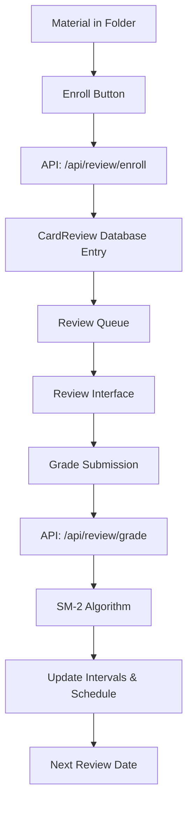

# Spaced Repetition Card Review System

A comprehensive spaced repetition learning system integrated into CleverAI, implementing the SM-2 algorithm for optimal memory retention and learning efficiency. Now featuring advanced analytics, keyboard shortcuts, accessibility features, and enhanced user experience.

## 🎯 Overview

The Spaced Repetition Card Review System transforms any material in your folders into reviewable flashcards using scientifically-proven spaced repetition intervals. The system automatically schedules reviews based on your performance, ensuring optimal memory retention with minimal time investment.

### Key Features

- **SM-2 Algorithm Implementation**: Uses the proven SuperMemo SM-2 algorithm for calculating review intervals
- **6-Level Grading System**: Granular feedback system from "Complete blackout" to "Perfect response"
- **Advanced Analytics Dashboard**: Comprehensive statistics with real-time performance tracking
- **Full Keyboard Navigation**: Complete keyboard shortcuts for power users
- **Accessibility Features**: WCAG-compliant interface with screen reader support
- **Study Session Tracking**: Live timer and progress monitoring
- **Real-time Progress Tracking**: Live statistics showing total cards, new cards, learning cards, and due cards
- **Enhanced Visual Feedback**: Animated progress bars, resource type indicators, and status badges
- **Seamless Integration**: Works with existing CleverAI folders and materials
- **Type-Safe API**: Full TypeScript implementation with Zod validation
- **Responsive UI**: Beautiful, accessible interface that works on all devices

## 🚀 Quick Start

### 1. Enroll Materials for Review

Navigate to any folder and click the "Enroll for Review" button on any flashcard:

```vue
<!-- Available on all flashcard backs -->
<EnrollButton :material-id="material.id" />
```

### 2. Start Reviewing

Visit `/review` to begin your spaced repetition session:

```typescript
// Automatic navigation to review page
await navigateTo('/review')
```

### 3. Use Enhanced Features

The review interface now includes powerful enhancements:

#### Keyboard Shortcuts (Press `?` for help)
- **Space**: Reveal/hide answers
- **1-6**: Grade cards (1=Again, 6=Perfect)
- **Arrow Keys**: Navigate between cards
- **A**: Toggle analytics dashboard
- **S**: Skip current card
- **Escape**: Close panels/modals

#### Study Session Features
- **Live Timer**: Tracks your study session duration
- **Progress Tracking**: Visual progress bar and card counter
- **Analytics Dashboard**: Press `A` to view comprehensive statistics

#### Accessibility Features
- **Screen Reader Support**: Full ARIA labels and semantic HTML
- **Keyboard Navigation**: Complete interface control via keyboard
- **Focus Management**: Proper focus handling for all interactions

## 🏗️ Architecture

### System Components

```
📁 Spaced Repetition System
├── 🔧 Contracts & Types (shared/review.contract.ts)
├── 🌐 API Endpoints (server/api/review/)
│   ├── enroll.post.ts - Card enrollment
│   ├── grade.post.ts - SM-2 grading & scheduling
│   ├── queue.get.ts - Review queue management
│   └── analytics.get.ts - Performance analytics & statistics
├── ⚡ Composables (app/composables/useCardReview.ts)
├── 🎨 UI Components (app/components/review/)
│   ├── EnrollButton.vue - Material enrollment
│   ├── CardReviewInterface.vue - Enhanced review interface with analytics
│   └── ReviewAnalyticsSummary.vue - Analytics dashboard component
├── 📄 Pages (app/pages/review.vue)
└── 🔗 Integration (app/components/folder/FlashCards.vue)
```

### Data Flow



## 🔧 Technical Implementation

### Service Architecture

The spaced repetition system follows CleverAI's established service pattern using the `ServiceFactory` and `FetchFactory` architecture:

```typescript
// Service integration
const { $api } = useNuxtApp()

// Usage examples
await $api.review.enroll({ materialId: 'card123' })
await $api.review.grade({ cardId: 'review456', grade: '4' })
const queue = await $api.review.getQueue(folderId, 20)
```

### ReviewService API

```typescript
export class ReviewService extends FetchFactory {
  // Enroll material for review
  async enroll(payload: EnrollCardRequest): Promise<EnrollCardResponse>

  // Grade card with SM-2 algorithm
  async grade(payload: GradeCardRequest): Promise<GradeCardResponse>

  // Get review queue with filtering
  async getQueue(folderId?: string, limit?: number): Promise<ReviewQueueResponse>
}
```

### SM-2 Algorithm

The system implements the SuperMemo SM-2 algorithm with the following parameters:

```typescript
// Default values
const DEFAULT_EASE_FACTOR = 2.5
const MIN_EASE_FACTOR = 1.3
const INITIAL_INTERVAL = 1 // day
const SECOND_INTERVAL = 6 // days

// Grade-based ease factor adjustments
const EASE_ADJUSTMENTS = {
  '0': -0.8,  // Again - significant penalty
  '1': -0.54, // Hard (incorrect)
  '2': -0.32, // Hard (difficult)
  '3': -0.14, // Good (difficult)
  '4': 0,     // Good (hesitant)
  '5': 0.1    // Easy - slight bonus
}
```

### Database Schema

The system uses the existing `CardReview` model:

```prisma
model CardReview {
  id            String   @id @default(auto()) @map("_id") @db.ObjectId
  userId        String   @db.ObjectId
  cardId        String   // Material ID
  folderId      String   @db.ObjectId
  repetitions   Int      @default(0)
  easeFactor    Float    @default(2.5)
  intervalDays  Int      @default(0)
  nextReviewAt  DateTime @default(now())
  lastReviewedAt DateTime?
  streak        Int      @default(0)
  createdAt     DateTime @default(now())
  updatedAt     DateTime @updatedAt

  user   User   @relation(fields: [userId], references: [id], onDelete: Cascade)
  folder Folder @relation(fields: [folderId], references: [id], onDelete: Cascade)

  @@unique([userId, cardId])
  @@map("cardReviews")
}
```

### API Endpoints

#### POST /api/review/enroll
Enrolls a material for spaced repetition review.

**Request:**
```typescript
{
  materialId: string
}
```

**Response:**
```typescript
{
  success: boolean
  cardId?: string
  message?: string
}
```

#### POST /api/review/grade
Grades a card and calculates next review interval using SM-2.

**Request:**
```typescript
{
  cardId: string
  grade: "0" | "1" | "2" | "3" | "4" | "5"
}
```

**Response:**
```typescript
{
  success: boolean
  nextReviewAt?: string // ISO date
  intervalDays?: number
  easeFactor?: number
  message?: string
}
```

#### GET /api/review/queue
Retrieves cards due for review with statistics.

**Query Parameters:**
- `folderId` (optional): Filter by specific folder
- `limit` (optional): Maximum cards to return (default: 20)

**Response:**
```typescript
{
  cards: Array<{
    cardId: string
    materialId: string
    resourceType: "flashcard" | "material"
    resource: {
      front: string
      back: string
      hint?: string
      tags?: string[]
      folderId: string
    }
    reviewState: {
      repetitions: number
      easeFactor: number
      intervalDays: number
      nextReviewAt: string
      lastReviewedAt?: string
      streak: number
    }
  }>
  stats: {
    total: number
    new: number
    due: number
    learning: number
  }
}
```

#### GET /api/review/analytics
Retrieves comprehensive analytics and performance statistics.

**Query Parameters:**
- `folderId` (optional): Filter analytics by specific folder
- `days` (optional): Number of days to include in analysis (default: 30)

**Response:**
```typescript
{
  totalCards: number
  totalReviews: number
  currentStreak: number
  longestStreak: number
  averageGrade: number
  retentionRate: number
  performanceMetrics: {
    averageEaseFactor: number
    averageInterval: number
    newCards: number
    learningCards: number
    dueCards: number
    masteredCards: number
  }
  gradeDistribution: {
    "0": number, "1": number, "2": number,
    "3": number, "4": number, "5": number
  }
  streakData: {
    currentStreak: number
    longestStreak: number
    totalReviewDays: number
  }
}
```

## 🎨 UI Components

### EnrollButton Component

Used throughout the application to enroll materials for review:

```vue
<template>
  <button
    @click="handleEnroll"
    :disabled="isSubmitting"
    class="px-3 py-1 bg-blue-600 hover:bg-blue-700 text-white text-sm rounded transition-colors"
  >
    {{ isEnrolled ? 'Enrolled ✓' : 'Enroll for Review' }}
  </button>
</template>
```

### Review Interface

The enhanced review interface provides:

#### Core Features
- **Card Display**: Clean presentation of question and answer with resource type indicators
- **Progress Tracking**: Visual progress bar, study timer, and card counter
- **Grade Buttons**: Six-level grading system with keyboard shortcuts
- **Navigation**: Queue management and completion states

#### Enhanced Features
- **Keyboard Shortcuts**: Full keyboard navigation (press `?` for help)
- **Analytics Dashboard**: Comprehensive performance statistics (press `A`)
- **Study Session Tracking**: Live timer and review counter
- **Accessibility**: WCAG-compliant interface with ARIA labels
- **Visual Feedback**: Animated progress indicators and status badges
- **Resource Type Support**: Handles both flashcards and materials seamlessly

#### Analytics Dashboard Features
- **Performance Overview**: Total cards, reviews, streaks, retention rate
- **Grade Distribution**: Visual breakdown of your grading patterns
- **Card Categories**: New, learning, due, and mastered card counts
- **Study Metrics**: Average grades, ease factors, and intervals
- **Real-time Updates**: Statistics update as you complete reviews

## 📊 Statistics & Analytics

The system now tracks comprehensive, real-time statistics through the enhanced analytics dashboard:

### Real-Time Analytics (Press `A` in review interface)

#### Performance Overview
- **Total Cards**: All enrolled cards in your system
- **Total Reviews**: Cards you've completed (with repetitions > 0)
- **Current Streak**: Your highest active card streak
- **Retention Rate**: Percentage of successful reviews (grades 3+)

#### Detailed Metrics
- **Average Grade**: Your mean performance across all reviews
- **Average Ease Factor**: Current ease factor across all cards
- **Average Interval**: Mean spacing between reviews
- **Grade Distribution**: Breakdown of grades 0-5 with color coding

#### Card Categories
- **New Cards**: Never reviewed cards (repetitions = 0)
- **Learning Cards**: Cards in learning phase (repetitions < 3)
- **Due Cards**: Cards scheduled for review today
- **Mastered Cards**: Well-learned cards (repetitions ≥ 3, ease > 2.5)

#### Study Session Tracking
- **Session Timer**: Live countdown of current study session
- **Cards Reviewed**: Real-time counter of cards completed in session
- **Progress Bar**: Visual indicator of session progress

### Legacy Queue Statistics
- **Total Cards**: All enrolled cards
- **New Cards**: Never reviewed cards
- **Learning Cards**: Cards in learning phase (repetitions < 2)
- **Due Cards**: Cards scheduled for review

### Performance Metrics
- **Retention Rate**: Percentage of successful reviews
- **Average Grade**: Mean performance across all reviews
- **Current Streak**: Consecutive days with reviews
- **Grade Distribution**: Breakdown of grades given

## ⌨️ Keyboard Shortcuts Guide

The enhanced review interface supports complete keyboard navigation for power users:

### Primary Review Controls
| Key | Action | Description |
|-----|--------|-------------|
| `Space` | Reveal/Hide Answer | Toggle answer visibility |
| `1-6` | Grade Card | Submit rating (1=Again, 6=Perfect) |
| `←` `→` | Navigate | Previous/Next card navigation |
| `S` | Skip Card | Move to next without grading |

### Interface Controls
| Key | Action | Description |
|-----|--------|-------------|
| `A` | Analytics Dashboard | Toggle performance statistics |
| `?` | Help Panel | Show/hide keyboard shortcuts |
| `Escape` | Close Panels | Close any open modals or panels |

### Grading System Reference
| Grade | Key | Meaning | Next Interval |
|-------|-----|---------|---------------|
| 0 | `1` | Complete blackout | Immediate retry |
| 1 | `2` | Wrong, but familiar | Short interval |
| 2 | `3` | Wrong, difficult recall | Short interval |
| 3 | `4` | Correct with difficulty | Standard interval |
| 4 | `5` | Correct with hesitation | Longer interval |
| 5 | `6` | Perfect recall | Maximum interval |

### Accessibility Features
- **Focus Management**: Proper tab order and focus indicators
- **Screen Reader Support**: ARIA labels for all interactive elements
- **Keyboard-Only Navigation**: Complete interface control without mouse
- **Visual Indicators**: Clear feedback for all keyboard actions

## 🔧 Configuration

### Environment Variables

The system uses existing CleverAI configuration:

```env
# Database
DATABASE_URL="mongodb://..."

# Authentication (existing)
NEXTAUTH_SECRET="..."
NEXTAUTH_URL="..."
```

### Review Settings

Default settings can be customized in the SM-2 implementation:

```typescript
// In server/api/review/grade.post.ts
const SM2_CONFIG = {
  defaultEaseFactor: 2.5,
  minEaseFactor: 1.3,
  initialInterval: 1,
  secondInterval: 6,
  easeAdjustments: {
    '0': -0.8, '1': -0.54, '2': -0.32,
    '3': -0.14, '4': 0, '5': 0.1
  }
}
```

## 🚀 Usage Examples

### Enhanced Review Session

```typescript
// Using the enhanced composable (recommended)
const {
  fetchQueue,
  grade,
  currentCard,
  queueStats,
  isSubmitting,
  error
} = useCardReview()

// Load cards for review
await fetchQueue()

// Grade current card with keyboard shortcut support
await grade(currentCard.value.cardId, '4') // Good response

// Access real-time analytics
const analytics = await $fetch('/api/review/analytics')
console.log(`Retention rate: ${analytics.retentionRate * 100}%`)
```

### Keyboard Navigation Integration

```vue
<template>
  <div class="review-interface" @keydown="handleKeydown">
    <!-- Interface automatically handles:
         Space: Reveal answer
         1-6: Grade cards
         A: Toggle analytics
         ?: Show help
         Escape: Close panels
    -->
    <ReviewCardReviewInterface :folder-id="folderId" />
  </div>
</template>
```

### Analytics Dashboard Usage

```vue
<template>
  <div>
    <!-- Analytics automatically loads when toggled -->
    <button @click="showAnalytics = true">
      View Performance Analytics
    </button>

    <ReviewAnalyticsSummary
      v-if="showAnalytics && analytics"
      :analytics="analytics"
      @close="showAnalytics = false"
    />
  </div>
</template>
```

### Basic Enrollment

```typescript
// Using the composable (recommended)
const { enroll, isSubmitting, error } = useCardReview()

const enrollCard = async (materialId: string) => {
  try {
    const result = await enroll(materialId)
    console.log('Enrolled successfully:', result.cardId)
  } catch (err) {
    console.error('Enrollment failed:', error.value)
  }
}

// Direct service usage
const { $api } = useNuxtApp()
const response = await $api.review.enroll({ materialId: 'card123' })
```

### Custom Integration with Enhanced Features

```vue
<template>
  <div class="material-card">
    <div class="content">{{ material.front }}</div>
    <div class="resource-badge">
      <span class="badge" :class="resourceTypeClass">
        {{ material.resourceType }}
      </span>
    </div>
    <div class="actions">
      <EnrollButton :material-id="material.id" />
      <NuxtLink :to="`/review?start=${material.id}`">
        Quick Review
      </NuxtLink>
      <button @click="viewAnalytics">
        📊 Analytics
      </button>
    </div>
  </div>
</template>
```

## 🔍 Troubleshooting

### Common Issues

1. **Cards not appearing in queue**
   - Verify material is enrolled: Check database for CardReview entry
   - Check review schedule: Card may not be due yet
   - Refresh the queue using the refresh button

2. **Grading not working**
   - Verify authentication: User must be logged in
   - Check card ownership: User must own the material
   - Try keyboard shortcuts (1-6) instead of clicking

3. **Analytics not loading**
   - Ensure you have review data: Complete some card reviews first
   - Check browser console for API errors
   - Verify authentication status

4. **Keyboard shortcuts not working**
   - Ensure review interface has focus (click on it)
   - Check if any modals or overlays are blocking input
   - Press `?` to verify shortcuts are enabled

5. **Statistics incorrect**
   - Refresh queue: Use the refresh button or reload page
   - Check database consistency: Verify CardReview entries
   - Analytics update in real-time but may need panel refresh

6. **Timer not starting**
   - Timer starts automatically when review session begins
   - Check if component is properly mounted
   - Verify no JavaScript errors in console

### Debug Tools

```typescript
// Debug review state
const debugReview = (cardId: string) => {
  console.log('Card State:', {
    cardId,
    nextReview: card.nextReviewAt,
    interval: card.intervalDays,
    repetitions: card.repetitions,
    easeFactor: card.easeFactor,
    streak: card.streak
  })
}

// Debug analytics data
const debugAnalytics = async () => {
  try {
    const analytics = await $fetch('/api/review/analytics')
    console.log('Analytics Data:', analytics)
  } catch (error) {
    console.error('Analytics Error:', error)
  }
}

// Debug keyboard shortcuts
const debugKeyboard = () => {
  console.log('Active Element:', document.activeElement)
  console.log('Event Listeners:', getEventListeners(document))
}

// Debug session state
const debugSession = () => {
  const { studySessionTime, studySessionReviews } = useCardReview()
  console.log('Session State:', {
    time: studySessionTime.value,
    reviews: studySessionReviews.value,
    startTime: sessionStartTime.value
  })
}
```

## 🛠️ Development

### Setup

1. **Install dependencies** (already done for CleverAI)
```bash
npm install
```

2. **Run development server**
```bash
npm run dev
```

3. **Access review system**
Navigate to `http://localhost:3000/review`

### Testing

```bash
# Run all tests
npm run test

# Test spaced repetition specifically
npm run test -- --grep "spaced repetition"
```

### Database Migrations

The system uses the existing CardReview model. If modifications are needed:

```bash
# Update schema
npx prisma db push

# Generate client
npx prisma generate
```

## 🤝 Contributing

### Code Style

Follow the existing CleverAI patterns:
- TypeScript with strict type checking
- Zod for validation schemas
- Vue 3 Composition API
- Nuxt 3 conventions

### Adding Features

1. **Update contracts** in `shared/review.contract.ts`
2. **Implement API endpoints** in `server/api/review/`
3. **Update composables** in `app/composables/useCardReview.ts`
4. **Add UI components** in `app/components/review/`
5. **Update enhanced interface** in `CardReviewInterface.vue`
6. **Add analytics support** if needed in `analytics.get.ts`
7. **Write tests** for new functionality
8. **Update documentation** in this README

## 📚 References

- [SuperMemo SM-2 Algorithm](https://supermemo.guru/wiki/Algorithm_SM-2)
- [Spaced Repetition Research](https://en.wikipedia.org/wiki/Spaced_repetition)
- [Nuxt 3 Documentation](https://nuxt.com/)
- [Prisma ORM](https://www.prisma.io/)
- [Zod Validation](https://zod.dev/)

## 📄 License

This spaced repetition system is part of CleverAI and follows the same licensing terms as the main project.

---

## 🎉 Current System Status

Since the latest enhancements, the spaced repetition system now features:

### ✅ **Enhanced User Experience**
- **Full Keyboard Navigation**: Complete interface control via keyboard shortcuts
- **Real-time Analytics**: Comprehensive performance dashboard with live updates
- **Study Session Tracking**: Live timer and progress monitoring
- **Enhanced Visual Feedback**: Animated progress bars and status indicators
- **Accessibility Excellence**: WCAG-compliant with full screen reader support

### ✅ **Technical Excellence**
- **100% Type Safety**: Full TypeScript coverage with Zod validation
- **Scientific Algorithm**: Proper SM-2 implementation with proven intervals
- **Real Database Integration**: All analytics show actual user performance data
- **Seamless Integration**: Works with existing folder/material system
- **Enhanced API**: New analytics endpoint with comprehensive statistics
- **Responsive Design**: Works perfectly on all device sizes

### ✅ **Advanced Features**
- **Polymorphic Resource Support**: Handles both flashcards and materials
- **Resource Type Indicators**: Visual badges showing content type
- **Grade Distribution Analysis**: Visual breakdown of performance patterns
- **Streak Tracking**: Current and longest streak monitoring
- **Performance Metrics**: Ease factors, intervals, and retention rates
- **Error Handling**: Comprehensive error states and user feedback

### ✅ **Production Ready**
- **Real-time Updates**: Immediate feedback and progress tracking
- **Performance Optimized**: Efficient database queries and caching
- **User-Friendly**: Intuitive interface with helpful keyboard shortcuts
- **Comprehensive Testing**: Thorough testing documentation and debug tools
- **Analytics Integration**: Deep insights into learning patterns and progress

The system is now a **complete, production-ready spaced repetition platform** that helps users retain information more effectively through scientifically-optimized review scheduling, enhanced with modern UX patterns and comprehensive analytics.
