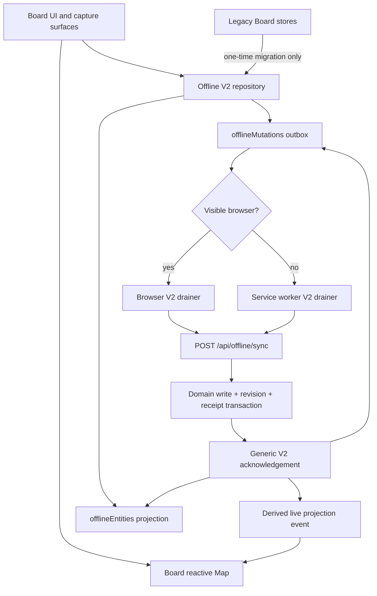
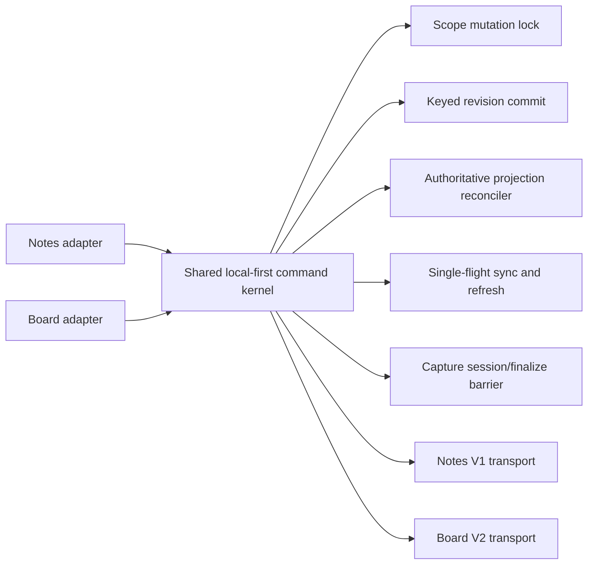

# Board local-first pipeline audit

Date: 2026-07-19

## Implementation update (2026-07-18)

The reported Board creation, duplication, stale-delete flash, false-conflict,
and capture-finalization paths were hardened in Phase 1.

| Defect | Fix | Why this is the correct boundary |
| --- | --- | --- |
| Fresh clients used `baseVersion: 0` | Item/column GETs now return `offlineRevision`; authoritative reconciliation seeds both the feature cache and `offlineEntities` | Every later update/delete starts from the revision actually read from the server |
| Column delete silently advanced item revisions | Sync results now include `related` entity IDs, canonical snapshots, and revisions; browser and no-window worker apply and rebase them | The server transaction remains the source of truth and clients do not infer related versions |
| Refresh/pack resurrected or overwrote rows | Board projection replacement is one IndexedDB transaction over feature rows, V2 entities, and active mutations; absent clean rows are deleted/tombstoned and pending/volatile rows win | A GET is authoritative only for clean state, never for unresolved local intent |
| GET raced memory edits/deletes | Item and column refreshes are single-flight, capture a request snapshot, overlay response-time deltas, and re-check edits/deletes made while the projection transaction commits | Both race windows—during the request and during persistence—are covered |
| Full-item updates caused false overlaps | A framework-free patch builder diffs mutable fields and sends only the matching payload keys; move/reorder use only column/order/position | `changedFields` now describes the command actually applied by the server |
| Global and center captures diverged | Both surfaces now use `useQuickBoardItemCapture`; the center page's second create/save implementation was removed | One session, one create promise, and one revision counter own the logical capture |
| Done/close/open-full could lose or duplicate the final draft | The sheet emits one final payload, swipe emits before close, identical payloads are ignored, and capture calls `flushItem()` before a revision is declared durable | Closing/navigation cannot outrun the Board store's debounce, and one payload cannot generate two logical commits |
| Acknowledgement could show Synced while a successor existed | Feature-cache acknowledgement now reads the V2 outbox in the same transaction, excludes the acknowledged mutation, and retains dirty state for any successor | Status follows unresolved durable work, not just payload equality |
| Keep Local/Keep Server only changed generic V2 state | Conflict resolution now projects the selected snapshot/version into Board IndexedDB and live maps; discarded column deletes rehydrate their item projection | The Sync Center decision and visible Board state change together |
| Legacy `position: null` failed strict validation | Board GET/pack responses normalize null positions to omission, and shared schemas tolerate legacy null as absent | Missing rank is represented consistently; malformed non-null ranks remain rejected |

## Phase 2 implementation update (2026-07-19)

Phase 2 is implemented. `offlineEntities` is now the only active durable Board
projection and `offlineMutations` is the only Board outbox. The old
`boardItems`, `boardColumns`, and `pendingBoardItems` stores remain in the
IndexedDB schema only as one-time migration inputs; the migration moves any
recoverable rows/commands into V2 atomically, clears the legacy stores, and
records an account-scoped marker.

| Phase 2 defect/debt | Fix | Why this is the correct boundary |
| --- | --- | --- |
| Page and worker acknowledged a second Board cache | Removed every Board cache acknowledgement/remap/rollback write from both drainers; `remapOfflineIds` plus `applySyncResult` now own the complete durable transaction | Visible and no-window sync cannot commit different durable projections |
| Board stores hydrated legacy feature caches | Added Board repository ports over V2 entities/mutations; items and columns hydrate only through those ports | Memory is now a derived projection of the same rows that provide `baseVersion` |
| GET/pack reconciliation still involved feature stores | Workspace replacement now reads/writes only V2 entities and mutations; server-clean rows replace clean state while active mutations, durable drafts, and request-time volatile changes win | One transaction decides canonical versus local intent without a bridge |
| A draft could exist during the debounce without an outbox row | Added `localDirty` metadata to the generic entity record; refresh, pack replacement, pack removal, receipt application, and restart recovery preserve it | The sole durable projection covers the debounce window without resurrecting a feature cache |
| A receipt could overwrite a newer durable draft with no successor mutation yet | Generic acknowledgement compares the acknowledged payload with a `localDirty` snapshot and preserves/revisions it; the later keyed flush queues it against the new server version | Acknowledgement is based on local revision state, not only the current outbox rows |
| Link/comment GETs did not seed V2 revisions | Link and comment contracts/GETs now return `offlineRevision`; item-scoped relation reconciliation writes authoritative, pending-aware V2 subsets | A delete/update of a server-loaded relation no longer starts from revision zero |
| Relation conflict decisions did not update the mounted detail panel | Applied results and Keep Server/Keep Local decisions now project link/comment remaps, canonical snapshots, deletes, and rollbacks into live memory | Sync Center and the mounted Board surface show the same decision immediately |
| Legacy V1 intake/merge code remained callable | Removed the pending Board helper exports and the orphaned `mergePendingBoardItems` implementation/tests; active services remain only where they still provide server reads | The obsolete path cannot be accidentally re-entered while legacy rows remain migratable |

The service-worker protocol identifier was advanced so an older worker cannot
continue using the removed cache bridge. Both page and worker now perform only
generic remap plus generic acknowledgement.

## Verdict

Board now has one end-to-end Offline V2 durable pipeline. Phase 1 fixed the
behavioral blockers; Phase 2 removed the cache bridge and completed revision-
aware relation hydration/live conflict projection. The Board status pill
counts active item, column, link, and comment V2 mutations for its workspace.

The correct reuse target is the hardened Notes **local-first invariants**, not
the Notes V1 HTTP endpoint. Board should remain a V2 domain because its field
conflicts, cross-entity dependencies, column deletes, links, comments, and
receipt-based replay benefit from V2. Notes and Board can still share the same
client kernel around their domain-specific transports.

## Current ownership



The former split between feature caches and generic entities no longer exists
in the active path. Legacy stores are never hydrated or acknowledged after
their migration transaction completes.

> The traces and defect table below preserve the pre-fix diagnosis. The
> implementation-update tables above record what changed; Phase 2 removes the
> remaining bridge entirely.

## Bottom-up trace

### 1. Server domain transaction

`syncOfflineMutations` validates a typed mutation and applies the Board domain
write inside a Prisma transaction. The same transaction advances
`OfflineEntityState` and writes an `OfflineMutationReceipt`. A retry of the same
mutation ID returns the stored result instead of applying the write twice.

This provides good server idempotency for a repeated request. It cannot dedupe
two different client mutation IDs that accidentally represent two logical
creates; that must be prevented by the capture/command owner.

Board conflicts are field/version based. An update supplies `baseVersion` and
`changedFields`. A conflict is returned only when one of those fields changed
on the server after the supplied base revision, or when the entity was deleted.

### 2. HTTP transport

All Board create/update/delete/move/reorder commands are envelopes in
`POST /api/offline/sync`. `POST` is correct here: the HTTP request submits a
batch of domain commands, while each mutation's `operation` contains the real
verb (`boardItem.create`, `boardItem.delete`, and so on). Board reads still use
`GET /api/board-items` and `GET /api/board-columns`.

### 3. Generic Offline V2 repository

The generic repository already has valuable invariants:

- an entity projection and mutation are committed in one transaction;
- pending/retry updates coalesce by entity;
- an exact local revision is atomically leased before sending;
- one entity cannot have two ordinary revisions in flight;
- a stale acknowledgement cannot delete a newer successor;
- a successor is rebased to the predecessor's returned server version;
- temp IDs and dependent payloads are remapped;
- stale `syncing` leases can be replayed safely because receipts are idempotent;
- downloaded generic packs preserve active mutations and tombstone absent clean
  entities.

Those guarantees apply to `offlineEntities` and `offlineMutations`. They do not
atomically include the Board feature cache that the UI actually hydrates.

### 4. Browser/service-worker ownership

The browser drains V2 while a visible client exists. The service worker drains
only when no window exists. Both use the same atomic lease and result
application functions. That ownership model is appropriate.

For Board results, however, each owner first remaps/acknowledges the legacy
Board cache and then applies the generic result in another transaction. A crash
is replayable, but the UI cache, generic projection, status, and outbox can
temporarily disagree. There is no authoritative repair that always reconciles
those two projections on startup.

### 5. Board feature stores

`useBoardItemsStore` and `useBoardColumnsStore` keep workspace-keyed reactive
maps. They hydrate the legacy `boardItems` / `boardColumns` stores, then fetch
the server and merge a snapshot of pending V2 mutations.

The merge is not protected by a workspace mutation lock and is not a
single-flight refresh. The pending snapshot is collected before the network
GET and used after it returns, even though creates, edits, deletes, ID remaps,
and acknowledgements can occur during that request.

## Top-down action flows

### General Capture Sheet: new Board card

1. `begin()` waits for the previous capture session to finalize and pins the
   selected workspace store.
2. Opening the editor creates nothing.
3. The first non-empty input starts one shared `createPromise`.
4. `createItem` creates a UUID-backed temp ID and a complete optimistic card.
5. The card is written to `boardItems` IndexedDB.
6. The card is added to the reactive map.
7. `offline.queue` atomically writes the generic `offlineEntities` projection
   and a `boardItem.create` mutation.
8. Online starts a V2 drain; offline leaves the same mutation pending.
9. The server inserts once, advances revision 1, stores a receipt, and returns
   temp-to-server ID mapping.
10. Generic IDs are remapped, then the Board feature cache and live maps are
    remapped, then the generic result is acknowledged.
11. Later input waits 500 ms in quick capture, writes the Board cache through
    `updateItem`, then waits another 1,000 ms in the store before entering V2.
12. `finalize()` waits for the capture commit, but `updateItem` resolves after
    the Board cache write and scheduling the store debounce—not after the V2
    mutation is durable.

The session controller prevents the previously observed stale-finalize create
race, but the completion contract is still too weak and the debounce is
stacked.

### Board page center capture

1. Add opens the live sheet without creating.
2. Draft state lives inside `BoardCardSheet`.
3. The sheet waits 500 ms, then emits `live-update`.
4. The parent uses one `liveCreatePromise`, so concurrent callbacks normally
   share one create.
5. Updates then enter the store's additional 1,000 ms debounce.

There are three concrete lifecycle defects in this separate implementation:

- closing/swiping the sheet does not flush the sheet's pending 500 ms draft;
- Open Full carries the latest payload but does not apply it when the card
  already exists;
- Done flushes `live-update` and then emits `save`, causing the parent to apply
  the same payload twice. Create is promise-deduped, but move/update work can
  still be repeated or split across two drains.

### Update

1. Memory is changed optimistically.
2. The Board feature cache is written.
3. A 1,000 ms keyed debounce eventually reads the latest full item.
4. V2 queues an update and drains online.
5. An acknowledgement clears `isDirty` only if the feature cache still matches
   the sent payload; a newer local value remains dirty.

The keyed debounce correctly isolates item A from item B. The defect is that
every update sends the full item and declares nearly every Board field changed,
even when only content, tags, or due date changed.

### Delete

1. Memory removes the card immediately.
2. V2 queues `boardItem.delete` with the complete previous card as
   `rollbackData`.
3. The canonical Board cache row is retained while the delete is unresolved.
4. Applied purges the Board cache; rejected restores cache and memory.
5. Offline follows the same sequence, except draining waits for connectivity.

This matches the intended optimistic model for applied/rejected outcomes.
Conflict resolution is incomplete: choosing Keep Server updates the generic
projection but does not immediately restore the Board feature cache/live map.

### Move and reorder

- Move computes `columnId`, numeric rank, and fractional `position`, writes the
  Board cache, then queues V2.
- Item reorder changes only the minimal fractional ranks, writes them locally,
  and coalesces a 150 ms per-column trailing command.
- Column reorder writes all new positions and queues V2 commands before one
  drain.

The ranking approach is appropriate. The command payload and conflict fields
are not precise: moves/reorders are currently represented as full-item
updates, increasing conflict surface and request size.

### Column delete

1. The column disappears from memory.
2. Its cards are optimistically projected into Uncategorized.
3. One `boardColumn.delete` is queued.
4. The server normalizes all affected cards, deletes the column, and advances
   every related card revision in one transaction.
5. The response returns only the column's result. The client does not receive
   the related cards' new revisions.
6. A follow-up Board GET refreshes the feature cache, but not the generic V2
   entity versions.

The next edit to one of those cards can therefore use a stale base revision and
conflict with the column delete performed by the same client.

### Links and comments

Links/comments optimistically update the mounted detail panel and always queue
V2 online and offline. Generic entities make them durable, and temp ID events
repair the mounted panel. They do not use the Board feature cache. Keep Server
conflict resolution has the same live-projection gap as Board items/columns.

## Confirmed defects and root causes

| Priority | Defect | Root cause | User-visible result |
| --- | --- | --- | --- |
| P0 | First edit can conflict on a fresh client | Ordinary Board GET responses do not include `offlineRevision` and do not seed `offlineEntities`; V2 falls back to base version 0 | “Resolve conflict” even for a normal edit, often after prior successful writes on another context |
| P0 | A GET can erase a create/edit made while it is in flight | Refresh snapshots pending IDs before the GET and applies that stale set afterward; there is no mutation lock or request-generation overlay | Temp card disappears, newest draft is overwritten, or its feature-cache row is deleted while its V2 mutation still exists |
| P0 | Center capture can lose its latest draft | Close does not flush; Open Full does not apply payload to an existing live card | Typed content vanishes on swipe/fast navigation |
| P0 | Column delete makes related card bases stale | Server advances related item revisions but the result does not return them; Board GET does not hydrate V2 revisions | The client's own next card edit conflicts |
| P1 | False conflicts from broad writes | Every item update declares content, tags, date, attachments, column, workspace, and position changed, regardless of the actual patch | Unrelated server changes overlap and block a valid local edit |
| P1 | Pack download can overwrite pending Board state | Generic pack replacement is pending-aware, then `hydrateLegacyCoreCaches` blindly bulk-puts server Board rows into the feature cache | Pending update reverts locally after reload; empty/absent server rows remain in the cache |
| P1 | Deleted/stale rows can flash on reload | Normal server refresh bulk-puts returned rows but does not delete absent clean feature-cache rows | Deleted card appears from IndexedDB first, then disappears after the GET |
| P1 | Two durable Board projections can disagree | `boardItems`/`boardColumns` and `offlineEntities` are written and acknowledged in separate transactions | Local/Synced labels, reload state, conflict base, and visible content diverge |
| P1 | Done can apply one center-capture payload twice | Child emits both a flushed `live-update` and `save` | Extra cache writes and possible successor/move requests |
| P1 | Capture “durable revision” is not yet in the outbox | `updateItem` resolves after cache write plus debounce scheduling | Done may close with the final content waiting outside the durable command queue |
| P1 | Keep Server is not projected into Board UI | Generic conflict resolution updates only `offlineEntities` | Sync Center says resolved while the Board still shows local/error state until a later refresh |
| P2 | Column create remap can clear a newer dirty rename | Column temp-ID acknowledgement unconditionally sets clean, unlike item payload matching | Incorrect transient Synced state |
| P2 | Board status is not authoritative | Main Board page derives Local/Synced from item flags/`lastSync`, ignoring column/link/comment mutations and V2 status | UI can say Synced with pending or conflicted Board work, or Local after an acknowledgement |
| P2 | Dead Board V1 code remains | Pending Board intake helpers, legacy sync module/contracts, and orphaned older Board components remain in source | Larger audit surface and easier accidental re-entry into an obsolete path |

## When the behavior was introduced

- Commit `f5cd0fb` still used direct REST online and the feature Board V1 queue
  offline. It was simpler, but online/offline semantics differed and column
  operations were disabled offline.
- The IDB-first, put-only Board refresh dates back to `6ffb88a` (2026-05-05).
  V2 did not create that stale-row bug, but its second projection makes the
  consequences harder to repair.
- The separate Board-page live capture and its 500 ms draft layer were added in
  `b3142b4` (2026-07-08).
- Offline V2, packs, field revisions, and the generic entity/outbox projection
  arrived in `203fe8d` (2026-07-11).
- The current working-tree cutover that sends all Board actions through V2 is
  not committed yet. The missing normal-GET revision seed, broad
  `changedFields`, and related-revision response gap became correctness blockers
  at that cutover boundary.

## What should be reused

The reusable unit should be a small local-first client kernel with domain
adapters:



Share these invariants:

1. immediate memory echo;
2. one durable command boundary before an action reports local success;
3. one authoritative durable projection per domain;
4. exact local revision/lease acknowledgement;
5. a per-scope mutation lock around cache/outbox/remap/refresh application;
6. race-aware server projection: server snapshot + current pending commands +
   volatile edits, with absent clean rows purged;
7. single-flight drain with one requested rerun;
8. a keyed revision debouncer with explicit `flush` used by Done, Close, Open
   Full, hidden, and pagehide;
9. temp-ID aliases/remap performed in the same durable acknowledgement;
10. conflict resolution that updates durable projection and live memory
    together.

Keep these domain-specific:

- Notes groups, layouts, note versions, collaboration snapshots, and
  `/api/notes/sync`;
- Board columns, links, comments, fractional ranking, field-level conflict
  fields, related changes, receipts, and `/api/offline/sync`.

## Recommended target for Board

Use `offlineEntities` as the only durable Board projection and
`offlineMutations` as the only Board outbox. The `boardItems` and
`boardColumns` stores should become migration inputs only, then leave the
active path. Reactive Board maps should hydrate through a Board repository
adapter over the generic V2 stores.

This removes the acknowledgement bridge entirely:

```text
memory -> atomic generic entity + mutation -> server receipt
       -> atomic generic acknowledgement -> derived memory projection
```

Normal Board GET must return `offlineRevision` (including revisions advanced by
related changes) and feed a pending-aware, entity-scoped generic projection
replacement. A normal GET must never blind-put the feature cache.

## Safe migration order

### Phase 1: correctness blockers — implemented

1. Return `offlineRevision` from Board item/column GETs and seed/update the V2
   projection before any edit can be queued.
2. Return related entity revisions/canonical snapshots for column delete, or
   force a revision-aware entity refresh before considering it acknowledged.
3. Send minimal patches and exact `changedFields` for content, metadata, move,
   and reorder.
4. Put Board refresh behind a single-flight owner and one IndexedDB projection
   transaction; recompute pending/volatile work at response application time
   and overlay memory changes made while that transaction commits.
5. Replace put-only refresh/pack hydration with authoritative pending-aware
   replacement that deletes absent clean rows.
6. Make center capture and global capture use one controller. Done, Close, and
   Open Full must await one outbox-durable final revision.
7. Project Keep Server/Keep Local outcomes into the active Board repository and
   memory in the same reconciliation operation.

### Phase 2: remove the second projection — implemented

1. Add Board repository ports over `offlineEntities`/`offlineMutations`.
2. Hydrate both Board stores only through those ports.
3. Move remap/ack/rollback logic into the repository transaction.
4. Stop writing `boardItems`/`boardColumns` in the runtime and worker.
5. Migrate any remaining legacy rows once, then delete dead V1 helpers and
   orphaned Board components/services.

### Phase 3: shared kernel extraction

Extract the Notes-tested generic algorithms without changing Notes transport:

- scoped async mutation lock;
- keyed async revision committer;
- single-flight drain/rerun;
- race-aware projection merge/replacement;
- capture session/finalize controller;
- generic conflict-resolution projection hook.

Adopt them in Board first. Move Notes onto the shared interfaces only after
Board regression tests prove the contracts; do not combine the Notes and Board
server protocols as part of this refactor.

## Regression coverage

The suite now includes deterministic coverage for related-result contracts,
related-revision rebasing, exact patches, capture durability/idempotence,
successor-aware acknowledgements, one-time legacy migration, single-projection
purge/preservation, relation revision seeding, and acknowledgement during the
pre-outbox durable-draft window. The full unit suite, Nuxt typecheck,
architecture check, and service-worker build/check pass.

Additional authenticated browser/multi-context scenarios remain valuable as
ongoing system validation:

- a Board GET revision becoming the next mutation's base version;
- a new card, edit, and delete occurring while a Board GET is in flight;
- authoritative refresh tombstoning an absent clean Board entity;
- pack hydration preserving a pending Board update;
- column delete returning/reconciling every affected card revision;
- exact changed fields for content, metadata, move, and reorder;
- center capture close, Done, and Open Full within the 500 ms window;
- exactly one logical create and one necessary successor update;
- Keep Server immediately replacing Board memory and durable projection;
- multiple tabs plus no-window service-worker receipt replay;
- sync status including items, columns, links, comments, conflicts, retries,
  and rejected work.

## Confidence boundary

The reported correctness blockers and the Phase 2 projection debt are covered
at the contract/repository/projection/capture levels. The remaining confidence
boundary is operational rather than a known split-brain path: this environment
cannot run an authenticated multi-tab browser test without a signed-in test
session. Phase 3 is optional shared-kernel extraction; it should reduce
duplication between feature algorithms without changing the now-correct Board
transport or reintroducing a second projection.
