# Module System Diagrams

> Current architecture map for the Cognilo modular monolith.
> Last checked from code: May 2026.

This document maps the current system from code, not only from intended architecture.
It should be read together with `docs/ARCHITECTURE.md`, feature READMEs under
`app/features/*`, and `scripts/check-architecture-boundaries.cjs`.

## System Shape

Cognilo is currently a single Nuxt/Nitro deployable with feature-oriented
frontend modules and server-side modular-monolith slices.

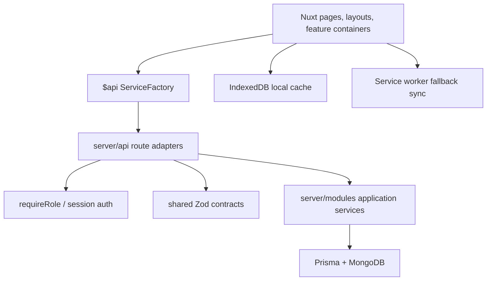

### Layer Rules

- API routes parse, authorize, call use cases, and return `success(...)`.
- Server domain code must not import Prisma, H3, Nuxt, fetch, application, or infrastructure code.
- Server modules should not import another module's application or infrastructure directly.
- Cross-feature behavior should go through ports, shared contracts, or domain events.
- Frontend feature internals should import local feature code explicitly, not legacy wrappers.
- Legacy wrapper paths stay for Nuxt auto-import compatibility.

## Shared Kernel

The shared kernel is intentionally small today.

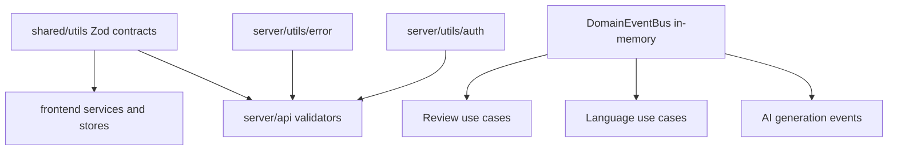

Current status:

- Shared contracts are the strongest shared-kernel mechanism.
- `DomainEventBus` is in-memory and useful for decoupling inside one running process.
- Events are not durable. They should not be treated as guaranteed background jobs.

## Notes Module

Notes is local-first and is the most interaction-heavy module.

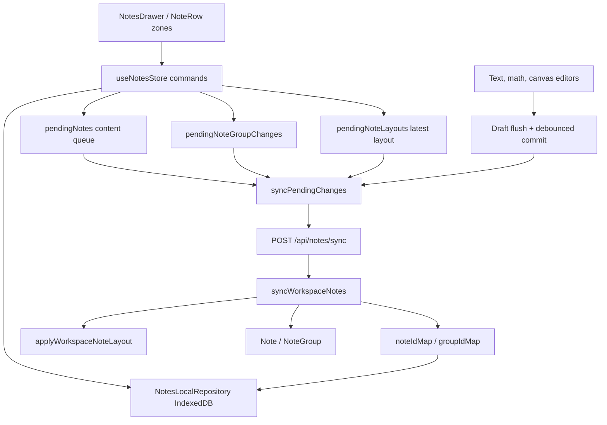

Interaction flow:

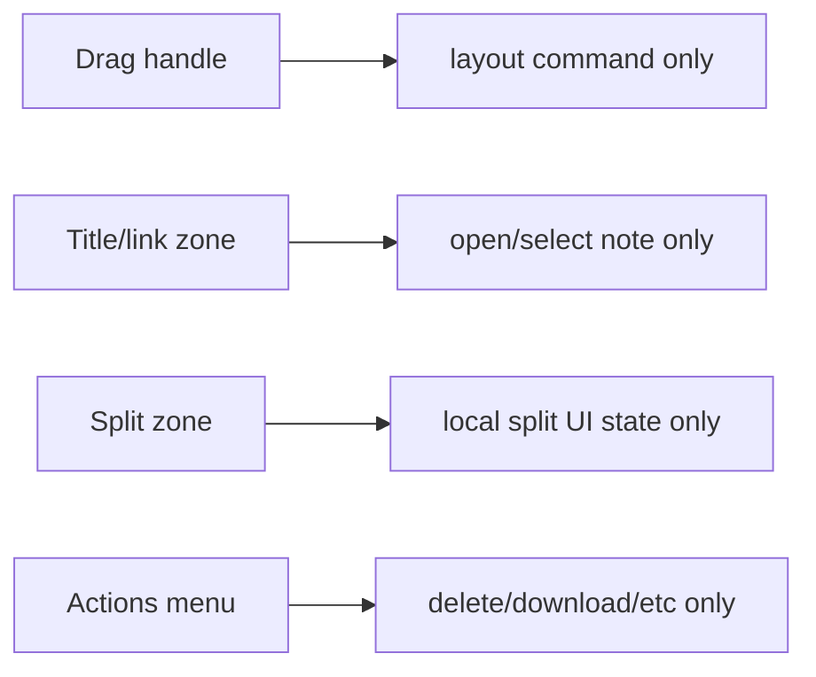

Sync flow:

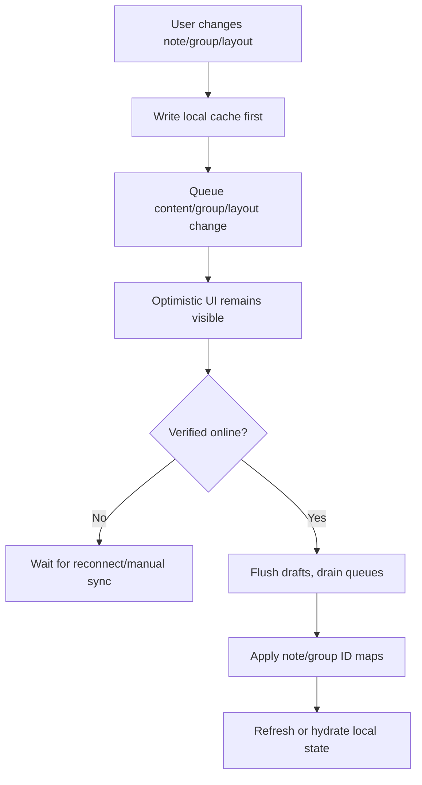

Important invariants:

- Reorder and group moves are layout changes, not content changes.
- Layout changes must not mark every note row as dirty/local.
- Group create/rename/delete are queued as group changes.
- Notes created in a temporary group must wait for `groupIdMap` before note sync drains.
- Split state is local UI state and must not sync to the server.
- Service worker sync is fallback; open-app sync should be client-owned.

Current maturity: high value but still high complexity. This module needs the most regression tests.

## Board Module

Board items, columns, links, and comments share one Offline V2 local-first
pipeline. Reactive stores are projections; `offlineEntities` is the only
durable Board state and `offlineMutations` is the only outbox.

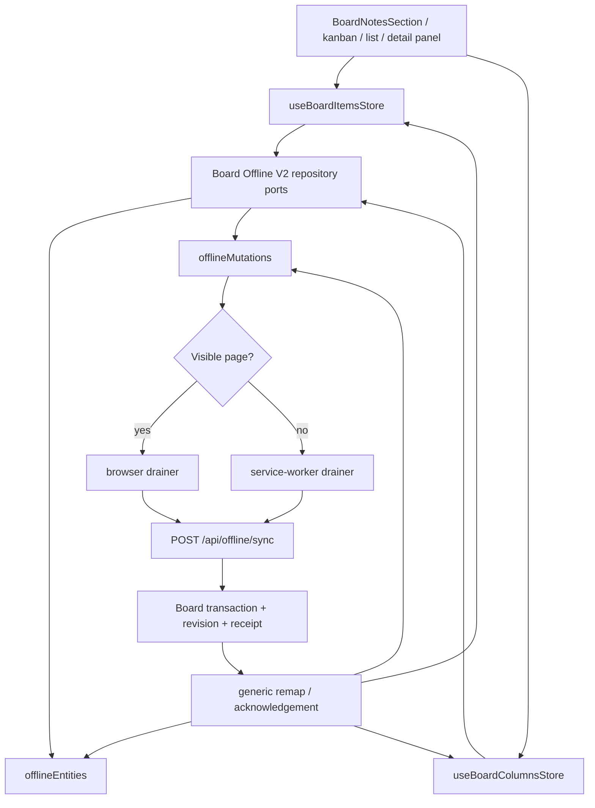

Important invariants:

- Temporary IDs are remapped atomically in generic entities, dependent payloads, and mutations.
- Server snapshots replace only clean rows; active mutations and `localDirty` drafts win.
- Server-newer conflicts retain local and server snapshots until explicit resolution.
- Columns, related item revision changes, links, and comments use the same receipt-aware pipeline.

Current maturity: high after Board Offline V2 Phase 2; authenticated multi-tab and no-window browser scenarios remain valuable operational coverage.

## Review Module

Review is the cleanest backend slice.

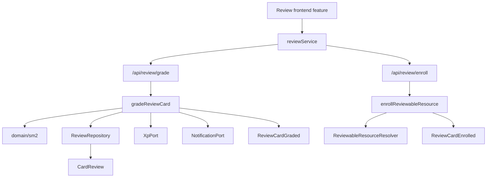

Important invariants:

- SM-2 calculation is pure domain logic.
- Grading is idempotent when `requestId` is provided.
- XP goes through `XpPort`.
- Review due notifications go through `NotificationPort`.
- Cross-resource enrollment goes through `ReviewableResourceResolver`.

Current maturity: high.

## Language Learning Module

Language learning owns capture, translation, stories, word bank, and language-specific review cards.

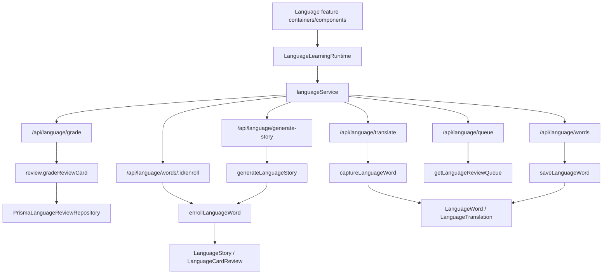

Important invariants:

- Language grading reuses the shared review engine.
- Language review persistence is isolated by `PrismaLanguageReviewRepository`.
- Language word enrollment emits `LanguageWordEnrolled`.
- Translation and story routes are thin adapters over language application services.
- Capture/story LLM responses are parsed and validated before quota finalization.
- AI translation/story generation is online-only. Preferences, word bank,
  enrollment, deletion, review, grading, and stats use account-scoped Offline
  V2 projections and typed mutations.
- User-facing Capture always saves the lexical entry. Translation fields are
  optional and default from `translateOnCapture`; definition-only and translated
  cache identities remain separate.
- `POST /api/language/words` remains the idempotent, non-generative persistence
  command for callers that already hold a `translationId`.
- Clicking a bank card opens word details. Story generation is a deliberate
  dialog action, and story text is constrained to the learned language.
- Frontend word-bank refresh goes through `LanguageLearningRuntime`, not global browser events.

Current maturity: high for review reuse and capture/save separation,
medium-high for offline Language integration. Authenticated browser coverage for
offline enrollment followed by dependent grading remains a release follow-up.

## Materials Module

Materials own uploaded/created learning source content and generation entrypoints.

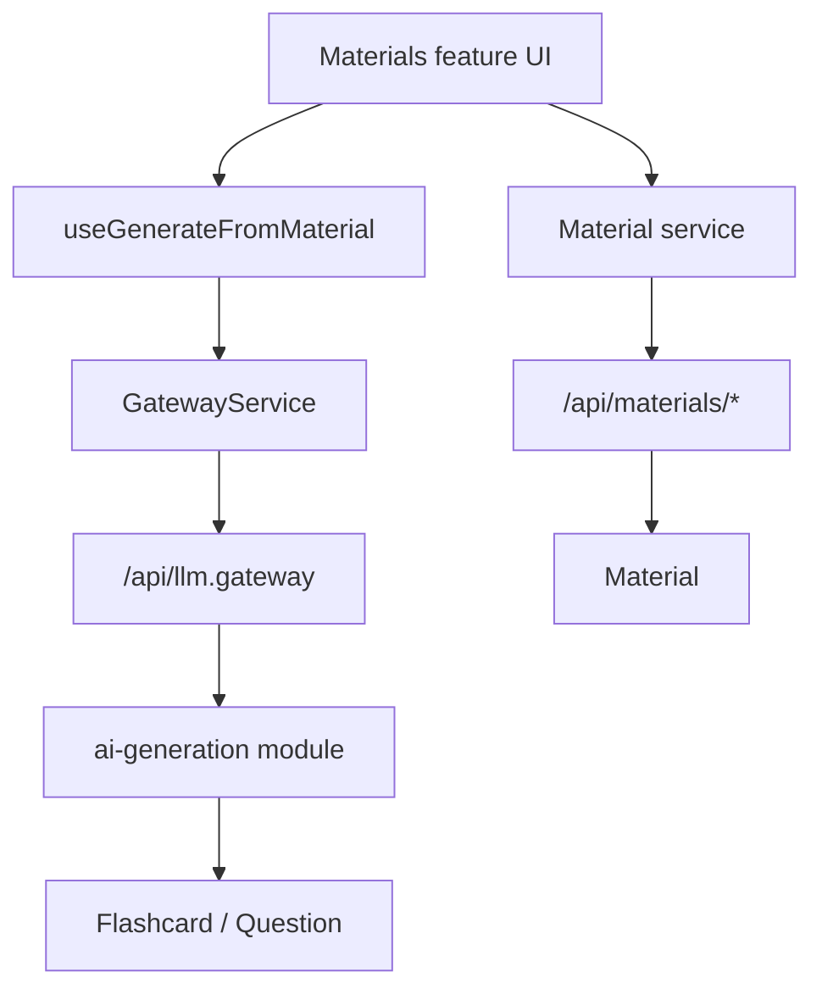

Important invariants:

- Materials are workspace-owned.
- Generation from a material goes through the LLM gateway.
- Regeneration is user-confirmed and can replace or append.

Current maturity: medium. Frontend feature slice exists; server material routes are not fully extracted into a `materials` module yet.

## AI Generation Module

AI generation coordinates request preparation, model routing, semantic cache, provider execution, quota, and saving artifacts.

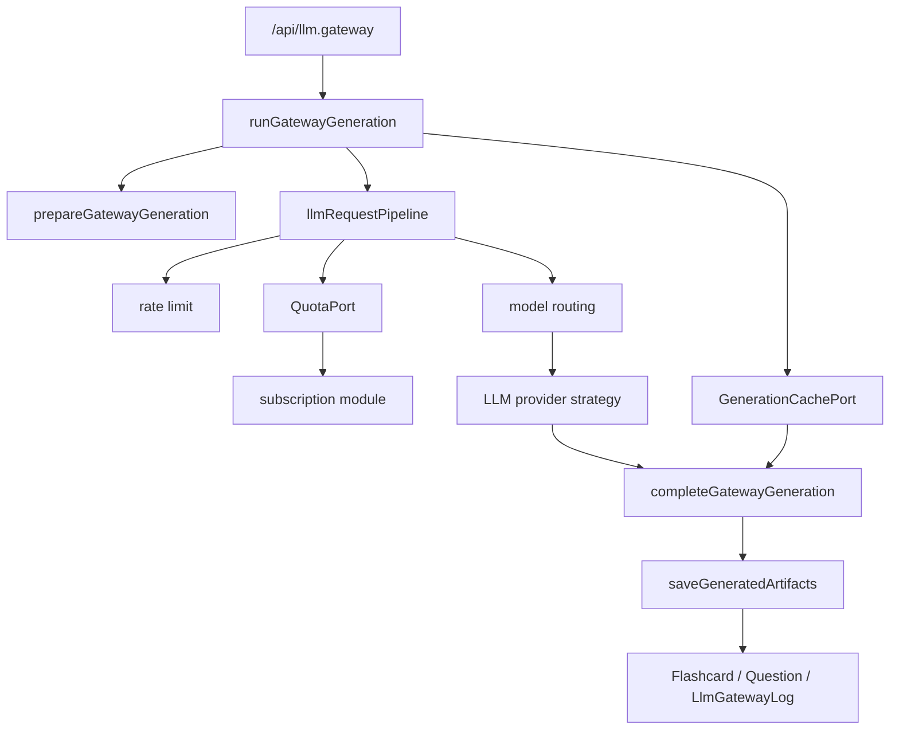

Important invariants:

- Public route remains `/api/llm.gateway`.
- Quota is checked/consumed through `QuotaPort`.
- Provider calls are isolated behind LLM strategies.
- Generated artifacts are saved inside the ai-generation application flow.
- The route is thin, but the application still accepts `H3Event` because the pipeline still depends on HTTP request context.

Current maturity: medium-high. The boundary is much better, but HTTP context should eventually be pushed out of application code.

## Subscription Module

Subscription owns generation quotas, credits, ad rewards, Stripe checkout, and Stripe credit grants.

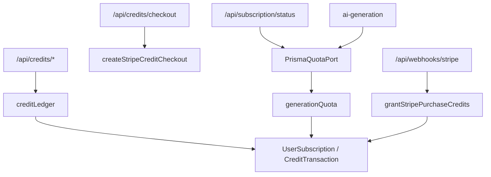

Important invariants:

- AI generation depends on `QuotaPort`, not direct subscription internals.
- Credit transactions should be idempotent by metadata/session/payment intent.
- Free quota and credit balance are server-authoritative.

Current maturity: high for quota/credits; subscription billing lifecycle can grow here.

## Notifications Module

Notifications owns push subscriptions, notification preferences, scheduled notifications, and delivery.

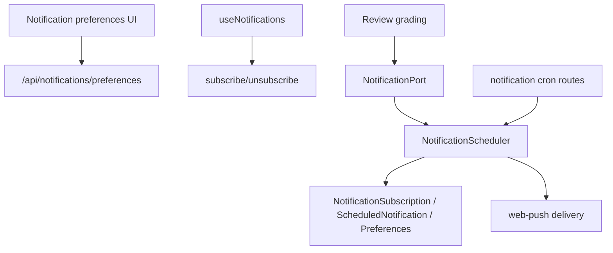

Important invariants:

- Review scheduling uses `NotificationPort`.
- Preferences, subscriptions, scheduled records, cron orchestration, and delivery are separate concerns conceptually.
- Several API routes still include direct behavior and should gradually move into application services.

Current maturity: medium. The port exists, but the module is not fully extracted.

## Auth, User, Workspace, Tags

These are foundational app capabilities but are not yet represented as full `server/modules/*` feature modules.

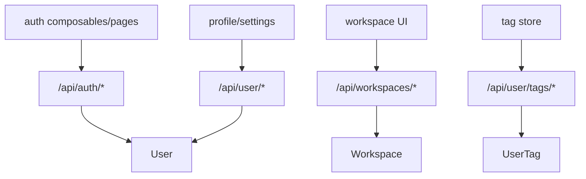

Current maturity: legacy-route style. These areas work as platform services, but they are not modularized to the same level as Review, Notes, or Subscription.

## Offline Runtime

The offline runtime supports notes, board items, forms, cached app assets, push, and background sync.

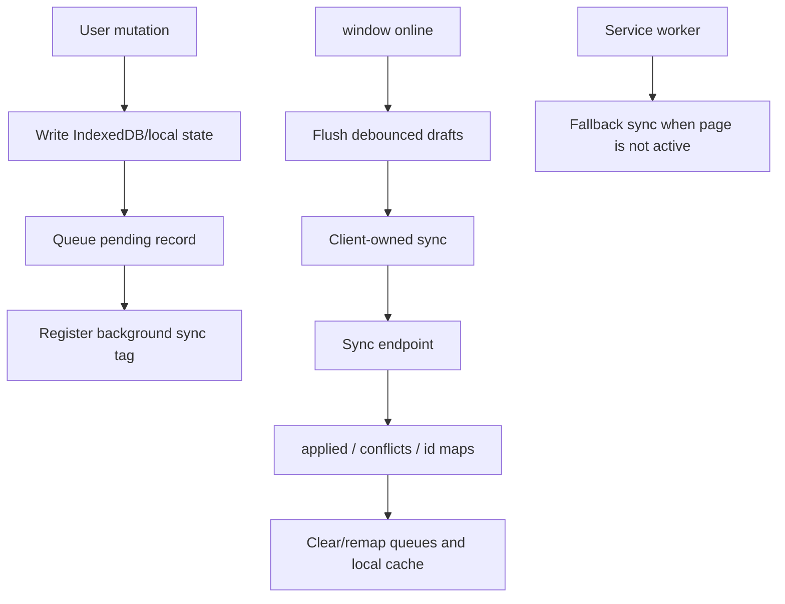

Important invariants:

- UI should never wait for server sync before reflecting a local change.
- Reconnect sync must flush drafts before reading queues.
- Open-app sync should avoid racing the service worker against the page.
- ID maps must be applied before layout changes referencing temp IDs are sent again.

## Cross-Module Collaboration

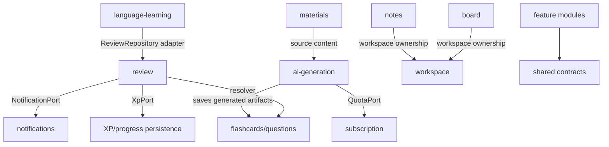

## Current Health Summary

Strong areas:

- Review core has clean domain/application/ports separation.
- Language grading correctly reuses the review engine.
- Notes now has explicit content, group, and layout queues.
- AI generation is mostly behind `runGatewayGeneration`.
- Subscription exposes quota through a port.
- Architecture checks exist and enforce key server/frontend boundaries.

Still risky:

- Notes remains the highest-complexity module because editor state, split UI, DnD, IndexedDB, temp IDs, and sync all meet there.
- Board item sync is local-first, but board columns are not equally local-first.
- Notifications has a port but still has route-heavy behavior.
- Materials server logic is still route-oriented.
- Domain events are not durable.
- Some platform services remain legacy-route style.

## Recommended Fitness Checks

These should be kept as tests or architecture checks:

- Notes reorder/group move never sets note content dirty.
- Notes group temp IDs are remapped before note content/layout sync drains.
- Notes manual sync flushes drafts before reading pending queues.
- Service worker and page do not both POST the same notes queue while the app is open.
- Board temp IDs are replaced everywhere after sync.
- Review domain does not import Prisma, H3, Nuxt, or fetch.
- Server modules do not import other modules' application/infrastructure layers.
- Frontend feature internals do not import their own legacy wrappers.
