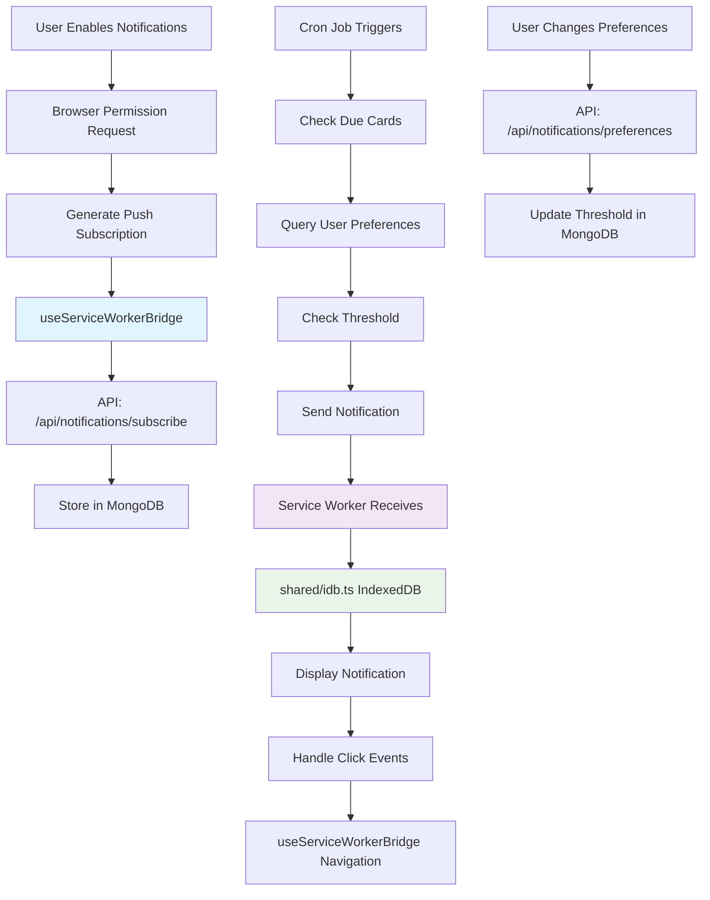

# 🔔 Notification System Documentation

> **Complete guide to CleverAI's push notification system with subscription management, user preferences, and MongoDB integration**

---

## 📑 Table of Contents

1. [System Overview](#-system-overview)
2. [Architecture & Components](#-architecture--components)
3. [User Preferences & Thresholds](#-user-preferences--thresholds)
4. [API Reference](#-api-reference)
5. [Database Schema](#-database-schema)
6. [Service Worker Integration](#-service-worker-integration)
7. [MongoDB Implementation](#-mongodb-implementation)
8. [Testing & Debugging](#-testing--debugging)
9. [Security & Privacy](#-security--privacy)
10. [Troubleshooting](#-troubleshooting)

---

## 🎯 System Overview

The CleverAI notification system provides intelligent push notifications for card due reminders with comprehensive user preference management, subscription lifecycle handling, and robust error recovery mechanisms.

### Key Features

- **Push Notifications**: Web Push API for real-time notifications
- **User Preferences**: Intelligent threshold system with engaging categories
- **Subscription Management**: Complete lifecycle with health tracking
- **MongoDB Integration**: Optimized for MongoDB with proper indexing
- **Service Worker Integration**: Offline notification handling
- **Error Recovery**: Comprehensive error handling and retry mechanisms
- **Security**: VAPID authentication and proper authorization
- **TypeScript**: Full type safety throughout the system

### Fixed Issues ✅

- ✅ **Unsubscribe API Endpoint** - Complete subscription management
- ✅ **Authentication Integration** - Proper auth integration points
- ✅ **Service Worker Error Handling** - Comprehensive error boundaries
- ✅ **Notification Click Navigation** - Proper URL handling and focus
- ✅ **TypeScript Types** - Complete type safety
- ✅ **Database Schema** - MongoDB-optimized with proper indexing
- ✅ **Cleanup Strategy** - Automatic subscription maintenance
- ✅ **User Preferences** - Engaging threshold categories

---

## 🏗️ Architecture & Components

### System Components

```
📁 Notification System
├── 🔧 Client-side
│   ├── app/composables/useNotifications.ts - Core notification logic
│   ├── app/composables/useServiceWorkerBridge.ts - SW message handling
│   ├── app/layouts/default.vue - Notification navigation handling
│   └── app/components/NotificationPreferences.vue - User settings UI
├── 🌐 Server-side APIs
│   ├── server/api/notifications/subscribe.post.ts - Subscription management
│   ├── server/api/notifications/unsubscribe.post.ts - Unsubscription
│   ├── server/api/notifications/send.post.ts - Send notifications
│   ├── server/api/notifications/preferences.get.ts - User preferences
│   └── server/api/notifications/subscriptions.get.ts - List subscriptions
├── ⚙️ Service Worker
│   ├── sw-src/index.ts - Push event handling (consolidated)
│   └── public/sw.js - Compiled service worker
├── 🗄️ Database
│   ├── prisma/schema.prisma - MongoDB schema
│   └── server/utils/cleanupSubscriptions.ts - Maintenance utilities
├── 🔧 Shared Infrastructure
│   ├── shared/idb.ts - IndexedDB helper (non-destructive)
│   ├── shared/constants/pwa.ts - Notification constants
│   └── types/notifications.ts - TypeScript definitions
└── 🔧 Utilities
    └── server/services/NotificationService.ts - Core service
```

### Data Flow



---

## 🎯 User Preferences & Thresholds

### Engaging Threshold Categories

We've transformed the technical "minimum cards threshold" into user-friendly categories that help users choose their ideal notification frequency based on their learning style.

#### ⚡ **Instant Learner** (1+ cards)
- **Target User**: Highly motivated learners who want to stay on top of every review
- **Learning Style**: Daily micro-sessions, consistent habit builders
- **Use Case**: "I want to review cards as soon as they're due"
- **Notification**: You'll get notified when even 1 card is ready

#### 📚 **Steady Studier** (3+ cards)
- **Target User**: Regular learners who prefer small, manageable batches
- **Learning Style**: Short but frequent study sessions
- **Use Case**: "I like to review a few cards at a time throughout the day"
- **Notification**: You'll get notified when 3 or more cards are ready

#### 🎯 **Focused Reviewer** (5+ cards) - *Default*
- **Target User**: Balanced learners who want meaningful study sessions
- **Learning Style**: Moderate sessions with good focus time
- **Use Case**: "I want enough cards to make it worth sitting down to study"
- **Notification**: You'll get notified when 5 or more cards are ready

#### 📊 **Batch Processor** (10+ cards)
- **Target User**: Efficiency-focused learners who prefer longer sessions
- **Learning Style**: Dedicated study blocks, fewer interruptions
- **Use Case**: "I prefer to accumulate cards and review them in batches"
- **Notification**: You'll get notified when 10 or more cards are ready

#### 💪 **Power Learner** (20+ cards)
- **Target User**: Intensive learners who love study marathons
- **Learning Style**: Long, focused sessions with high card volume
- **Use Case**: "I want to do serious study sessions with lots of cards"
- **Notification**: You'll get notified when 20 or more cards are ready

#### ⚙️ **Custom**
- **Target User**: Users with specific preferences not covered by presets
- **Learning Style**: Completely customizable
- **Use Case**: "I know exactly how many cards I want before being notified"
- **Notification**: You set the exact number (1-100 cards)

### User Experience Flow

1. User visits Settings → Notifications
2. Sees friendly threshold categories with descriptions
3. Clicks on their preferred learning style
4. Settings auto-save with visual confirmation
5. Cron system respects their individual preference

### Technical Implementation

#### Frontend Component (`NotificationPreferences.vue`)
```vue
<template>
  <div class="notification-preferences">
    <div class="threshold-categories">
      <ThresholdCard
        v-for="category in thresholdCategories"
        :key="category.value"
        :category="category"
        :selected="selectedThreshold === category.value"
        @select="updateThreshold"
      />
    </div>
  </div>
</template>
```

#### Backend Integration
```typescript
// User preferences stored in database
interface UserNotificationPreferences {
  cardDueEnabled: boolean
  cardDueThreshold: number // 1-100
  timezone: string
  quietHoursEnabled: boolean
  // ... other preferences
}
```

---

---

## 🔧 Client-Side Integration

### useServiceWorkerBridge Pattern

The notification system uses a consolidated singleton pattern for all service worker communication:

```typescript
// app/composables/useServiceWorkerBridge.ts
const { 
  isSwRegistered,
  swUpdateAvailable,
  registerServiceWorker,
  updateServiceWorker
} = useServiceWorkerBridge()

// Reactive state for notifications
watch(isSwRegistered, (registered) => {
  if (registered) {
    // Service worker is ready, can now handle notifications
    initializeNotifications()
  }
})
```

### Integration with useNotifications

```typescript
// app/composables/useNotifications.ts
export const useNotifications = () => {
  const { isSwRegistered } = useServiceWorkerBridge()
  
  const subscribeToNotifications = async () => {
    if (!isSwRegistered.value) {
      throw new Error('Service worker not registered')
    }
    
    // Get push subscription through consolidated SW bridge
    const subscription = await getSubscription()
    
    // Use shared API call
    await $fetch('/api/notifications/subscribe', {
      method: 'POST',
      body: { subscription }
    })
  }
}
```

### Layout Integration

```typescript
// app/layouts/default.vue
const { notificationCount } = useNotifications()
const { isSwRegistered } = useServiceWorkerBridge()

// Reactive notification badge
const showNotificationBadge = computed(() => 
  isSwRegistered.value && notificationCount.value > 0
)
```

---

## 🔗 API Reference

### Subscription Management

#### `POST /api/notifications/subscribe`
Subscribe to push notifications.

```typescript
// Request
{
  subscription: PushSubscription,
  userAgent?: string,
  deviceInfo?: object
}

// Response
{
  success: boolean,
  subscriptionId: string,
  message: string
}
```

#### `POST /api/notifications/unsubscribe`
Unsubscribe from push notifications.

```typescript
// Request
{
  endpoint: string
}

// Response
{
  success: boolean,
  message: string
}
```

### Notification Operations

#### `POST /api/notifications/send`
Send a push notification (admin/system only).

```typescript
// Request
{
  userId?: string,
  title: string,
  body: string,
  icon?: string,
  badge?: string,
  url?: string,
  data?: object
}

// Response
{
  success: boolean,
  sent: number,
  failed: number,
  details: Array<{
    subscriptionId: string,
    success: boolean,
    error?: string
  }>
}
```

### User Preferences

#### `GET /api/notifications/preferences`
Get user notification preferences.

```typescript
// Response
{
  success: boolean,
  preferences: {
    cardDueEnabled: boolean,
    cardDueThreshold: number,
    timezone: string,
    cardDueTime: string,
    quietHoursEnabled: boolean,
    quietHoursStart: string,
    quietHoursEnd: string,
    dailyReminderEnabled: boolean,
    dailyReminderTime: string
  }
}
```

#### `POST /api/notifications/preferences`
Update user notification preferences.

```typescript
// Request
{
  cardDueEnabled?: boolean,
  cardDueThreshold?: number,
  timezone?: string,
  cardDueTime?: string,
  quietHoursEnabled?: boolean,
  quietHoursStart?: string,
  quietHoursEnd?: string,
  dailyReminderEnabled?: boolean,
  dailyReminderTime?: string
}

// Response
{
  success: boolean,
  preferences: UserNotificationPreferences
}
```

### Subscription Monitoring

#### `GET /api/notifications/subscriptions`
List all user subscriptions (admin only).

```typescript
// Response
{
  success: boolean,
  subscriptions: Array<{
    id: string,
    endpoint: string,
    userId?: string,
    createdAt: string,
    expiresAt?: string,
    isActive: boolean,
    failureCount: number,
    lastSeen?: string,
    userAgent?: string
  }>
}
```

---

## 🗄️ Database Schema

### MongoDB Schema (Prisma)

```prisma
model NotificationSubscription {
  id           String           @id @default(auto()) @map("_id") @db.ObjectId
  endpoint     String           @unique
  keys         SubscriptionKeys
  userId       String?          @db.ObjectId
  user         User?            @relation(fields: [userId], references: [id])
  createdAt    DateTime         @default(now())
  expiresAt    DateTime?
  isActive     Boolean          @default(true)
  failureCount Int              @default(0)
  lastSeen     DateTime?
  userAgent    String?
  deviceInfo   Json?

  @@index([userId])
  @@index([expiresAt])
  @@index([isActive])
  @@index([failureCount])
}

type SubscriptionKeys {
  p256dh String
  auth   String
}

model UserNotificationPreferences {
  id                    String   @id @default(auto()) @map("_id") @db.ObjectId
  userId                String   @unique @db.ObjectId
  user                  User     @relation(fields: [userId], references: [id])

  // Card due notifications
  cardDueEnabled        Boolean  @default(true)
  cardDueThreshold      Int      @default(5)
  cardDueTime           String   @default("09:00")
  timezone              String   @default("UTC")

  // Quiet hours
  quietHoursEnabled     Boolean  @default(false)
  quietHoursStart       String   @default("22:00")
  quietHoursEnd         String   @default("08:00")

  // Daily reminders
  dailyReminderEnabled  Boolean  @default(false)
  dailyReminderTime     String   @default("19:00")

  createdAt             DateTime @default(now())
  updatedAt             DateTime @updatedAt
}
```

### Database Operations

#### Subscription Health Tracking
```typescript
// Update subscription health
const updateSubscriptionHealth = async (subscriptionId: string, success: boolean) => {
  if (success) {
    await prisma.notificationSubscription.update({
      where: { id: subscriptionId },
      data: {
        lastSeen: new Date(),
        failureCount: 0
      }
    })
  } else {
    await prisma.notificationSubscription.update({
      where: { id: subscriptionId },
      data: {
        failureCount: { increment: 1 }
      }
    })
  }
}
```

#### Cleanup Expired Subscriptions
```typescript
// Remove failed/expired subscriptions
const cleanupSubscriptions = async () => {
  const result = await prisma.notificationSubscription.deleteMany({
    where: {
      OR: [
        { failureCount: { gte: 5 } },
        { expiresAt: { lt: new Date() } },
        {
          lastSeen: {
            lt: new Date(Date.now() - 30 * 24 * 60 * 60 * 1000) // 30 days
          }
        }
      ]
    }
  })
  return result.count
}
```

---

## ⚙️ Service Worker Integration

### Consolidated Architecture

The service worker notification system now uses a consolidated architecture with shared IndexedDB operations:

- **📁 sw-src/index.ts**: Main service worker with push event handling
- **📁 shared/idb.ts**: Shared IndexedDB helper for consistent data operations
- **📁 useServiceWorkerBridge.ts**: Singleton pattern for SW communication
- **📁 shared/constants/pwa.ts**: Centralized notification constants

### Push Event Handling

```typescript
// sw-src/index.ts - Consolidated implementation
import { openFormsDB, getAllRecords } from '../shared/idb'
import { NOTIFICATION_ACTIONS, CACHE_NAMES } from '../shared/constants/pwa'

self.addEventListener('push', async (event) => {
  try {
    const data = event.data?.json() || {}
    
    // Store notification data in IndexedDB using shared helper
    const db = await openFormsDB()
    // ... store notification data for offline access
    
    const options = {
      body: data.body || 'You have new cards to review!',
      icon: data.icon || '/icons/icon-192x192.png',
      badge: data.badge || '/icons/badge-72x72.png',
      data: {
        url: data.url || '/review',
        timestamp: Date.now(),
        ...data.data
      },
      actions: NOTIFICATION_ACTIONS,
      requireInteraction: true,
      tag: 'card-due-notification'
    }

    event.waitUntil(
      self.registration.showNotification(data.title || 'Cards Ready', options)
    )
  } catch (error) {
    console.error('Push event error:', error)
    // Fallback notification using constants
    event.waitUntil(
      self.registration.showNotification('CleverAI', {
        body: 'You have updates available',
        icon: '/icons/icon-192x192.png'
      })
    )
  }
})
```

### Notification Click Handling

```typescript
// Handle notification clicks with bridge communication
self.addEventListener('notificationclick', async (event) => {
  event.notification.close()

  const action = event.action
  const data = event.notification.data || {}

  if (action === 'dismiss') {
    return
  }

  const url = action === 'review' ? '/review' : (data.url || '/')

  // Communicate with client through useServiceWorkerBridge
  event.waitUntil(
    clients.matchAll({ type: 'window' }).then(async (clientList) => {
      // Try to focus existing window and send navigation message
      for (const client of clientList) {
        if (client.url.includes(self.location.origin)) {
          // Send message to useServiceWorkerBridge for handling
          client.postMessage({
            type: 'NAVIGATE_TO_URL',
            payload: { url, source: 'notification-click' }
          })
          return client.focus()
        }
      }
      // Open new window if no existing client
      return clients.openWindow(url)
    })
  )
})
```

---

## 🐚 MongoDB Implementation

### MongoDB-Specific Considerations

Since you're using MongoDB with Prisma, the notification system uses `prisma db push` instead of migrations:

#### Schema Update Commands
```bash
# Update schema (MongoDB way)
yarn db:sync

# Run cleanup
yarn notifications:cleanup

# View database
yarn db:studio
```

#### Package.json Scripts
```json
{
  "scripts": {
    "db:sync": "prisma db push",
    "notifications:cleanup": "tsx server/utils/cleanupSubscriptions.ts"
  }
}
```

#### MongoDB-Optimized Queries
```typescript
// Efficient MongoDB queries with proper indexing
const getActiveSubscriptions = async (userId: string) => {
  return prisma.notificationSubscription.findMany({
    where: {
      userId,
      isActive: true,
      failureCount: { lt: 5 }
    },
    select: {
      id: true,
      endpoint: true,
      keys: true
    }
  })
}

// Bulk operations for better performance
const updateMultipleSubscriptions = async (subscriptionIds: string[]) => {
  return prisma.notificationSubscription.updateMany({
    where: {
      id: { in: subscriptionIds }
    },
    data: {
      lastSeen: new Date()
    }
  })
}
```

#### Cleanup Utility for MongoDB
```typescript
// server/utils/cleanupSubscriptions.ts
import { PrismaClient } from '@prisma/client'

const prisma = new PrismaClient()

const cleanupExpiredSubscriptions = async () => {
  const thirtyDaysAgo = new Date(Date.now() - 30 * 24 * 60 * 60 * 1000)

  const result = await prisma.notificationSubscription.deleteMany({
    where: {
      OR: [
        { failureCount: { gte: 5 } },
        { expiresAt: { lt: new Date() } },
        { lastSeen: { lt: thirtyDaysAgo } },
        {
          isActive: false,
          createdAt: { lt: thirtyDaysAgo }
        }
      ]
    }
  })

  console.log(`Cleaned up ${result.count} expired subscriptions`)
  return result.count
}
```

---

## 🧪 Testing & Debugging

### Testing Interface

Use `/test-notifications` page for comprehensive testing:

#### Manual Testing
1. **Subscribe/Unsubscribe**: Test subscription lifecycle
2. **Send Test Notification**: Send immediate test notification
3. **Preference Testing**: Change thresholds and test behavior
4. **Error Scenarios**: Test with invalid subscriptions

#### Automated Testing Commands
```bash
# Test notification sending
curl -X POST http://localhost:3000/api/notifications/send \
  -H "Content-Type: application/json" \
  -d '{
    "title": "Test Notification",
    "body": "This is a test",
    "url": "/review"
  }'

# Test subscription cleanup
yarn notifications:cleanup

# Check subscription health
curl http://localhost:3000/api/notifications/subscriptions
```

### Debug Tools

#### Browser Console Testing
```javascript
// Test notification permissions
const testPermissions = async () => {
  console.log('Current permission:', Notification.permission)
  if (Notification.permission === 'default') {
    const permission = await Notification.requestPermission()
    console.log('New permission:', permission)
  }
}

// Test service worker registration
const testServiceWorker = async () => {
  const registration = await navigator.serviceWorker.ready
  console.log('SW registration:', registration)
  console.log('Push manager:', registration.pushManager)
}

// Test subscription creation
const testSubscription = async () => {
  const registration = await navigator.serviceWorker.ready
  const subscription = await registration.pushManager.subscribe({
    userVisibleOnly: true,
    applicationServerKey: 'your-vapid-public-key'
  })
  console.log('Subscription:', subscription.toJSON())
}
```

#### Server-Side Debugging
```typescript
// Enable debug logging in environment
DEBUG_NOTIFICATIONS=true

// Check subscription health
const checkSubscriptionHealth = async () => {
  const subscriptions = await prisma.notificationSubscription.findMany({
    select: {
      id: true,
      endpoint: true,
      failureCount: true,
      lastSeen: true,
      isActive: true
    }
  })

  console.table(subscriptions)
}
```

---

## 🔒 Security & Privacy

### VAPID Authentication

```bash
# Generate VAPID keys
npx web-push generate-vapid-keys

# Environment variables
VAPID_PUBLIC_KEY=your_public_key
VAPID_PRIVATE_KEY=your_private_key
VAPID_EMAIL=your_email@domain.com
```

### Authorization Checks

```typescript
// Server-side authorization
const checkNotificationAuth = async (req: NextRequest) => {
  // Check session or API key
  const session = await getServerSession(req)
  if (!session?.user) {
    throw new Error('Unauthorized')
  }
  return session.user.id
}

// Rate limiting for notification sending
const rateLimiter = new Map()

const checkRateLimit = (userId: string) => {
  const now = Date.now()
  const userLimits = rateLimiter.get(userId) || { count: 0, resetTime: now + 60000 }

  if (now > userLimits.resetTime) {
    userLimits.count = 0
    userLimits.resetTime = now + 60000
  }

  if (userLimits.count >= 10) { // 10 notifications per minute
    throw new Error('Rate limit exceeded')
  }

  userLimits.count++
  rateLimiter.set(userId, userLimits)
}
```

### Privacy Considerations

1. **Subscription Data**: Only store necessary subscription data
2. **User Consent**: Clear opt-in/opt-out mechanisms
3. **Data Retention**: Automatic cleanup of expired subscriptions
4. **Encryption**: All push messages encrypted in transit
5. **Minimal Data**: Don't include sensitive information in notifications

---

## 🔧 Troubleshooting

### Consolidated Architecture Debugging

#### **Service Worker Bridge Issues**
The singleton useServiceWorkerBridge pattern prevents duplicate listeners but requires proper initialization:

```typescript
// Debug SW Bridge state
const { isSwRegistered, swUpdateAvailable } = useServiceWorkerBridge()
console.log('SW Registered:', isSwRegistered.value)
console.log('SW Update Available:', swUpdateAvailable.value)

// Check if bridge is properly initialized
if (!isSwRegistered.value) {
  await registerServiceWorker()
}
```

#### **IndexedDB Shared Helper Issues**
The shared/idb.ts helper uses non-destructive operations:

```typescript
// Debug IndexedDB operations
import { openFormsDB, getAllRecords } from '~/shared/idb'

const debugIndexedDB = async () => {
  try {
    const db = await openFormsDB()
    const records = await getAllRecords('notifications')
    console.log('IndexedDB Records:', records)
  } catch (error) {
    console.error('IndexedDB Error:', error)
  }
}
```

#### **Message Handling Between SW and Client**
Check communication between service worker and the bridge:

```typescript
// In service worker (sw-src/index.ts)
self.addEventListener('message', (event) => {
  console.log('SW received message:', event.data)
})

// In client (useServiceWorkerBridge.ts)
navigator.serviceWorker?.addEventListener('message', (event) => {
  console.log('Client received SW message:', event.data)
})
```

### Common Issues

#### **Notifications Not Showing**
1. Check browser permission status
2. Verify service worker is registered and active
3. Check VAPID keys are correctly configured
4. Validate subscription in database

```javascript
// Debug notification permissions
console.log('Permission:', Notification.permission)
console.log('Service Worker:', navigator.serviceWorker.controller)
```

#### **Subscription Failures**
1. Check VAPID public key format
2. Verify service worker scope
3. Check for HTTPS requirement (dev/prod)
4. Validate subscription endpoint

```typescript
// Debug subscription issues
const debugSubscription = async () => {
  try {
    const registration = await navigator.serviceWorker.ready
    const subscription = await registration.pushManager.getSubscription()
    console.log('Current subscription:', subscription?.toJSON())
  } catch (error) {
    console.error('Subscription error:', error)
  }
}
```

#### **Database Issues**
1. Check MongoDB connection
2. Verify schema is pushed (`yarn db:sync`)
3. Check indexing performance
4. Validate ObjectId formats

```bash
# Check database schema
yarn db:studio

# Verify subscriptions
db.NotificationSubscription.find().limit(5)
```

#### **Service Worker Issues**
1. Check service worker registration
2. Verify push event handlers
3. Check notification click handlers
4. Validate service worker scope

```javascript
// Debug service worker state
navigator.serviceWorker.getRegistrations().then(registrations => {
  registrations.forEach(registration => {
    console.log('SW registration:', registration)
    console.log('SW state:', registration.active?.state)
  })
})
```

### Emergency Recovery

#### Reset All Subscriptions
```typescript
// Clear all subscriptions for a user
const resetUserSubscriptions = async (userId: string) => {
  await prisma.notificationSubscription.deleteMany({
    where: { userId }
  })
}
```

#### Force Cleanup
```bash
# Run comprehensive cleanup
yarn notifications:cleanup

# Manual database cleanup
db.NotificationSubscription.deleteMany({
  $or: [
    { "failureCount": { $gte: 5 } },
    { "isActive": false },
    { "lastSeen": { $lt: new Date(Date.now() - 7*24*60*60*1000) } }
  ]
})
```

### Performance Monitoring

```typescript
// Monitor notification performance
const monitorNotificationPerformance = async () => {
  const stats = await prisma.notificationSubscription.aggregate({
    _count: { id: true },
    _avg: { failureCount: true },
    where: { isActive: true }
  })

  console.log('Active subscriptions:', stats._count.id)
  console.log('Average failure rate:', stats._avg.failureCount)
}
```

---

## 📚 Additional Resources

- [Web Push Protocol](https://web.dev/push-notifications-overview/)
- [Service Worker API](https://developer.mozilla.org/en-US/docs/Web/API/Service_Worker_API)
- [VAPID Specification](https://datatracker.ietf.org/doc/html/draft-thomson-webpush-vapid)
- [MongoDB with Prisma](https://www.prisma.io/docs/concepts/database-connectors/mongodb)
- [Notification API](https://developer.mozilla.org/en-US/docs/Web/API/Notifications_API)

---

*Last updated: September 2025*
