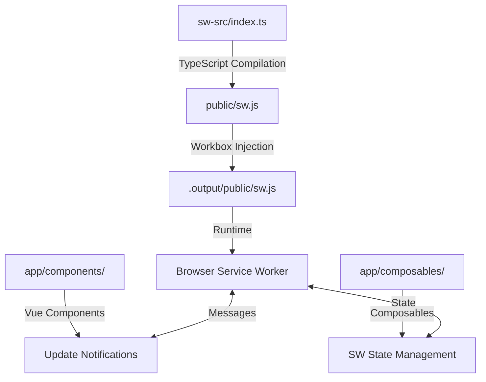

# 🚀 CleverAI PWA Documentation

> **Complete Progressive Web App Guide**
> Everything you need to know about the PWA system, Service Worker, Caching, Notifications, Updates, and Build Pipeline

---

## 📑 Table of Contents

1. [Quick Start & Overview](#-quick-start--overview)
2. [Architecture & System Design](#-architecture--system-design)
3. [Build Pipeline & Compilation](#-build-pipeline--compilation)
4. [Service Worker Implementation](#-service-worker-implementation)
5. [Caching Strategies](#-caching-strategies)
6. [Update System](#-update-system)
7. [Development Tools](#-development-tools)
8. [Constants & Configuration](#-constants--configuration)
9. [Testing & Validation](#-testing--validation)
10. [Deployment & Production](#-deployment--production)
11. [Troubleshooting](#-troubleshooting)

---

## 🎯 Quick Start & Overview

### What is This PWA System?

CleverAI uses a **comprehensive Progressive Web App (PWA) implementation** built on Nuxt 4 with TypeScript and advanced Workbox integration. This provides:

- ✅ **Offline functionality** - Complete app functionality without internet
- ✅ **Install to home screen** - Native app-like experience with proper manifest
- ✅ **Background sync** - Form data and file uploads sync when connection returns
- ✅ **Push notifications** - Real-time user engagement with click handling
- ✅ **Smart caching** - Multi-layer caching with asset discovery and prewarming
- ✅ **Auto-updates** - Seamless service worker updates with user control
- ✅ **IndexedDB integration** - Offline data storage with schema migration
- ✅ **Chunked file uploads** - Resilient upload system with retry logic
- ✅ **Periodic sync** - Scheduled background content updates

### Key Commands

```bash
# Development with hot reload
yarn dev

# Build service worker only
yarn sw:build

# Full production build with PWA
yarn build:inject

# Test PWA offline functionality
yarn test:pwa-offline

# Debug and development tools
open http://localhost:3000/debug
open http://localhost:3000/test-enhanced-sw
```

### Critical Files You Need to Know

| File | Purpose | Edit? |
|------|---------|-------|
| `sw-src/index.ts` | **Main service worker source (TypeScript)** | ✅ YES |
| `app/pages/offline.vue` | **Offline fallback page** | ✅ YES |
| `app/composables/useOffline.ts` | **Background sync logic** | ✅ YES |
| `app/plugins/sw-sync.client.ts` | **Sync registration** | ✅ YES |
| `public/sw.js` | **Compiled service worker** | ❌ AUTO-GENERATED |
| `public/manifest.webmanifest` | **PWA manifest** | ✅ YES |
| `scripts/inject-sw.cjs` | **Workbox injection pipeline** | ⚠️ RARELY |
| `shared/constants/pwa.ts` | **PWA constants & configuration** | ✅ YES |

---

## 🏗️ Architecture & System Design

### PWA Pipeline Overview



### Core Technologies

- **Nuxt 4.0.3**: Framework with manual PWA control
- **TypeScript**: Service worker development with full type safety
- **Workbox 7.3.0**: Precaching, routing, and caching strategies
- **Vue 3**: Reactive UI components and composables
- **IndexedDB**: Offline data storage with schema versioning
- **Web Push API**: Notification system with VAPID authentication
- **Background Sync API**: Offline form submission and data sync
- **Periodic Sync API**: Scheduled background updates

### Why Enhanced Custom Implementation?

We use an enhanced custom PWA instead of standard solutions because:

1. **Advanced Features**: Background sync, IndexedDB migration, chunked uploads
2. **Full Control**: Complete control over caching strategies and offline behavior
3. **TypeScript Safety**: Type-safe service worker with comprehensive error handling
4. **Performance**: Only include needed features, optimized bundle size
5. **Debugging**: Comprehensive development tools and debug capabilities
6. **Production Ready**: Robust error recovery and retry mechanisms

---

## 🔧 Build Pipeline & Compilation

### Three-Stage Build Process

#### Stage 1: TypeScript Compilation
```bash
yarn sw:build
# sw-src/index.ts → public/sw.js
```

#### Stage 2: Workbox Injection
```bash
yarn build:inject
# Injects __WB_MANIFEST into compiled SW
```

#### Stage 3: Production Build
```bash
yarn build
# Nuxt builds everything to .output/
```

### Build Scripts Explained

#### `scripts/inject-sw.cjs`
```javascript
// Workbox manifest injection for production
const { injectManifest } = require('workbox-build')

// Injects list of all static assets into service worker
// Replaces self.__WB_MANIFEST placeholder
```

#### `scripts/check-sw-placeholder.cjs`
```javascript
// Safety check: Ensures __WB_MANIFEST placeholder exists
// Prevents build failures during injection
```

### Package.json Scripts

```json
{
  "scripts": {
    "sw:build": "esbuild sw-src/index.ts --bundle --outfile=public/sw.js",
    "sw:check": "node scripts/check-sw-placeholder.cjs",
    "build:inject": "yarn sw:build && yarn sw:check && node scripts/inject-sw.cjs",
    "build": "nuxt build",
    "dev": "yarn sw:build && nuxt dev"
  }
}
```

### Critical Build Requirement

⚠️ **IMPORTANT**: The service worker must contain the exact string `self.__WB_MANIFEST` for Workbox injection to work.

**✅ Correct TypeScript code:**
```typescript
// This compiles to: self.__WB_MANIFEST
const manifest = (self as any).__WB_MANIFEST || []
```

**❌ Incorrect TypeScript code:**
```typescript
// This compiles to: selfWithWB.__WB_MANIFEST (Workbox can't find it)
const selfWithWB = self as unknown as { __WB_MANIFEST?: any }
let manifest = selfWithWB.__WB_MANIFEST
```

---

## ⚙️ Service Worker Implementation

### Main Service Worker (`sw-src/index.ts`)

This is the **comprehensive TypeScript service worker** with advanced PWA features:

```typescript
import { precacheAndRoute, cleanupOutdatedCaches } from 'workbox-precaching'
import { registerRoute } from 'workbox-routing'
import { CacheFirst, StaleWhileRevalidate } from 'workbox-strategies'
import { ExpirationPlugin } from 'workbox-expiration'
import { SW_CONFIG, CACHE_NAMES, AUTH_STUBS } from '../shared/constants'

// Version and configuration
const SW_VERSION = SW_CONFIG.VERSION
```

### Key Features

1. **Precaching**: All build assets automatically cached
2. **Runtime Caching**: Strategic caching for different resource types
3. **Background Sync**: Offline form submissions and file uploads
4. **Push Notifications**: Complete notification system with click handling
5. **Update Management**: Seamless update detection and application
6. **Error Recovery**: Robust error handling and retry mechanisms
7. **Development Tools**: Debug features for development environment

---

## 🔄 Update System

### Enhanced Service Worker Update Notification

The `ServiceWorkerUpdateNotification.vue` component is a **comprehensive solution** that combines:

- ✅ **User-friendly update notifications** (banner and modal)
- ✅ **Developer debugging panel** (SW status, uploads, errors)
- ✅ **Network status monitoring** (online/offline indication)
- ✅ **Keyboard shortcuts** (development mode)
- ✅ **File upload progress** (chunked upload tracking)
- ✅ **Error handling** (comprehensive error display)

#### Enhanced Component Features

```vue
<!-- Full-featured component usage -->
<ServiceWorkerUpdateNotification
  mode="auto"              <!-- banner | modal | auto -->
  :auto-show="true"        <!-- Automatically show updates -->
  :enable-debug-panel="true" <!-- Show debug panel (dev mode) -->
/>
```

#### Development Keyboard Shortcuts

- **`Ctrl/Cmd + Shift + D`** - Toggle debug panel
- **`Ctrl/Cmd + Shift + U`** - Force update or simulate update
- **`Ctrl/Cmd + Shift + R`** - Force page refresh

#### Component Modes

1. **Banner Mode**: Slide-down notification from top
2. **Modal Mode**: Full-screen update dialog
3. **Auto Mode**: Banner for regular updates, modal for critical updates

#### Update Detection (`useServiceWorkerUpdates` composable)

- **Automatic Checks**: Every 5 minutes in background
- **User Control**: Updates only apply when user chooses
- **Progress Tracking**: Visual progress indicators
- **Error Recovery**: Graceful fallbacks if updates fail

---

## 🛠️ Development Tools

### Dev Mode Controls

Development mode includes enhanced debugging capabilities:

#### **Available Dev Mode Functions**

1. **Force SW Update** - Manually triggers service worker update check
2. **Force SW Control** - Forces service worker to take control of the page
3. **Manual Refresh** - Simple page reload functionality
4. **Debug SW** - Comprehensive service worker state logging
5. **Test SW Message** - Tests message passing between page and service worker

#### **Enhanced Composable Features**

```typescript
// Development-only functions (conditionally available)
const {
  // Production functions (always available)
  updateAvailable,
  isUpdating,
  checkForUpdates,
  applyUpdate,

  // Development functions (dev mode only)
  forceServiceWorkerUpdate,
  forceServiceWorkerControl,
  manualRefresh,
  debugServiceWorker
} = useServiceWorkerUpdates()
```

### Testing Pages

1. **`/test-enhanced-sw`** - Enhanced component testing with all features
2. **`/debug`** - Comprehensive debug dashboard with live logging
3. **`/offline`** - Offline experience testing

---

## ⚙️ Constants & Configuration

### Centralized Configuration

All PWA constants are now centralized in `shared/constants/pwa.ts`:

#### **Before vs After Refactoring:**

**✅ BEFORE:**
```typescript
const SW_VERSION = 'v1.8.0-enhanced'
const DB_NAME = 'recwide_db'
const CACHE_NAMES = { pages: 'pages', assets: 'assets' }
```

**✅ AFTER:**
```typescript
import { SW_CONFIG, DB_CONFIG, CACHE_NAMES } from '../../shared/constants'

const SW_VERSION = SW_CONFIG.VERSION
const { NAME: DB_NAME } = DB_CONFIG
```

#### **Key Configuration Sections:**

1. **SW_CONFIG** - Service worker version, timeouts, intervals
2. **CACHE_NAMES** - All cache names and strategies
3. **DB_CONFIG** - IndexedDB configuration
4. **UPLOAD_CONFIG** - Chunked upload settings
5. **AUTH_STUBS** - Development authentication stubs
6. **URL_PATTERNS** - Route matching patterns

### Files Refactored

- `sw-src/index.ts` - Service worker constants
- `app/composables/useOffline.ts` - Offline functionality
- `app/plugins/sw-sync.client.ts` - Sync registration
- `app/pages/offline.vue` - Offline experience

---

## 🧪 Testing & Validation

### Manual Testing

#### **1. Basic Update Detection**
1. Make a change to any file
2. Run `yarn build:inject`
3. Refresh the browser
4. Update notification should appear

#### **2. Offline Functionality**
1. Open browser dev tools → Network tab
2. Set to "Offline"
3. Navigate the app - should work fully offline
4. Submit forms - should queue for background sync

#### **3. Installation Testing**
1. Open site in Chrome/Edge
2. Look for install prompt or address bar icon
3. Install as PWA
4. Test app functionality in standalone mode

### Automated Testing

```bash
# Run PWA offline tests
yarn test:pwa-offline

# Run basic PWA tests
yarn test:pwa-basic
```

### CI Validation

Quick validation steps for service worker injection:

```bash
# Check that SW placeholder exists
node scripts/check-sw-placeholder.cjs

# Verify injection worked
grep -q "workbox-" .output/public/sw.js && echo "✅ Workbox injected"
```

---

## 🚀 Deployment & Production

### Production Checklist

- [ ] Run `yarn build:inject` to inject Workbox manifest
- [ ] Verify `sw.js` contains workbox code (not just placeholder)
- [ ] Test offline functionality in production build
- [ ] Verify update notifications work correctly
- [ ] Check PWA install prompt appears
- [ ] Test background sync functionality
- [ ] Validate push notifications (if enabled)

### Environment Configuration

```bash
# Required environment variables
VAPID_PUBLIC_KEY=your_vapid_public_key
VAPID_PRIVATE_KEY=your_vapid_private_key
NOTIFICATION_EMAIL=your_email@domain.com
```

### Performance Considerations

1. **Service Worker Size**: Keep SW bundle small for fast updates
2. **Cache Strategy**: Balance between performance and storage
3. **Update Frequency**: Don't check for updates too frequently
4. **Asset Precaching**: Only precache critical assets

---

## 🔧 Troubleshooting

### Common Issues

#### **Service Worker Not Updating**
- Check browser dev tools → Application → Service Workers
- Clear all data and try again
- Verify `__WB_MANIFEST` placeholder exists in source
- Check console for Workbox injection errors

#### **Offline Functionality Not Working**
- Verify service worker is active and controlling the page
- Check Network tab - requests should show "(from ServiceWorker)"
- Clear cache and reload
- Check IndexedDB for stored offline data

#### **Build Issues**
- Ensure `yarn sw:build` runs without errors
- Check that `public/sw.js` is generated
- Verify Workbox injection completed successfully
- Check for TypeScript compilation errors

#### **Update Notifications Not Showing**
- Check `useServiceWorkerUpdates` composable is properly imported
- Verify component is added to layout
- Check browser console for JavaScript errors
- Test in incognito/private mode

### Debug Tools

1. **`/debug`** - Comprehensive debugging dashboard
2. **Browser DevTools** - Application → Service Workers
3. **Console Logging** - All debug functions use `[DEV]` prefix
4. **Network Tab** - Verify requests are served from SW

### Emergency SW Cleanup

If service worker gets in a bad state:

```javascript
// Emergency cleanup (run in browser console)
navigator.serviceWorker.getRegistrations().then(registrations => {
  registrations.forEach(registration => registration.unregister())
})
```

---

## 📚 Additional Resources

- [Workbox Documentation](https://developers.google.com/web/tools/workbox)
- [PWA Best Practices](https://web.dev/pwa-checklist/)
- [Service Worker Lifecycle](https://web.dev/service-worker-lifecycle/)
- [IndexedDB Guide](https://developer.mozilla.org/en-US/docs/Web/API/IndexedDB_API)

---

*Last updated: September 2025*
