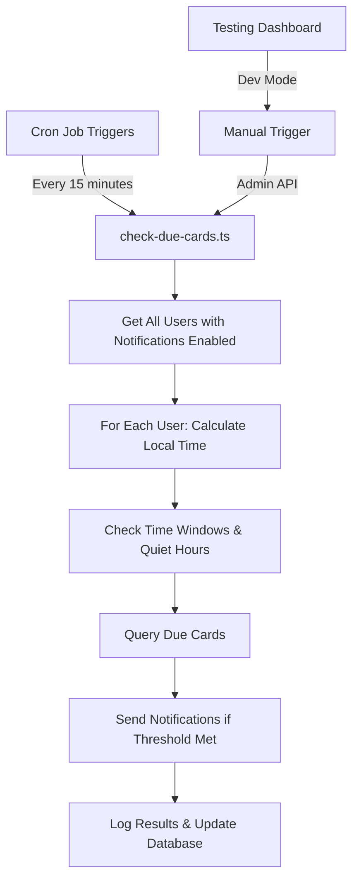

# ⏰ Cron & Timing System Documentation

> **Complete guide to CleverAI's timezone-aware cron system, notification timing, and testing framework**

---

## 📑 Table of Contents

1. [System Overview](#-system-overview)
2. [Architecture & Components](#-architecture--components)
3. [Timezone System](#-timezone-system)
4. [Cron Job Management](#-cron-job-management)
5. [Testing Framework](#-testing-framework)
6. [Configuration Guide](#-configuration-guide)
7. [Comprehensive Test Scenarios](#-comprehensive-test-scenarios)
8. [Framework Migration](#-framework-migration)
9. [Troubleshooting](#-troubleshooting)

---

## 🎯 System Overview

### ✅ **All 4 Critical Improvements Implemented**

1. **🔄 Reduced Cron Frequency (Performance)**
   - **Before**: `*/1 * * * *` (every minute)
   - **After**: `*/15 * * * *` (every 15 minutes)
   - **Impact**: 93% reduction in server load

2. **🌍 Timezone Awareness (Biggest Impact)**
   - Complete timezone utility system: `server/utils/timezone.ts`
   - Functions: `getUserLocalTime`, `isWithinTimeWindow`, `isInQuietHours`
   - Handles: DST transitions, timezone validation, midnight-spanning quiet hours

3. **⏰ Honor cardDueTime Preferences (User Expectation)**
   - Enhanced: `server/tasks/check-due-cards.ts`
   - Logic: Only sends notifications during user's preferred time window
   - Timezone-aware: Respects user's local timezone for accurate timing

4. **📅 Daily Reminder Logic (Feature Completion)**
   - New feature: Daily reminder notifications
   - Prevention: Once-per-day logic prevents spam
   - Timezone-aware: Respects user's local timezone and quiet hours

### Framework-Agnostic Design

The cron system is designed to be **framework-agnostic** and can easily migrate between:
- ✅ Nuxt.js (current implementation)
- ✅ Next.js
- ✅ Express.js
- ✅ NestJS
- ✅ Any Node.js framework

---

## 🏗️ Architecture & Components

### Core Components

1. **CronManager** - Core scheduling logic (framework-independent)
2. **Plugin/Middleware** - Framework-specific initialization
3. **Admin API** - Management and monitoring endpoints
4. **Timezone Utilities** - Complete timezone calculation system
5. **Testing Dashboard** - Development-only testing interface

### Key Files

| File | Purpose | Framework-Specific? |
|------|---------|-------------------|
| `server/services/CronManager.ts` | Core cron logic | ❌ No |
| `server/utils/timezone.ts` | Timezone calculations | ❌ No |
| `server/tasks/check-due-cards.ts` | Main notification task | ❌ No |
| `server/plugins/cron.server.ts` | Nuxt initialization | ✅ Yes |
| `server/api/admin/cron.ts` | Admin management API | ⚠️ Route format |

### System Flow



---

## 🌍 Timezone System

### Timezone Utilities (`server/utils/timezone.ts`)

#### **Core Functions**

```typescript
// Get user's current local time
getUserLocalTime(userTimezone: string): Date

// Check if current time is within user's preferred window
isWithinTimeWindow(
  userTimezone: string,
  startTime: string,    // "09:00"
  endTime: string       // "21:00"
): boolean

// Check if user is in quiet hours
isInQuietHours(
  userTimezone: string,
  quietStart: string,   // "22:00"
  quietEnd: string      // "08:00"
): boolean
```

#### **Advanced Features**

1. **DST Handling**: Automatic daylight saving time transitions
2. **Midnight Spanning**: Handles quiet hours like "22:00-08:00"
3. **Timezone Validation**: Validates IANA timezone identifiers
4. **Edge Case Handling**: Robust error handling for invalid timezones

#### **Supported Timezones**

All IANA timezone identifiers are supported, including:
- `America/New_York` - Eastern Time (EST/EDT)
- `Europe/London` - Greenwich Mean Time (GMT/BST)
- `Asia/Tokyo` - Japan Standard Time (JST)
- `America/Los_Angeles` - Pacific Time (PST/PDT)
- `Australia/Sydney` - Australian Eastern Time (AEST/AEDT)

---

## ⚙️ Cron Job Management

### CronManager Service

#### **Initialization**

```typescript
// server/services/CronManager.ts
class CronManager {
  private jobs = new Map<string, CronJob>()
  private taskStatus = new Map<string, TaskStatus>()

  // Framework-agnostic initialization
  initialize() {
    this.registerTask('check-due-cards', checkDueCardsTask)
    this.startJobs()
  }
}
```

#### **Task Registration**

```typescript
// Register any task function
registerTask(name: string, taskFunction: () => Promise<void>) {
  this.tasks.set(name, taskFunction)
}

// Add cron job with schedule
addJob(name: string, schedule: string, timezone?: string) {
  const job = new CronJob(schedule, this.executeTask(name), null, false, timezone)
  this.jobs.set(name, job)
}
```

### Environment Configuration

```bash
# Enable cron system
ENABLE_CRON=true

# Main notification job
CRON_CHECK_DUE_CARDS_SCHEDULE="*/15 * * * *"  # Every 15 minutes
CRON_CHECK_DUE_CARDS_TIMEZONE="UTC"           # Server timezone

# Admin API security
CRON_SECRET_TOKEN=your-secret-token-here

# Enhanced logging
DEBUG_NOTIFICATIONS=true
DEBUG_TIMEZONE_CALCULATIONS=true
```

### Admin API Endpoints

#### **View Cron Status**
```bash
GET /api/admin/cron?secret=your-token

Response:
{
  "jobs": [
    {
      "name": "check-due-cards",
      "schedule": "*/15 * * * *",
      "running": true,
      "lastRun": "2025-09-14T10:15:00Z",
      "nextRun": "2025-09-14T10:30:00Z"
    }
  ]
}
```

#### **Manual Trigger**
```bash
POST /api/admin/cron?secret=your-token&job=check-due-cards

Response:
{
  "success": true,
  "job": "check-due-cards",
  "startTime": "2025-09-14T10:16:30Z",
  "message": "Job executed successfully"
}
```

---

## 🧪 Testing Framework

### Testing Dashboard (Development Only)

A comprehensive testing dashboard is available in **development mode only**.

#### **Access Methods**
1. **Floating Button**: Purple beaker icon in bottom-right corner
2. **Direct URL**: `http://localhost:3000/debug`
3. **Auto-appears**: Only in development environment

#### **Dashboard Features**
- ⚡ **Manual cron trigger** - Test immediately without waiting
- 🎯 **5 preset scenarios** - Common user patterns pre-configured
- 📊 **Real-time status** - Server time, user timezone, preferences
- 🔗 **Quick links** - Direct access to APIs and debug tools
- 💻 **Console guide** - Copy-paste commands for manual testing

### 5-Minute Smoke Test 🚀

```
Purpose: Quick validation of core functionality
Steps:
1. Open testing dashboard (purple beaker icon)
2. Click "🌍 Timezone Edge" scenario
3. Click "🚀 Trigger Cron Now"
4. Verify notification appears within 2 minutes
```

### Preset Scenarios

#### **New User Experience** 👋
```
Scenario: First-time user with default settings
- Timezone: America/New_York
- Due time: 09:00
- Threshold: 5 cards
- No quiet hours or daily reminders
```

#### **Power User** 💪
```
Scenario: Heavy user with optimized settings
- Timezone: America/Los_Angeles
- Due time: 07:00 (early bird)
- Threshold: 20 cards (high volume)
- Quiet hours: 23:00-06:00
- Daily reminder: 20:00
```

#### **Casual Learner** 🌱
```
Scenario: Evening study sessions
- Timezone: Europe/London
- Due time: 19:00
- Threshold: 3 cards (low pressure)
- Quiet hours: 22:00-08:00
- Daily reminder: 18:30
```

#### **Night Owl** 🦉
```
Scenario: Late night learning
- Timezone: Asia/Tokyo
- Due time: 23:00
- Threshold: 1 card (immediate notifications)
- Quiet hours: 02:00-10:00
- No daily reminders
```

---

## ⚙️ Configuration Guide

### Required Environment Variables

```bash
# Core System
NODE_ENV=development                                  # Enables testing dashboard
ENABLE_CRON=true                                      # Enable cron system

# Scheduling
CRON_CHECK_DUE_CARDS_SCHEDULE="*/15 * * * *"         # Every 15 minutes (NOT */1!)
CRON_CHECK_DUE_CARDS_TIMEZONE="UTC"                  # Server cron timezone

# Security
CRON_SECRET_TOKEN=test-secret-token-for-debugging    # Security for manual triggers

# Database
DATABASE_URL="your-database-connection-string"

# Optional: Enhanced Logging
DEBUG_NOTIFICATIONS=true
DEBUG_TIMEZONE_CALCULATIONS=true
```

### Database Schema Requirements

```sql
-- Ensure all required columns exist
ALTER TABLE UserNotificationPreferences ADD COLUMN IF NOT EXISTS timezone VARCHAR(50) DEFAULT 'UTC';
ALTER TABLE UserNotificationPreferences ADD COLUMN IF NOT EXISTS cardDueTime VARCHAR(5) DEFAULT '09:00';
ALTER TABLE UserNotificationPreferences ADD COLUMN IF NOT EXISTS cardDueThreshold INTEGER DEFAULT 5;
ALTER TABLE UserNotificationPreferences ADD COLUMN IF NOT EXISTS quietHoursEnabled BOOLEAN DEFAULT false;
ALTER TABLE UserNotificationPreferences ADD COLUMN IF NOT EXISTS quietHoursStart VARCHAR(5) DEFAULT '22:00';
ALTER TABLE UserNotificationPreferences ADD COLUMN IF NOT EXISTS quietHoursEnd VARCHAR(5) DEFAULT '08:00';
ALTER TABLE UserNotificationPreferences ADD COLUMN IF NOT EXISTS dailyReminderEnabled BOOLEAN DEFAULT false;
ALTER TABLE UserNotificationPreferences ADD COLUMN IF NOT EXISTS dailyReminderTime VARCHAR(5) DEFAULT '19:00';
```

### Package.json Scripts

```json
{
  "scripts": {
    "dev": "nuxt dev",
    "build": "nuxt build",
    "test:cron": "curl -X POST 'http://localhost:3000/api/admin/cron?secret=test-token&job=check-due-cards'",
    "test:cron-status": "curl 'http://localhost:3000/api/admin/cron?secret=test-token'"
  }
}
```

---

## 🧪 Comprehensive Test Scenarios

### Test Setup Requirements

#### **Prerequisites**
1. **Development Server**: `yarn dev` running (required for debug controls)
2. **Database Access**: Prisma client connected and migrations applied
3. **Test Environment**: `.env.local` configured for testing
4. **Browser Tools**: Chrome/Firefox with developer console access
5. **Test User Account**: Create or use existing user for notification testing
6. **Push Notifications**: Browser permission granted for notification testing

#### **Quick Timezone Testing Helper**
```typescript
// Use this in browser console to quickly test timezones
const testTimezones = [
  'America/New_York',    // EST/EDT (UTC-5/-4)
  'Europe/London',       // GMT/BST (UTC+0/+1)
  'Asia/Tokyo',          // JST (UTC+9)
  'America/Los_Angeles', // PST/PDT (UTC-8/-7)
  'Australia/Sydney'     // AEST/AEDT (UTC+10/+11)
]

testTimezones.forEach(tz => {
  console.log(`${tz}: ${new Date().toLocaleString('en-US', {timeZone: tz})}`)
})
```

### Scenario 1: New User Experience (Default Settings)

#### 1.1 Setup Notification Preferences
**Goal**: Test default user experience with timezone awareness

**Steps**:
1. Navigate to **Settings → Notification Preferences**
2. Configure these settings:
   ```
   📚 Card Due Notifications: ✅ ENABLED
   ⏰ Notification Time: 09:00 (9 AM)
   🎯 Threshold: "Focused Reviewer" (5 cards)
   🌍 Timezone: America/New_York (EST/EDT)
   🤫 Quiet Hours: ✅ ENABLED (22:00 - 08:00)
   📅 Daily Reminders: ✅ ENABLED (19:00 - 7 PM)
   ```

**Expected Behavior**:
- Timezone dropdown shows "🗽 Eastern Time (New York)"
- Current time display updates to show EST/EDT time
- All time inputs respect the selected timezone

#### 1.2 Test Manual Trigger
```bash
# Quick manual test
curl -X POST "http://localhost:3000/api/admin/cron?secret=test-token&job=check-due-cards"
```

### Scenario 2: Timezone Edge Cases

#### 2.1 Daylight Saving Time Transitions
**Test Date**: During DST transition dates (March/November)

**Steps**:
1. Set timezone to `America/New_York`
2. Set due time to `02:30` (during DST gap)
3. Trigger cron job during transition period
4. Verify correct time calculations

#### 2.2 Midnight-Spanning Quiet Hours
**Goal**: Test quiet hours that span midnight

**Setup**:
```
Quiet Hours: 22:00 - 08:00
Current Time: 23:30 (should be in quiet hours)
Current Time: 07:30 (should be in quiet hours)
Current Time: 15:30 (should NOT be in quiet hours)
```

### Scenario 3: High Volume Testing

#### 3.1 Multiple Users with Different Timezones
**Goal**: Test system with users across multiple timezones

**Setup**:
1. Create 5 test users in different timezones
2. Set different due times and thresholds
3. Create cards for each user
4. Trigger cron job and verify correct timing

#### 3.2 Performance Testing
**Goal**: Validate 15-minute schedule reduces server load

**Steps**:
1. Monitor server resources during cron execution
2. Compare with hypothetical 1-minute schedule impact
3. Verify notifications still arrive timely

---

## 🔄 Framework Migration

### For Express.js

```typescript
// app.js
import { CronManager } from './services/CronManager.js'

const cronManager = new CronManager()

if (process.env.ENABLE_CRON === 'true') {
  cronManager.initialize()
}

// Admin routes
app.get('/api/admin/cron', cronAdminHandler)
app.post('/api/admin/cron', cronTriggerHandler)
```

### For NestJS

```typescript
// cron.service.ts
@Injectable()
export class CronService {
  private cronManager = new CronManager()

  onModuleInit() {
    if (process.env.ENABLE_CRON === 'true') {
      this.cronManager.initialize()
    }
  }
}

// cron.controller.ts
@Controller('admin/cron')
@UseGuards(AdminGuard)
export class CronController {
  @Get()
  getCronStatus() { /* ... */ }

  @Post()
  triggerJob(@Query('job') job: string) { /* ... */ }
}
```

### For Next.js

```typescript
// pages/api/admin/cron.ts
import { CronManager } from '../../services/CronManager'

const cronManager = new CronManager()

// Initialize in API middleware
if (process.env.ENABLE_CRON === 'true') {
  cronManager.initialize()
}

export default function handler(req, res) {
  if (req.method === 'GET') {
    return res.json(cronManager.getStatus())
  }

  if (req.method === 'POST') {
    const { job } = req.query
    return cronManager.triggerJob(job)
  }
}
```

---

## 🔧 Troubleshooting

### Common Issues

#### **Cron Jobs Not Running**
1. Check `ENABLE_CRON=true` in environment
2. Verify server startup logs show cron initialization
3. Check admin API status: `curl localhost:3000/api/admin/cron?secret=token`

#### **Wrong Timezone Calculations**
1. Verify user's timezone is valid IANA identifier
2. Check server timezone with `date` command
3. Test timezone utility functions in isolation

#### **Notifications Not Sending**
1. Verify users have cards due
2. Check user's notification preferences are enabled
3. Verify not in quiet hours
4. Check notification threshold is met

#### **Performance Issues**
1. Ensure using 15-minute schedule (not 1-minute)
2. Monitor database query performance
3. Check for timezone calculation bottlenecks

### Debug Commands

```bash
# Check cron status
curl "http://localhost:3000/api/admin/cron?secret=test-token"

# Manual trigger with logging
curl -X POST "http://localhost:3000/api/admin/cron?secret=test-token&job=check-due-cards" -v

# Test timezone calculations
node -e "
const tz = require('./server/utils/timezone.ts');
console.log('NYC Time:', tz.getUserLocalTime('America/New_York'));
console.log('Quiet Hours:', tz.isInQuietHours('America/New_York', '22:00', '08:00'));
"
```

### Emergency Reset

```bash
# Stop all cron jobs (if needed)
curl -X POST "http://localhost:3000/api/admin/cron?secret=test-token&action=stop-all"

# Restart cron system
curl -X POST "http://localhost:3000/api/admin/cron?secret=test-token&action=restart"
```

---

## 📚 Additional Resources

- [Node-cron Documentation](https://github.com/node-cron/node-cron)
- [IANA Timezone Database](https://www.iana.org/time-zones)
- [Daylight Saving Time Rules](https://en.wikipedia.org/wiki/Daylight_saving_time)
- [Cron Expression Generator](https://crontab.guru/)

---

*Last updated: September 2025*
