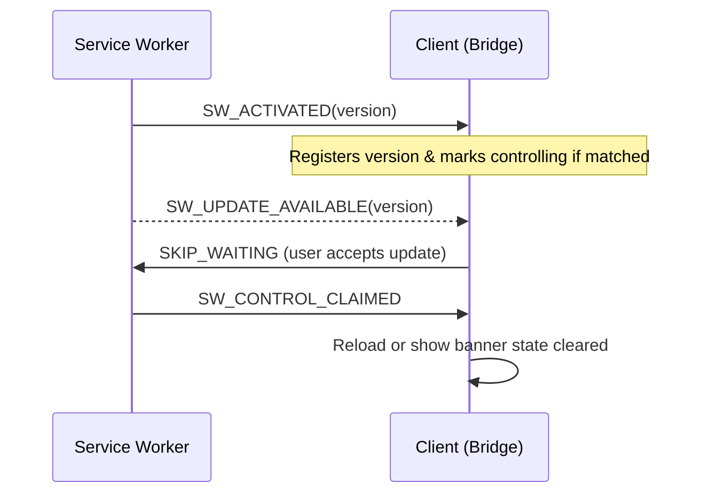
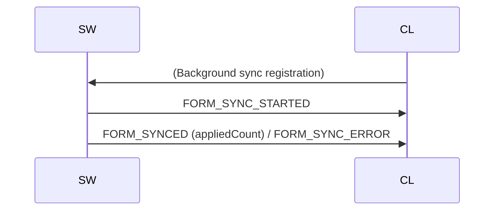
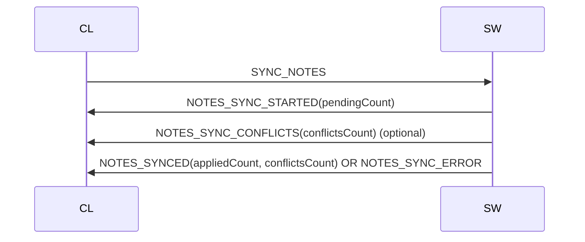
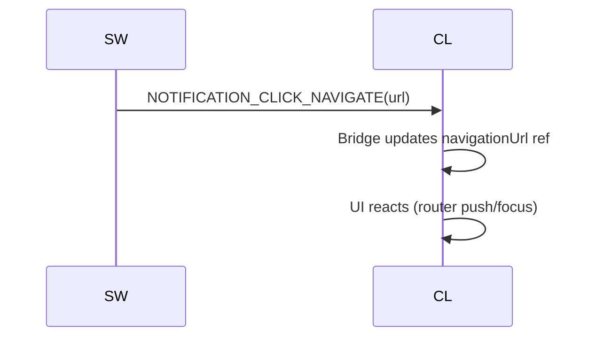

# 🧩 Service Worker Messaging Lifecycle

> Canonical reference for all Service Worker ↔ Client message types, payload schemas, flows, and extension guidelines.
>
> Source of truth locations:
> - Runtime constants: `app/utils/constants/pwa.ts` (`SW_MESSAGE_TYPES`)
> - Type contracts: `shared/types/sw-messages.ts`
> - Bridge implementation: `app/composables/useServiceWorkerBridge.ts`
> - Service worker handlers: `sw-src/index.ts`
> - Unified DB helper: `app/utils/idb.ts`
>
> Legacy aliases (`SW_MESSAGE_TYPE`) and DB wrappers (`openFormsDB`, `openNotesDB`) have been removed. Use `SW_MESSAGE_TYPES` and `openUnifiedDB` exclusively.

---
## 📑 Table of Contents
1. Overview
2. Design Goals & Principles
3. Message Taxonomy
4. Direction Matrix (SW→Client vs Client→SW)
5. Payload Schemas (Type References)
6. Lifecycle Sequences (Diagrams)
7. Error & Edge Handling
8. Adding a New Message Type (Checklist)
9. Deprecations & Migration Notes
10. Verification & Testing
11. FAQ

---
## 1. Overview
The messaging layer enables structured, type-safe communication between the service worker and application windows (clients). It covers activation, updates, offline sync (forms + notes), debug commands, and user-triggered actions (navigation from notification clicks).

---
## 2. Design Goals & Principles
- Single source of truth for message string values (`SW_MESSAGE_TYPES`).
- Discriminated unions for compile-time exhaustiveness (`assertNever`).
- Separation of concerns: SW only emits defined outgoing messages; client only sends defined incoming messages.
- Minimal payloads: only necessary fields; avoid large blobs.
- Forward compatibility: additive changes use optional fields; avoid breaking renames.
- Graceful degradation: unknown message types ignored with a dev warning.

---
## 3. Message Taxonomy
Categories:
- Activation & Control: `SW_ACTIVATED`, `SW_CONTROL_CLAIMED`, `SW_UPDATE_AVAILABLE`, `SKIP_WAITING`, `CLAIM_CONTROL`.
- Update / Versioning: `SW_UPDATE_AVAILABLE`, client triggers `SKIP_WAITING`.
- Debug / Diagnostics: `SET_DEBUG`, `ERROR`.
- Offline Sync – Forms: `FORM_SYNC_STARTED`, `FORM_SYNCED`, `FORM_SYNC_ERROR`.
- Offline Sync – Notes: `NOTES_SYNC_STARTED`, `NOTES_SYNCED`, `NOTES_SYNC_ERROR`, `NOTES_SYNC_CONFLICTS`.
- Notifications: `NOTIFICATION_CLICK_NAVIGATE` (SW→Client), test harness `TEST_NOTIFICATION_CLICK` (Client→SW).
- Data Ops / Triggers: `SYNC_NOTES` (Client→SW background notes sync trigger).

---
## 4. Direction Matrix
| Message Type | Direction | Purpose |
|--------------|-----------|---------|
| `SW_ACTIVATED` | SW → Client | Signals successful activation & version.
| `SW_CONTROL_CLAIMED` | SW → Client | Page now under SW control.
| `SW_UPDATE_AVAILABLE` | SW → Client | A new version is waiting.
| `SKIP_WAITING` | Client → SW | Request immediate activation of waiting SW.
| `CLAIM_CONTROL` | Client → SW | Prompt SW to claim uncontrolled clients.
| `SET_DEBUG` | Client → SW | Toggle SW debug logging.
| `FORM_SYNC_STARTED` | SW → Client | Forms sync cycle started.
| `FORM_SYNCED` | SW → Client | Forms sync completed.
| `FORM_SYNC_ERROR` | SW → Client | Forms sync failed.
| `NOTES_SYNC_STARTED` | SW → Client | Notes sync begun.
| `NOTES_SYNCED` | SW → Client | Notes sync succeeded.
| `NOTES_SYNC_ERROR` | SW → Client | Notes sync failed.
| `NOTES_SYNC_CONFLICTS` | SW → Client | Notes sync had conflicts.
| `SYNC_NOTES` | Client → SW | Trigger notes sync attempt.
| `TEST_NOTIFICATION_CLICK` | Client → SW | Simulate a notification click (dev/testing).
| `NOTIFICATION_CLICK_NAVIGATE` | SW → Client | Notify UI of navigation target after real click.
| `ERROR` | SW → Client | Generic error surfaced to UI (structured message).

---
## 5. Payload Schemas (Type References)
All interfaces are defined in `shared/types/sw-messages.ts`.

Example excerpt (simplified for brevity):
```ts
export interface FormSyncStartedMessage { type: typeof SW_MESSAGE_TYPES.FORM_SYNC_STARTED; data: { message: string; mode: 'background' | 'interactive' } }
export interface FormSyncedMessage { type: typeof SW_MESSAGE_TYPES.FORM_SYNCED; data: { message: string; appliedCount: number; mode: 'background' | 'interactive' } }
export interface FormSyncErrorMessage { type: typeof SW_MESSAGE_TYPES.FORM_SYNC_ERROR; data: { message: string; mode: 'background' | 'interactive' } }

export interface NotesSyncStartedMessage { type: typeof SW_MESSAGE_TYPES.NOTES_SYNC_STARTED; data: { message: string; pendingCount: number; mode: 'background' | 'interactive' } }
export interface NotesSyncedMessage { type: typeof SW_MESSAGE_TYPES.NOTES_SYNCED; data: { appliedCount: number; conflictsCount: number; mode: 'background' | 'interactive' } }
export interface NotesSyncConflictsMessage { type: typeof SW_MESSAGE_TYPES.NOTES_SYNC_CONFLICTS; data: { conflictsCount: number; mode: 'background' | 'interactive' } }
export interface NotesSyncErrorMessage { type: typeof SW_MESSAGE_TYPES.NOTES_SYNC_ERROR }
```

Use discriminated unions (`IncomingSWMessage` / `OutgoingSWMessage`) for exhaustive switches in the bridge and in the SW.

---
## 6. Lifecycle Sequences
### Activation & Update


### Forms Sync (Background Tag)


### Notes Sync (User-triggered)


### Notification Click


---
## 7. Error & Edge Handling
| Scenario | Behavior | Recovery |
|----------|----------|----------|
| Unknown message type | Ignored, dev console warn | None needed |
| Missing payload field | Bridge logs structured error | Message dropped |
| Transient IDB failures | SW retries (bounded via helper) | Success or emits `ERROR` on hard fail |
| Sync conflict (notes) | Emits `NOTES_SYNC_CONFLICTS` then `NOTES_SYNCED` | UI can show conflict resolution badge |
| Update available but user ignores | Banner remains, no forced reload | Next navigation can re-check |

Generic SW-level irrecoverable errors can emit `ERROR` messages with structure `{ message: string; identifier?: string }`.

---
## 8. Adding a New Message Type (Checklist)
1. Add constant key to `SW_MESSAGE_TYPES`.
2. Define interface in `shared/types/sw-messages.ts` and extend union.
3. Update SW emission logic (`sw-src/index.ts`).
4. Handle in `useServiceWorkerBridge.ts` switch: narrow with `Extract<>`, update reactive state.
5. Add documentation entry (this file – taxonomy section + sequence if needed).
6. If it’s user-triggered (Client→SW), ensure validation of payload fields.
7. Add at least one Playwright or unit test for emission + reception.
8. Avoid breaking changes: if evolving existing type, prefer adding optional fields.

---
## 9. Deprecations & Migration Notes
| Removed | Replacement | Status |
|---------|-------------|--------|
| `SW_MESSAGE_TYPE` alias re-export | Direct `SW_MESSAGE_TYPES` usage | Removed |
| `openFormsDB`, `openNotesDB` | `openUnifiedDB` | Removed |
| Duplicate local message interfaces (SW) | Central `shared/types/sw-messages.ts` | Complete |

Legacy wrappers remain for a short window; internal code should not call them except transitional compatibility layers.

---
## 10. Verification & Testing
Recommended tests:
- Bridge unit test: exhaustive switch uses `assertNever` for future safety.
- Playwright: trigger notes sync → expect ordered events (`STARTED` then `SYNCED` / `CONFLICTS`).
- Update flow: build new SW, visit page, assert `SW_UPDATE_AVAILABLE` received, trigger `SKIP_WAITING`, assert `SW_CONTROL_CLAIMED`.
- Notification click: simulate push → assert `NOTIFICATION_CLICK_NAVIGATE` and route change.

Manual debug aids:
```js
// From client console
navigator.serviceWorker.controller?.postMessage({ type: SW_MESSAGE_TYPES.SYNC_NOTES })

// Inspect received messages
window.__bridgeTap = (msg) => console.log('[Bridge Tap]', msg)
```
Integrate a diagnostic hook inside bridge if necessary (dev only).

---
## 11. FAQ
**Q: Why are message type values exported as an object instead of a TS enum?**  
A: Object of `as const` string literals avoids enum transpilation overhead in the SW bundle and enables tree-shakable value references.

**Q: Can I rename an existing message key?**  
Avoid renames—add new key, keep old one emitting transitional event until clients updated, then remove in a scheduled deprecation.

**Q: How do I send large payloads (e.g., arrays of records)?**  
Prefer IDB storage + send a small message referencing a key or count; keep messages lightweight to avoid serialization overhead.

**Q: What if a client misses a sync completion message?**  
Bridge persists last sync event type/state in reactive refs; the consuming UI can show stale data until next manual trigger. For critical flows, add a query endpoint to reconcile state.

**Q: How do I test error messages?**  
Force an artificial failure (e.g., throw inside sync handler) and observe `ERROR` message reception; assert UI surfaces the content.

---
_Last updated: November 2025_
