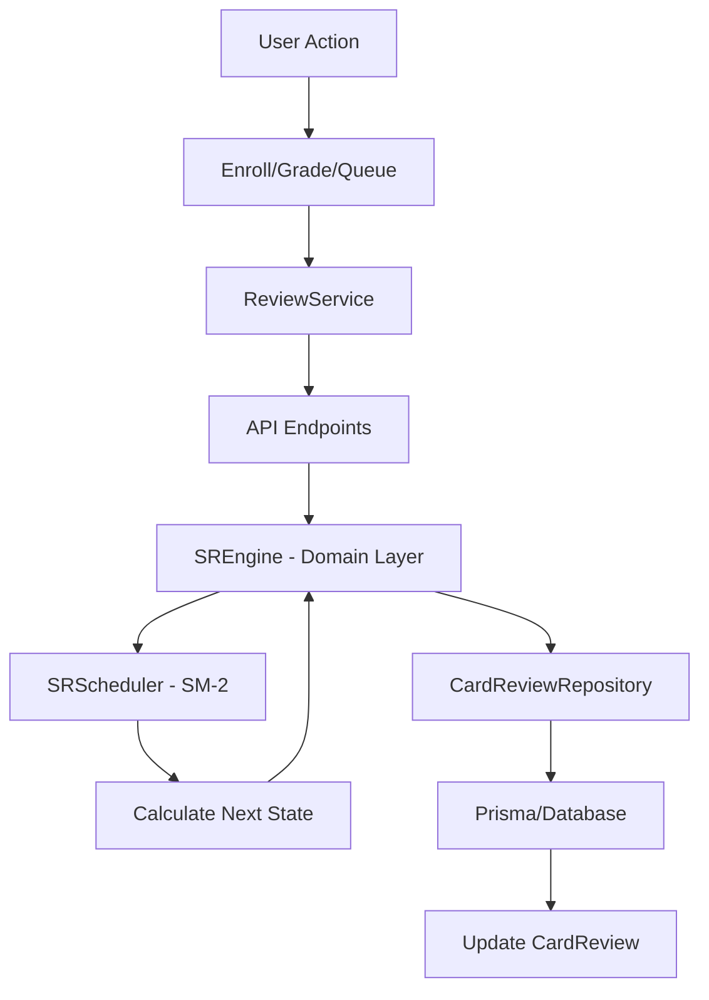

# 📚 Spaced Repetition System Documentation

> **Complete guide to CleverAI's spaced repetition learning system with SM-2 algorithm, analytics, and debug controls**

---

## 📑 Table of Contents

1. [System Overview](#-system-overview)
2. [Quick Start Guide](#-quick-start-guide)
3. [SM-2 Algorithm & Examples](#-sm-2-algorithm--examples)
4. [Architecture & Components](#-architecture--components)
5. [User Interface & Features](#-user-interface--features)
6. [Debug Controls & Testing](#-debug-controls--testing)
7. [API Reference](#-api-reference)
8. [Testing Workflows](#-testing-workflows)
9. [Performance & Analytics](#-performance--analytics)
10. [Troubleshooting](#-troubleshooting)

---

## 🎯 System Overview

The Spaced Repetition Card Review System transforms any material in your folders into reviewable flashcards using scientifically-proven spaced repetition intervals. The system automatically schedules reviews based on your performance, ensuring optimal memory retention with minimal time investment.

### Key Features

- **SM-2 Algorithm Implementation**: Uses the proven SuperMemo SM-2 algorithm for calculating review intervals
- **6-Level Grading System**: Granular feedback system (grades 0-5) from "Again" to "Easy"
- **Advanced Analytics Dashboard**: Comprehensive statistics with real-time performance tracking
- **Full Keyboard Navigation**: Complete keyboard shortcuts for power users
- **Accessibility Features**: WCAG-compliant interface with screen reader support
- **Study Session Tracking**: Live timer and progress monitoring
- **Real-time Progress Tracking**: Live statistics showing total cards, new cards, learning cards, and due cards
- **Enhanced Visual Feedback**: Animated progress bars, resource type indicators, and status badges
- **Debug Controls**: Development tools for testing algorithm behavior
- **Seamless Integration**: Works with existing CleverAI folders and materials
- **Type-Safe API**: Full TypeScript implementation with Zod validation
- **Responsive UI**: Beautiful, accessible interface that works on all devices

---

## 🚀 Quick Start Guide

### 1. Enroll Materials for Review

Navigate to any folder and click the "Enroll for Review" button on any flashcard:

```vue
<!-- Available on all flashcard backs -->
<EnrollButton :material-id="material.id" />
```

### 2. Start Reviewing

Visit `/review` to begin your spaced repetition session:

```typescript
// Automatic navigation to review page
await navigateTo('/review')
```

### 3. Use Enhanced Features

The review interface includes powerful enhancements:

#### Keyboard Shortcuts (Press `?` for help)
- **Space**: Reveal/hide answers
- **0-5**: Grade cards (0=Again, 5=Easy)
- **Arrow Keys**: Navigate between cards
- **A**: Toggle analytics dashboard
- **S**: Skip current card
- **Escape**: Close panels/modals

#### Study Session Features
- **Live Timer**: Tracks your study session duration
- **Progress Tracking**: Visual progress bar and card counter
- **Analytics Dashboard**: Press `A` to view comprehensive statistics

#### Accessibility Features
- **Screen Reader Support**: Full ARIA labels and semantic HTML
- **Keyboard Navigation**: Complete interface control via keyboard
- **Focus Management**: Proper focus handling for all interactions

---

## 📊 SM-2 Algorithm & Examples

### Algorithm Overview

The SM-2 (SuperMemo-2) algorithm calculates optimal review intervals based on:
- **Repetitions**: Number of successful reviews
- **Ease Factor**: Difficulty modifier (1.3 to 2.5+)
- **Interval**: Days until next review
- **Grade**: Your performance rating (0-5)

### Default Starting State

When you first enroll a card:
```typescript
{
  repetitions: 0,
  easeFactor: 2.5,
  intervalDays: 0,
  nextReviewAt: "today"
}
```

### Grading Scale

| Grade | Meaning | Algorithm Effect |
|-------|---------|------------------|
| 0 | **Again** (complete blackout) | Reset to start, ease factor decreases heavily |
| 1 | **Hard** (incorrect but familiar) | Reset to start, ease factor decreases |
| 2 | **Hard** (correct with difficulty) | Reset to start, ease factor decreases slightly |
| 3 | **Good** (correct with hesitation) | Normal progression, ease factor decreases slightly |
| 4 | **Good** (correct with effort) | Normal progression, ease factor unchanged |
| 5 | **Easy** (perfect recall) | Normal progression, ease factor increases |

### Example 1: Hard → Easy Performance

Learning a difficult Spanish word: "perspicaz" (perceptive)

#### **Review #1 (Today)**
- **Before**: `repetitions: 0, easeFactor: 2.5, interval: 0`
- **Grade**: `2` (Hard - incorrect)
- **Calculation**:
  ```typescript
  repetitions = 0        // Reset (stays 0)
  intervalDays = 1       // Always 1 day for incorrect
  easeFactor = 2.5 - 0.32 = 2.18  // Gets harder
  ```
- **Result**: Review **tomorrow** (1 day)

#### **Review #2 (Tomorrow)**
- **Before**: `repetitions: 0, easeFactor: 2.18, interval: 1`
- **Grade**: `4` (Good - correct with hesitation)
- **Calculation**:
  ```typescript
  intervalDays = 1       // Always 1 day for first success
  repetitions = 1        // Increment
  easeFactor = 2.18 + 0 = 2.18  // No change for grade 4
  ```
- **Result**: Review **tomorrow** (1 day)

#### **Review #3 (Day After Tomorrow)**
- **Before**: `repetitions: 1, easeFactor: 2.18, interval: 1`
- **Grade**: `5` (Easy - perfect recall!)
- **Calculation**:
  ```typescript
  intervalDays = 6       // Always 6 days for second success
  repetitions = 2        // Increment
  easeFactor = 2.18 + 0.1 = 2.28  // Gets easier
  ```
- **Result**: Review in **6 days**

#### **Review #4 (6 Days Later)**
- **Before**: `repetitions: 2, easeFactor: 2.28, interval: 6`
- **Grade**: `5` (Easy - still perfect!)
- **Calculation**:
  ```typescript
  intervalDays = Math.round(6 * 2.28) = 14 days
  repetitions = 3        // Increment
  easeFactor = 2.28 + 0.1 = 2.38  // Gets easier
  ```
- **Result**: Review in **14 days**

### Example 2: Forgetting Pattern

Learning "casa" (house) - starts easy but later forgotten

#### **Reviews #1-3**: Easy progression (1 day → 6 days → 16 days)
#### **Review #4 (16 Days Later - Forgotten!)**
- **Before**: `repetitions: 3, easeFactor: 2.8, interval: 16`
- **Grade**: `1` (Hard - wrong, but familiar when shown)
- **Calculation**:
  ```typescript
  repetitions = 0        // Back to square one
  intervalDays = 1       // Start over with 1 day
  easeFactor = 2.8 - 0.54 = 2.26  // Gets harder
  ```
- **Result**: Review **tomorrow** (back to daily reviews)

### Key Algorithm Insights

1. **Easy cards get spaced further apart** (higher ease factor = longer intervals)
2. **Hard cards stay closer together** (lower ease factor = shorter intervals)
3. **Forgetting resets progress** but keeps the "difficulty memory" (ease factor)
4. **The system adapts** to each card's individual difficulty for you
5. **First two reviews** are always 1 day, then 6 days (regardless of ease factor)

---

## 🏗️ Architecture & Components

### System Architecture

The spaced repetition system follows a **Domain-Driven Design (DDD)** architecture with clean separation of concerns:

```
┌─────────────────────────────────────────────────────────────┐
│                      Presentation Layer                      │
│  ┌──────────────┐  ┌──────────────┐  ┌──────────────┐      │
│  │ Pages        │  │ Components   │  │ Composables  │      │
│  │ review.vue   │  │ CardReview   │  │ useCardReview│      │
│  └──────────────┘  └──────────────┘  └──────────────┘      │
└─────────────────────────────────────────────────────────────┘
                            ↓
┌─────────────────────────────────────────────────────────────┐
│                       Service Layer                          │
│  ┌──────────────┐                                           │
│  │ ReviewService│ → FetchFactory → API Endpoints            │
│  └──────────────┘                                           │
└─────────────────────────────────────────────────────────────┘
                            ↓
┌─────────────────────────────────────────────────────────────┐
│                        API Layer                             │
│  POST /api/review/enroll                                    │
│  POST /api/review/grade  ← Uses Domain Layer                │
│  GET  /api/review/queue                                     │
│  GET  /api/review/analytics                                 │
│  GET  /api/review/enrollment-status                         │
└─────────────────────────────────────────────────────────────┘
                            ↓
┌─────────────────────────────────────────────────────────────┐
│                      Domain Layer (DDD)                      │
│  ┌──────────────┐  ┌──────────────┐  ┌──────────────┐      │
│  │  SREngine    │  │ SRScheduler  │  │  SRPolicy    │      │
│  │  (Business)  │  │  (SM-2 Algo) │  │  (Config)    │      │
│  └──────────────┘  └──────────────┘  └──────────────┘      │
│  ┌──────────────┐  ┌──────────────┐                        │
│  │ CardReview   │  │  SRTypes     │                        │
│  │ Repository   │  │  (Domain)    │                        │
│  └──────────────┘  └──────────────┘                        │
└─────────────────────────────────────────────────────────────┘
                            ↓
┌─────────────────────────────────────────────────────────────┐
│                    Data Layer (Prisma)                       │
│  CardReview Model → MongoDB                                 │
└─────────────────────────────────────────────────────────────┘
```

### Domain Layer Components

The domain layer (`app/domain/sr/`) implements core business logic:

#### **SREngine** (Business Logic Orchestrator)
```typescript
// app/domain/sr/SREngine.ts
interface SREngine {
  enroll(params): Promise<ReviewState>
  getDailyQueue(query): Promise<ReviewState[]>
  grade(input): Promise<ReviewState>
  snooze(params): Promise<ReviewState>
  suspend(params): Promise<void>
  resume(params): Promise<void>
}
```

**Responsibilities**:
- Orchestrates review workflows
- Coordinates between repository and scheduler
- Handles business rules (daily caps, idempotency)
- Manages card lifecycle

#### **SRScheduler** (SM-2 Algorithm)
```typescript
// app/domain/sr/SRScheduler.ts
interface SRScheduler {
  next(prev: ReviewState, grade: 0|1|2|3|4|5, policy?: SRPolicy): ReviewState
}

class Sm2Scheduler implements SRScheduler {
  // Pure SM-2 algorithm implementation
  // No side effects, fully testable
}
```

**Responsibilities**:
- Calculates next review state
- Implements SM-2 formula
- Updates ease factor, interval, repetitions
- Strategy pattern allows future algorithm swaps

#### **SRPolicy** (Configuration)
```typescript
// app/domain/sr/SRPolicy.ts
type SRPolicy = {
  defaultEaseFactor: 2.5
  minEaseFactor: 1.3
  firstIntervalDays: 1
  secondIntervalDays: 6
  maxIntervalDays: 180
  dailyNewCap: 10
}
```

**Purpose**: Centralized configuration for algorithm behavior

#### **CardReviewRepository** (Data Access)
```typescript
// app/domain/repositories/CardReviewRepository.ts
interface CardReviewRepository {
  findByUserAndCard(userId, cardId): Promise<ReviewState | null>
  create(state): Promise<ReviewState>
  update(state): Promise<ReviewState>
  findDue(query): Promise<ReviewState[]>
  suspend(userId, cardId): Promise<void>
  resume(userId, cardId): Promise<void>
}
```

**Pattern**: Repository pattern abstracts data layer from business logic

#### **SRTypes** (Domain Models)
```typescript
// app/domain/sr/SRTypes.ts
type ReviewState = {
  cardId: string
  userId: string
  folderId: string
  repetitions: number
  easeFactor: number
  intervalDays: number
  nextReviewAt: Date
  lastReviewedAt?: Date
  lastGrade?: number
}
```

**Purpose**: Domain-specific type definitions

### Component Tree

```
📁 Spaced Repetition System
├── 🔧 Contracts & Types (shared/utils/review.contract.ts)
├── 🧠 Domain Layer (app/domain/sr/) - **DDD Architecture**
│   ├── SREngine.ts - Business logic orchestrator
│   ├── SRScheduler.ts - SM-2 algorithm implementation  
│   ├── SRPolicy.ts - Configuration and defaults
│   ├── SRTypes.ts - Domain type definitions
│   └── ReminderService.ts - Notification interface
├── 📊 Repository Pattern (app/domain/repositories/)
│   ├── CardReviewRepository.ts - Repository interface
│   └── PrismaCardReviewRepository.ts - Prisma implementation
├── 🌐 API Endpoints (server/api/review/)
│   ├── enroll.post.ts - Card enrollment
│   ├── grade.post.ts - SM-2 grading (uses SREngine internally)
│   ├── queue.get.ts - Review queue management
│   ├── analytics.get.ts - Performance analytics
│   ├── enrollment-status.get.ts - Bulk enrollment checks
│   └── debug/update.post.ts - Debug controls (dev-only)
├── 🔌 Service Layer (app/services/ReviewService.ts)
├── ⚡ Composables (app/composables/useCardReview.ts)
├── 🎨 UI Components (app/components/review/)
│   ├── EnrollButton.vue - Material enrollment
│   ├── CardReviewInterface.vue - Review interface with integrated debug panel
│   └── ReviewAnalyticsSummary.vue - Analytics dashboard
├── 📄 Pages (app/pages/review.vue)
└── 🔗 Integration (app/components/folder/)
```

### Data Flow



**Key Architecture Benefits**:
- ✅ **Testable**: Domain logic isolated from infrastructure
- ✅ **Flexible**: Can swap algorithms via SRScheduler interface
- ✅ **Maintainable**: Clear separation of concerns
- ✅ **Type-Safe**: Full TypeScript + Zod validation

### Actual Database Schema

The CardReview model in Prisma (`server/prisma/schema.prisma`):

```prisma
model CardReview {
  id             String    @id @default(auto()) @map("_id") @db.ObjectId
  userId         String
  folderId       String
  cardId         String    // Polymorphic: Flashcard.id or Material.id
  resourceType   String    @default("flashcard")  // "material" | "flashcard"
  
  // SM-2 algorithm state
  intervalDays   Int       @default(0)
  easeFactor     Float     @default(2.5)
  repetitions    Int       @default(0)
  nextReviewAt   DateTime
  lastReviewedAt DateTime?
  
  // Analytics
  lastGrade      Int?      // 0-5
  streak         Int       @default(0)

  @@unique([userId, cardId])
  @@index([userId, nextReviewAt])
  @@index([folderId, nextReviewAt])
}
```

**Key features**:
- **Polymorphic design**: Supports both materials and flashcards via `cardId` + `resourceType`
- **Indexed queries**: Optimized for fetching due cards
- **Complete SM-2 state**: All algorithm parameters persisted
```

---

## 🎨 User Interface & Features

### Review Interface

The main review interface (`/review`) provides:

#### **Core Review Features**
- **Card Display**: Material content with question/answer format
- **Grading Buttons**: 6-level grading system with visual feedback
- **Progress Tracking**: Real-time progress bar and counters
- **Session Timer**: Live study session duration tracking

#### **Enhanced Navigation**
- **Keyboard Shortcuts**: Complete keyboard control
- **Skip Functionality**: Skip difficult cards for later
- **Help System**: On-screen help with `?` key
- **Responsive Design**: Works on all screen sizes

#### **Analytics Dashboard**
Toggle with `A` key to see:
- **Session Statistics**: Cards reviewed, time spent, grades distribution
- **Overall Progress**: Total cards, learning progress, retention rates
- **Performance Metrics**: Average ease factor, interval distribution
- **Visual Charts**: Grade distribution, progress over time

### Accessibility Features

#### **Keyboard Navigation**
```typescript
// Complete keyboard control
{
  'Space': 'Reveal/hide answers',
  '1-6': 'Grade cards',
  '←→': 'Navigate between cards',
  'A': 'Toggle analytics',
  'S': 'Skip current card',
  '?': 'Show help',
  'Escape': 'Close panels'
}
```

#### **Screen Reader Support**
- **ARIA Labels**: Comprehensive accessibility labels
- **Semantic HTML**: Proper heading structure and landmarks
- **Focus Management**: Logical tab order and focus indicators
- **Status Announcements**: Screen reader notifications for actions

#### **Visual Accessibility**
- **High Contrast**: WCAG-compliant color ratios
- **Scalable Fonts**: Respects browser font size settings
- **Clear Visual Hierarchy**: Consistent spacing and typography
- **Error States**: Clear visual and textual error indicators

---

## 🛠️ Debug Controls & Testing

### Debug Panel (Development Only)

A comprehensive debug panel is available in development mode for testing algorithm behavior.

#### **Accessing Debug Panel**
1. **Gear Icon**: Click the gear icon during card review
2. **Environment Check**: Only appears in development mode
3. **Security**: Dev-only API endpoints for safety

#### **Debug Controls Available**

##### **📊 Apply Values (Main Action)**
Manually set card review parameters for testing:
```typescript
{
  repetitions: number,      // 0-10 (number of successful reviews)
  easeFactor: number,       // 1.3-3.0 (difficulty modifier)
  intervalDays: number,     // 0-365 (days until next review)
  nextReviewDate: string    // ISO date string
}
```

**What it does**:
- ✅ Immediately updates the card's database record
- ✅ Overwrites current spaced repetition state permanently  
- ✅ Bypasses normal SM-2 algorithm calculations
- ✅ Changes take effect instantly for scheduling

**Database fields updated**:
- `easeFactor` → Controls future difficulty adjustments
- `intervalDays` → Used in next algorithm calculation
- `repetitions` → Tracks successful review count
- `streak` → Consecutive correct answers
- `nextReviewAt` → When card becomes due (if set)
- `lastGrade` → Previous performance score (if set)

##### **🔄 Reset**
Reset card to initial state:
```typescript
{
  repetitions: 0,
  easeFactor: 2.5,
  intervalDays: 0,
  nextReviewAt: "today"
}
```

**What it does**:
- Reloads current card's values from database
- Restores debug panel sliders to current card state
- Does NOT change database - only updates UI
- Useful for undoing unsaved changes

##### **🎯 Load Presets**
Quick-load common testing scenarios:
- **New Card**: Fresh enrollment state
- **Learning Card**: Early stage learning (1-2 repetitions)
- **Review Card**: Established card (3+ repetitions)
- **Difficult Card**: Low ease factor (hard to remember)
- **Easy Card**: High ease factor (easy to remember)

**What it does**:
- Sets debug panel controls to predefined values
- Does NOT change database until you click "Apply Values"
- Provides quick scenarios for common testing

#### **⏰ When to Apply Debug Values**

##### **🎯 Apply BEFORE Grading** (Recommended)
**Use case**: Testing how different card states affect the SM-2 algorithm

**Workflow**:
1. Load a card in review mode
2. Set debug values (simulate card history)
3. **Apply Values** → Card now has the state you want to test
4. **Grade the card** → See how algorithm responds
5. Observe new calculated values (interval, ease factor changes)

**Example**: "What happens when a struggling card (EF: 1.7, streak: 0) gets grade 4?"

##### **🔧 Apply AFTER Grading** (Edge Case Testing)
**Use case**: Overriding algorithm results to test specific scenarios

**Workflow**:
1. Grade card normally (algorithm calculates new values)
2. Override with debug values to test edge cases
3. **Apply Values** → Manually set specific scheduling scenarios
4. Move to next card or test further behavior

**Example**: "Force a card to be due tomorrow regardless of grade"

#### **⚠️ Important: Interval Days vs Next Review Date**

**Understanding the relationship**:

**Normal SM-2 Flow**:
1. User grades a card
2. Algorithm calculates new `intervalDays` based on performance  
3. System sets `nextReviewAt = today + intervalDays`

**Debug Controls Behavior**:
- **Interval Days**: Sets interval used for *future* calculations
- **Next Review Date**: Sets when card becomes due (immediate override)
- **When both set**: Next Review Date takes precedence for scheduling, but Interval Days affects future calculations

**Recommendations**:
- **For testing scheduling**: Set Next Review Date to make cards due now/soon
- **For testing algorithm**: Set Interval Days to test algorithm behavior
- **For realistic testing**: Keep them consistent (Next Review Date ≈ today + Interval Days)
- **For conflict testing**: Set differently to test edge cases

#### **Testing Timing: Before vs After Grading**

##### **🎯 Apply BEFORE Grading (Recommended)**
Set up test state, then grade normally to see algorithm response:
```
1. Apply debug values (e.g., repetitions: 2, easeFactor: 2.0)
2. Grade the card (e.g., grade 5 - Easy)
3. Observe new intervals calculated by algorithm
```

##### **🔧 Apply AFTER Grading (Edge Case Testing)**
Grade first, then manually override for testing edge cases:
```
1. Grade the card normally
2. Apply debug values to test specific scenarios
3. Useful for testing boundary conditions
```

#### **Debug Functions**

```typescript
// Available debug functions
const debugFunctions = {
  applyValues: (params: DebugParams) => Promise<void>,
  resetCard: () => Promise<void>,
  loadPreset: (preset: PresetName) => Promise<void>,
  getCurrentState: () => Promise<CardState>,
  testAlgorithm: (grade: number) => Promise<AlgorithmResult>
}
```

### Testing Workflow

#### **Step-by-Step Testing Process**
1. **Access Debug Panel** - Click gear icon during review
2. **Choose Scenario** - Select preset or set custom values
3. **Apply Values** - Click "Apply Values" to set card state
4. **Test Grading** - Grade the card and observe results
5. **Verify Algorithm** - Check that intervals and ease factors are correct
6. **Reset for Next Test** - Use reset button for clean slate

#### **Common Testing Patterns**

##### **🧪 Testing Algorithm Behavior**
```
Test: How does grading affect a learning card?
Setup: repetitions: 1, easeFactor: 2.5, interval: 1
Actions: Grade with different values (1-6)
Expected: Observe interval and ease factor changes
```

##### **📅 Testing Scheduling**
```
Test: Does next review date respect intervals?
Setup: Set intervalDays: 7
Action: Check nextReviewAt is 7 days from now
Expected: Date calculations are accurate
```

##### **⚡ Testing Edge Cases**
```
Test: Minimum/maximum ease factor bounds
Setup: easeFactor: 1.3 (minimum)
Action: Grade with 1 (should not go below 1.3)
Expected: Algorithm respects bounds
```

---

## 🔗 API Reference

### Enrollment API

#### `POST /api/review/enroll`
Enroll a material for spaced repetition review.

```typescript
// Request
{
  materialId: string
}

// Response
{
  success: boolean,
  cardReview: {
    id: string,
    materialId: string,
    nextReviewAt: string,
    repetitions: 0,
    easeFactor: 2.5,
    intervalDays: 0
  }
}
```

**Note**: The system supports both materials and flashcards. Use `resourceType` and `resourceId` for new code:
```typescript
// Preferred format
{
  resourceType: 'material' | 'flashcard',
  resourceId: string
}

// Legacy format (still supported)
{
  materialId: string
}
```

### Enrollment Status API

#### `GET /api/review/enrollment-status`
Check enrollment status for multiple resources at once.

```typescript
// Request (query parameters)
{
  resourceIds: string,  // comma-separated IDs
  resourceType?: 'material' | 'flashcard'
}

// Response
{
  enrollments: Record<string, boolean>  // resourceId -> isEnrolled
}

// Example usage
GET /api/review/enrollment-status?resourceIds=abc123,def456,ghi789&resourceType=flashcard

// Response
{
  enrollments: {
    "abc123": true,
    "def456": false,
    "ghi789": true
  }
}
```

**Use case**: Bulk checking enrollment status for displaying enrollment buttons in lists.

### Grading API

#### `POST /api/review/grade`
Submit a grade for a card and update SM-2 algorithm state.

```typescript
// Request
{
  cardReviewId: string,
  grade: number // 0-5
}

// Response
{
  success: boolean,
  cardReview: {
    id: string,
    nextReviewAt: string,
    repetitions: number,
    easeFactor: number,
    intervalDays: number
  },
  algorithmResult: {
    oldInterval: number,
    newInterval: number,
    oldEaseFactor: number,
    newEaseFactor: number
  }
}
```

### Queue API

#### `GET /api/review/queue`
Get the current review queue for the user.

```typescript
// Response
{
  success: boolean,
  queue: Array<{
    cardReview: CardReview,
    material: Material,
    isDue: boolean
  }>,
  stats: {
    totalCards: number,
    dueCards: number,
    newCards: number,
    learningCards: number
  }
}
```

### Analytics API

#### `GET /api/review/analytics`
Get comprehensive review analytics and statistics.

```typescript
// Response
{
  success: boolean,
  analytics: {
    sessionStats: {
      cardsReviewed: number,
      sessionDuration: number,
      gradesDistribution: Record<string, number>
    },
    overallStats: {
      totalCards: number,
      averageEaseFactor: number,
      retentionRate: number,
      streakCount: number
    },
    progressMetrics: {
      cardsLearning: number,
      cardsReview: number,
      intervalDistribution: Record<string, number>
    }
  }
}
```

### Debug API (Development Only)

#### `POST /api/review/debug/update`
Manually update card review parameters for testing.

```typescript
// Request
{
  cardReviewId: string,
  updates: {
    repetitions?: number,
    easeFactor?: number,
    intervalDays?: number,
    nextReviewAt?: string
  }
}

// Response
{
  success: boolean,
  cardReview: CardReview,
  message: string
}
```

---

## 🧪 Testing Workflows

### End-to-End Test Workflow

#### **Test Scenario: Complete Review Session**

##### Prerequisites
- User is logged in
- Has access to a folder with flashcards/materials
- Cards are enrolled in spaced repetition system

##### Test Steps

1. **Start Review Session**
   - Navigate to folder with cards
   - Click "Start Review"
   - Verify review interface loads
   - Check study timer starts

2. **Test Card Review Flow**
   - Read the question/front content
   - Press `Space` to reveal answer
   - Grade the card using number keys (1-6)
   - Verify audio feedback plays
   - Check progress bar updates

3. **Test Navigation**
   - Use `←/→` arrows to navigate between cards
   - Test `S` key to skip cards
   - Verify card counter updates

4. **Test Analytics**
   - Press `A` to open analytics
   - Verify all metrics display correctly
   - Check grade distribution
   - Close analytics with `Escape` or close button

5. **Test Keyboard Shortcuts**
   - Press `?` to show help
   - Test all documented shortcuts
   - Verify help closes properly

6. **Complete Session**
   - Review multiple cards
   - Check session timer accuracy
   - Verify final statistics
   - Test session completion flow

##### Expected Results
- ✅ All keyboard shortcuts work
- ✅ Analytics display accurate data
- ✅ Audio feedback works properly
- ✅ Timer and counters update correctly
- ✅ Visual feedback is smooth
- ✅ No console errors
- ✅ Responsive design works on different screen sizes

### Performance Testing

#### **Performance Checks**
- Page loads within 2 seconds
- Keyboard shortcuts respond immediately
- Analytics data loads quickly
- No memory leaks during extended use
- Smooth animations and transitions

#### **Browser Compatibility**
Test in:
- Chrome (latest)
- Firefox (latest)
- Safari (latest)
- Edge (latest)
- Mobile browsers (iOS Safari, Chrome Mobile)

#### **Error Scenarios**
- Test with no internet connection
- Test with invalid card data
- Test rapid keyboard input
- Test during API failures

### Algorithm Testing

#### **SM-2 Algorithm Validation**
1. **Test Grade Boundaries**: Verify grades 1-6 behave correctly
2. **Test Ease Factor Bounds**: Ensure 1.3 ≤ easeFactor ≤ 2.5+
3. **Test Interval Progression**: Verify 1 day → 6 days → formula
4. **Test Reset Behavior**: Ensure incorrect grades reset properly
5. **Test Edge Cases**: Boundary conditions and error handling

---

## 📊 Performance & Analytics

### Session Analytics

Real-time tracking during review sessions:
- **Cards Reviewed**: Total cards completed this session
- **Session Duration**: Live timer showing elapsed time
- **Grade Distribution**: Breakdown of grades given (1-6)
- **Average Response Time**: Time taken per card
- **Progress Velocity**: Cards per minute rate

### Overall Statistics

Long-term learning metrics:
- **Total Cards**: All cards enrolled in system
- **Learning Progress**: Percentage of cards in different stages
- **Retention Rate**: Success rate across all reviews
- **Streak Count**: Current consecutive days reviewing
- **Average Ease Factor**: Overall difficulty assessment

### Performance Metrics

Algorithm and system performance:
- **Interval Distribution**: Spread of review intervals
- **Memory Retention**: How well the algorithm predicts difficulty
- **Study Efficiency**: Time invested vs knowledge retained
- **System Load**: API response times and database performance

### Data Visualization

Charts and graphs showing:
- **Progress Over Time**: Learning curve visualization
- **Grade Distribution**: Pie chart of grading patterns
- **Interval Histogram**: Distribution of review intervals
- **Ease Factor Trends**: How card difficulty changes over time

---

## 🔧 Troubleshooting

### Common Issues

#### **Cards Not Appearing in Review Queue**
1. Check if materials are properly enrolled
2. Verify nextReviewAt dates are due
3. Check user authentication and permissions
4. Verify database schema is up to date

#### **Incorrect Algorithm Calculations**
1. Verify SM-2 algorithm implementation matches specification
2. Check ease factor bounds (1.3 to 2.5+)
3. Validate interval calculations for each grade
4. Test with known good examples

#### **Debug Panel Not Showing**
1. Ensure running in development mode (`NODE_ENV=development`)
2. Check that debug API endpoints are available
3. Verify user has appropriate permissions
4. Clear browser cache and reload

#### **Keyboard Shortcuts Not Working**
1. Check for JavaScript errors in console
2. Verify event listeners are properly attached
3. Test in different browsers
4. Check for conflicting browser extensions

### Debug Commands

#### **Browser Console Testing**
```javascript
// Test SM-2 algorithm manually
const testGrade = async (cardId, grade) => {
  const response = await fetch('/api/review/grade', {
    method: 'POST',
    headers: { 'Content-Type': 'application/json' },
    body: JSON.stringify({ cardReviewId: cardId, grade })
  })
  return response.json()
}

// Check current review queue
const checkQueue = async () => {
  const response = await fetch('/api/review/queue')
  return response.json()
}

// Get analytics data
const getAnalytics = async () => {
  const response = await fetch('/api/review/analytics')
  return response.json()
}
```

#### **Database Debugging**
```sql
-- Check card review states
SELECT id, repetitions, easeFactor, intervalDays, nextReviewAt
FROM CardReview
WHERE userId = 'user-id'
ORDER BY nextReviewAt;

-- Analyze grade distribution
SELECT grade, COUNT(*) as count
FROM ReviewHistory
GROUP BY grade
ORDER BY grade;

-- Find problematic cards
SELECT cr.id, cr.repetitions, cr.easeFactor, cr.intervalDays
FROM CardReview cr
WHERE cr.easeFactor < 1.3 OR cr.easeFactor > 3.0;
```

### Emergency Reset

If the system gets into a bad state:

```typescript
// Reset all user's cards to initial state
const resetAllCards = async (userId: string) => {
  await prisma.cardReview.updateMany({
    where: { userId },
    data: {
      repetitions: 0,
      easeFactor: 2.5,
      intervalDays: 0,
      nextReviewAt: new Date()
    }
  })
}
```

---

## 📚 Additional Resources

- [SM-2 Algorithm Specification](https://supermemo.guru/wiki/Algorithm_SM-2)
- [Spaced Repetition Research](https://en.wikipedia.org/wiki/Spaced_repetition)
- [WCAG Accessibility Guidelines](https://www.w3.org/WAI/WCAG21/quickref/)
- [Keyboard Navigation Best Practices](https://webaim.org/techniques/keyboard/)

---

*Last updated: September 2025*
